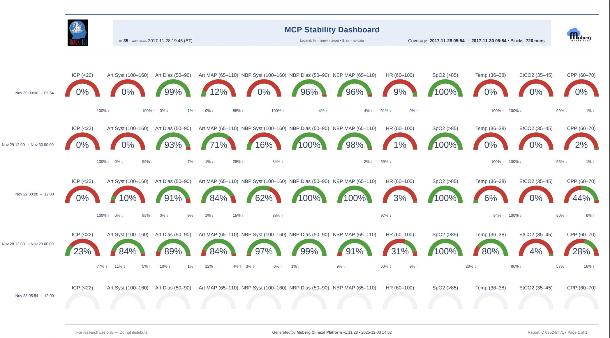
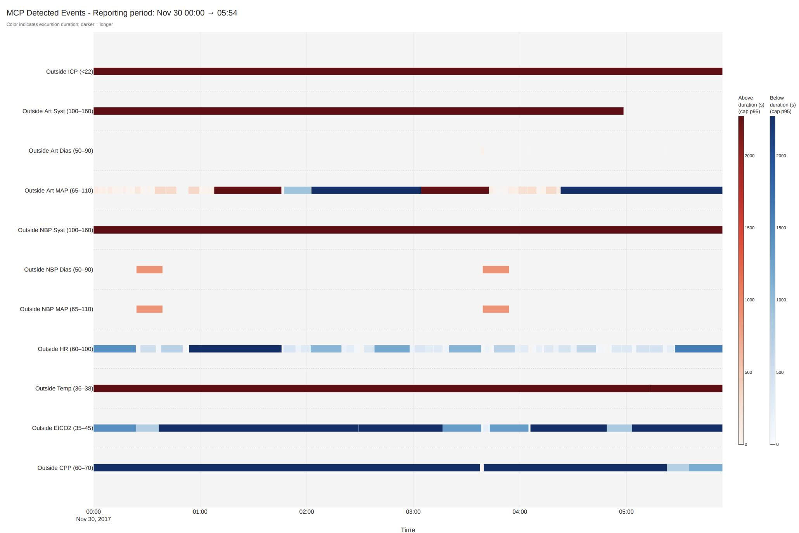

# Advanced Neuromonitoring in the Age of AI <br> Neuroinformatics and AI in the NeuroICU
2025 International Conference on Spreading Depolarizations (ICSD) \
December 8, 2025 in Old and Royal Windsor, UK.

## Notebook 2 - Event Detection

Implement and evaluate classical physiologic event detectors to support multimodal interpretation. You will detect ECG R-peaks, respiratory cycles, and threshold-based events. You will review detected events in ECG and respiratory second-to-second waveforms in addition to detected events in long-term trends over many days.

**For more information or help, please email support@moberganalytics.com**

What you'll learn:
* How to detect ECG R-peaks using standard signal-processing approaches and evaluate the accuracy of beat detection.
* How to identify respiratory cycles from respiratory waveforms and derive basic breathing-rate features.
* How to review and interpret signal quality to understand when detections may be unreliable or require correction.
* How to assess patient stabiltiy and detected events using threshold-based methods.

### Exercise 0: What is pycns?

**pycns** is an open-source Python library developed by Dr. Baptiste Balanca and his team (Lyon, CRNL, France) to make it easy to work with high-resolution physiologic data collected by the Natus CNS Monitor. It provides simple, standardized tools for loading, navigating, and analyzing data from the Moberg Clinical Platform (MCP) and legacy CNS Monitor archives.

The library handles the complex structure of multimodal ICU recordings—including waveforms (EEG, ABP, ICP, ECG), trends, annotations, and metadata—so users can focus on interpretation rather than file formats. With pycns, clinicians and researchers can efficiently:
* Load patient recordings from CNS or MCP archives
* Access synchronized multimodal signals with proper timestamps
* View annotations such as spreading depolarizations or clinical events
* Prepare data for signal processing, feature extraction, or AI models

In short, pycns is the foundational tool that enables fast, reproducible neuroinformatics workflows using Moberg data—powering everything from simple signal review to advanced research and machine-learning applications.

Where to Learn More
* GitHub repository: https://github.com/samuelgarcia/pycns
* Documentation & examples: https://pycns.readthedocs.io/en/latest/examples.html

These resources provide detailed usage examples, API references, and tutorials to help you get started quickly.

### Exercise 1: What is physio?

**physio** is an open-source Python library developed by by Dr. Baptiste Balanca and his team (Lyon, CRNL, France) to provide a unified toolbox for processing, annotating, and analyzing physiological signals commonly used in neuroscience and clinical research. Whereas *pycns* focuses on loading multimodal data from CNS/MCP archives, physio provides a rich collection of signal-processing methods designed specifically for physiologic time series such as ECG, respiration, blood pressure, EMG, and other biosignals.

The library includes high-level functions for event detection, filtering, quality assessment, resampling, and feature extraction—allowing users to quickly convert raw physiologic waveforms into clean, interpretable, and analysis-ready signals. With physio, clinicians and researchers can:

* Detect physiologic events such as ECG R-peaks, respiratory cycles, and pulse onsets
* Clean and preprocess noisy biosignals using standardized pipelines
* Extract features (heart rate, respiration rate, variability metrics, etc.) for downstream modeling
* Visualize waveforms and annotations interactively
* Build reproducible processing workflows for multimodal neurophysiology datasets

In short, physio is a flexible and powerful toolkit for transforming raw physiologic signals into structured information—ideal for research on autonomic function, multimodal monitoring, spreading depolarizations, and AI-based clinical analytics.

Where to Learn More

* **GitHub repository:** [https://github.com/samuelgarcia/physio](https://github.com/samuelgarcia/physio)
* **Documentation & examples:** [https://physio.readthedocs.io/en/latest/index.html](https://physio.readthedocs.io/en/latest/index.html)

These resources offer detailed tutorials, API references, and practical examples to help you integrate physio into your signal-processing workflows.

### Exercise 2: Setup Environment
Import the necessary libraries and functions we will need for the rest of the exercises


```python
# install from github
!pip install git+https://github.com/samuelgarcia/pycns.git@0dec1319c3e06f3c33105f1200582f770f6e2458 > /dev/null
!pip install git+https://github.com/samuelgarcia/physio.git@4569869a3b1938d0fc35335ab71641873bae8639 > /dev/null
!pip install ipywidgets PyPDF2==3.0.1 "kaleido<1.0.0" plotly > /dev/null

# import required libraries

# standard libraries
from datetime import datetime
from pathlib import Path

# third-party libraries
import numpy as np
import pandas as pd

# Lyon libraries
from custom_view_moberg_hcl import ECG_Detections, Resp_Detections, CSD_view # Tools for plotting 2D representations of Heart / Resp rate variability and others ...
import pycns # Toolbox made in Lyon, CRNL, France, for reading and viewing Moberg raw data
import physio # Toolbox made in Lyon, CRNL, France, for processing ECG and Respiratory signals

# moberg libraries
from stability_dashboard_15 import main as run_stability_dashboard
```

      Running command git clone --filter=blob:none --quiet https://github.com/samuelgarcia/pycns.git /tmp/pip-req-build-bxq8m1ba
      Running command git rev-parse -q --verify 'sha^0dec1319c3e06f3c33105f1200582f770f6e2458'
      Running command git fetch -q https://github.com/samuelgarcia/pycns.git 0dec1319c3e06f3c33105f1200582f770f6e2458
      Running command git clone --filter=blob:none --quiet https://github.com/samuelgarcia/physio.git /tmp/pip-req-build-sgd4zimb
      Running command git rev-parse -q --verify 'sha^4569869a3b1938d0fc35335ab71641873bae8639'
      Running command git fetch -q https://github.com/samuelgarcia/physio.git 4569869a3b1938d0fc35335ab71641873bae8639
      Running command git checkout -q 4569869a3b1938d0fc35335ab71641873bae8639


Initalize the patient by setting `patient_data_folder` to the path of a Natus CNS Archive. After going through this once, you can come back to this section to load in a different folder by exploring the directory structure in Notebook 1.


```python
patient_data_folder = f"/mnt/s3/tracktbi-data-main/66/cns/Patient_2017_Oct_31__13_26_47_444456"
patient_data_folder = Path(patient_data_folder)
```

Load data from Natus CNS Monitor format using the `pycns` library, which provides a `CnsReader` object.


```python
reader = pycns.CnsReader(patient_data_folder, event_time_zone = 'America/New_York')
```

### Exercise 3: Detect ECG Peaks & Detect Respiratory Cycles


```python
ecg_stream = reader.streams['ECG_II']
srate_ecg = ecg_stream.sample_rate

start_date = None # from beginning
stop_date = None # to the end

ecg_raw, ecg_dates = ecg_stream.get_data(sel = slice(start_date,stop_date), with_times=True, apply_gain=False) # load ecg data

ecg, r_peaks = physio.compute_ecg(ecg_raw, srate_ecg, parameter_preset = 'human_ecg')
r_peaks['peak_date'] = ecg_dates[r_peaks['peak_index']]
r_peaks
```


<div>
<style scoped>
    .dataframe tbody tr th:only-of-type {
        vertical-align: middle;
    }

    .dataframe tbody tr th {
        vertical-align: top;
    }

    .dataframe thead th {
        text-align: right;
    }
</style>
<table border="1" class="dataframe">
  <thead>
    <tr style="text-align: right;">
      <th></th>
      <th>peak_index</th>
      <th>peak_time</th>
      <th>peak_date</th>
    </tr>
  </thead>
  <tbody>
    <tr>
      <th>0</th>
      <td>261</td>
      <td>0.522277</td>
      <td>2017-10-31 13:26:49.649739</td>
    </tr>
    <tr>
      <th>1</th>
      <td>631</td>
      <td>1.262669</td>
      <td>2017-10-31 13:26:50.390080</td>
    </tr>
    <tr>
      <th>2</th>
      <td>1001</td>
      <td>2.003061</td>
      <td>2017-10-31 13:26:51.130421</td>
    </tr>
    <tr>
      <th>3</th>
      <td>1368</td>
      <td>2.737450</td>
      <td>2017-10-31 13:26:51.864760</td>
    </tr>
    <tr>
      <th>4</th>
      <td>1732</td>
      <td>3.465836</td>
      <td>2017-10-31 13:26:52.593095</td>
    </tr>
    <tr>
      <th>...</th>
      <td>...</td>
      <td>...</td>
      <td>...</td>
    </tr>
    <tr>
      <th>129148</th>
      <td>43542858</td>
      <td>87131.866065</td>
      <td>2017-11-01 13:38:55.045362</td>
    </tr>
    <tr>
      <th>129149</th>
      <td>43543226</td>
      <td>87132.602455</td>
      <td>2017-11-01 13:38:55.781701</td>
    </tr>
    <tr>
      <th>129150</th>
      <td>43543594</td>
      <td>87133.338845</td>
      <td>2017-11-01 13:38:56.518040</td>
    </tr>
    <tr>
      <th>129151</th>
      <td>43543958</td>
      <td>87134.067231</td>
      <td>2017-11-01 13:38:57.246376</td>
    </tr>
    <tr>
      <th>129152</th>
      <td>43544320</td>
      <td>87134.791614</td>
      <td>2017-11-01 13:38:57.970710</td>
    </tr>
  </tbody>
</table>
<p>129153 rows × 3 columns</p>
</div>


```python
co2_stream = reader.streams['CO2']
srate_co2 = co2_stream.sample_rate

start_date = None # from beginning
stop_date = None # to the end

co2_raw, co2_dates = co2_stream.get_data(sel = slice(start_date,stop_date), with_times=True, apply_gain=False) # load respi data

co2, resp_cycles = physio.compute_respiration(co2_raw, srate_co2, parameter_preset = 'human_co2')
resp_cycles['cycle_frequency_per_min'] = resp_cycles['cycle_freq'] * 60
resp_cycles['inspi_date'] = co2_dates[resp_cycles['inspi_index']]
resp_cycles['expi_date'] = co2_dates[resp_cycles['expi_index']]
resp_cycles
```


<div>
<style scoped>
    .dataframe tbody tr th:only-of-type {
        vertical-align: middle;
    }

    .dataframe tbody tr th {
        vertical-align: top;
    }

    .dataframe thead th {
        text-align: right;
    }
</style>
<table border="1" class="dataframe">
  <thead>
    <tr style="text-align: right;">
      <th></th>
      <th>inspi_index</th>
      <th>expi_index</th>
      <th>next_inspi_index</th>
      <th>inspi_time</th>
      <th>expi_time</th>
      <th>next_inspi_time</th>
      <th>cycle_duration</th>
      <th>inspi_duration</th>
      <th>expi_duration</th>
      <th>cycle_freq</th>
      <th>cycle_ratio</th>
      <th>cycle_frequency_per_min</th>
      <th>inspi_date</th>
      <th>expi_date</th>
    </tr>
  </thead>
  <tbody>
    <tr>
      <th>0</th>
      <td>185</td>
      <td>249</td>
      <td>393</td>
      <td>2.961569</td>
      <td>3.986111</td>
      <td>6.291332</td>
      <td>3.329764</td>
      <td>1.024543</td>
      <td>2.305221</td>
      <td>0.300322</td>
      <td>0.307692</td>
      <td>18.019297</td>
      <td>2017-10-31 13:26:52.088863</td>
      <td>2017-10-31 13:26:53.113335</td>
    </tr>
    <tr>
      <th>1</th>
      <td>393</td>
      <td>456</td>
      <td>602</td>
      <td>6.291332</td>
      <td>7.299866</td>
      <td>9.637104</td>
      <td>3.345772</td>
      <td>1.008534</td>
      <td>2.337238</td>
      <td>0.298885</td>
      <td>0.301435</td>
      <td>17.933080</td>
      <td>2017-10-31 13:26:55.418397</td>
      <td>2017-10-31 13:26:56.426862</td>
    </tr>
    <tr>
      <th>2</th>
      <td>602</td>
      <td>666</td>
      <td>809</td>
      <td>9.637104</td>
      <td>10.661647</td>
      <td>12.950860</td>
      <td>3.313755</td>
      <td>1.024543</td>
      <td>2.289212</td>
      <td>0.301772</td>
      <td>0.309179</td>
      <td>18.106347</td>
      <td>2017-10-31 13:26:58.763938</td>
      <td>2017-10-31 13:26:59.788410</td>
    </tr>
    <tr>
      <th>3</th>
      <td>809</td>
      <td>873</td>
      <td>1019</td>
      <td>12.950860</td>
      <td>13.975402</td>
      <td>16.312640</td>
      <td>3.361781</td>
      <td>1.024543</td>
      <td>2.337238</td>
      <td>0.297461</td>
      <td>0.304762</td>
      <td>17.847685</td>
      <td>2017-10-31 13:27:02.077465</td>
      <td>2017-10-31 13:27:03.101937</td>
    </tr>
    <tr>
      <th>4</th>
      <td>1019</td>
      <td>1080</td>
      <td>1226</td>
      <td>16.312640</td>
      <td>17.289157</td>
      <td>19.626395</td>
      <td>3.313755</td>
      <td>0.976517</td>
      <td>2.337238</td>
      <td>0.301772</td>
      <td>0.294686</td>
      <td>18.106347</td>
      <td>2017-10-31 13:27:05.439014</td>
      <td>2017-10-31 13:27:06.415464</td>
    </tr>
    <tr>
      <th>...</th>
      <td>...</td>
      <td>...</td>
      <td>...</td>
      <td>...</td>
      <td>...</td>
      <td>...</td>
      <td>...</td>
      <td>...</td>
      <td>...</td>
      <td>...</td>
      <td>...</td>
      <td>...</td>
      <td>...</td>
      <td>...</td>
    </tr>
    <tr>
      <th>28551</th>
      <td>5442091</td>
      <td>5442153</td>
      <td>5442278</td>
      <td>87119.599568</td>
      <td>87120.592093</td>
      <td>87122.593153</td>
      <td>2.993586</td>
      <td>0.992526</td>
      <td>2.001060</td>
      <td>0.334048</td>
      <td>0.331551</td>
      <td>20.042854</td>
      <td>2017-11-01 13:38:42.779711</td>
      <td>2017-11-01 13:38:43.772168</td>
    </tr>
    <tr>
      <th>28552</th>
      <td>5442278</td>
      <td>5442342</td>
      <td>5442466</td>
      <td>87122.593153</td>
      <td>87123.617696</td>
      <td>87125.602747</td>
      <td>3.009594</td>
      <td>1.024543</td>
      <td>1.985051</td>
      <td>0.332271</td>
      <td>0.340426</td>
      <td>19.936244</td>
      <td>2017-11-01 13:38:45.773090</td>
      <td>2017-11-01 13:38:46.797562</td>
    </tr>
    <tr>
      <th>28553</th>
      <td>5442466</td>
      <td>5442528</td>
      <td>5442654</td>
      <td>87125.602747</td>
      <td>87126.595273</td>
      <td>87128.612341</td>
      <td>3.009594</td>
      <td>0.992526</td>
      <td>2.017068</td>
      <td>0.332271</td>
      <td>0.329787</td>
      <td>19.936244</td>
      <td>2017-11-01 13:38:48.782476</td>
      <td>2017-11-01 13:38:49.774934</td>
    </tr>
    <tr>
      <th>28554</th>
      <td>5442654</td>
      <td>5442714</td>
      <td>5442841</td>
      <td>87128.612341</td>
      <td>87129.572850</td>
      <td>87131.605927</td>
      <td>2.993586</td>
      <td>0.960509</td>
      <td>2.033077</td>
      <td>0.334048</td>
      <td>0.320856</td>
      <td>20.042854</td>
      <td>2017-11-01 13:38:51.791863</td>
      <td>2017-11-01 13:38:52.752305</td>
    </tr>
    <tr>
      <th>28555</th>
      <td>5442841</td>
      <td>5442903</td>
      <td>5443027</td>
      <td>87131.605927</td>
      <td>87132.598453</td>
      <td>87134.583504</td>
      <td>2.977577</td>
      <td>0.992526</td>
      <td>1.985051</td>
      <td>0.335844</td>
      <td>0.333333</td>
      <td>20.150612</td>
      <td>2017-11-01 13:38:54.785242</td>
      <td>2017-11-01 13:38:55.777699</td>
    </tr>
  </tbody>
</table>
<p>28556 rows × 14 columns</p>
</div>


This interactive viewer lets you explore high-resolution physiologic data loaded through **pycns**. Use the controls below to navigate, change signals, and adjust the display.

#### 1. Selecting which signals to display

You control which measurements are shown by editing the `stream_names` argument:

```python
w = pycns.get_viewer(reader, stream_names=['ICP'])
```

You may supply **multiple signals**, for example:

```python
w = pycns.get_viewer(reader, stream_names=['ICP', 'ABP', 'ECG'])
```

The widget will update automatically based on the streams you choose.

#### 2. Navigating using the timeline

Use the **timeline slider at the bottom** of the widget to move forward or backward through the recording.
This is the easiest way to browse long recordings and quickly jump to different time periods.

#### 3. Adjusting the window size (IMPORTANT)

The visible window of data can be changed using the **`win (s)` input box**:

* Type the desired window length in seconds (e.g., `600`, `3600`, `30`).
* Press **Enter** to apply.

⚠️ **Do NOT use the dropdown menu next to the arrow buttons to change the window size.**
That dropdown is deprecated and may not reflect the actual window being drawn.
Always use **`win (s)`** instead.

#### 4. Showing or hiding measurements

Under the **`options`** tab, you can toggle individual measurements on or off.

* This is helpful when you have multiple streams displayed (e.g., ICP + ABP + ECG).
* Use the checkboxes to focus on a specific physiologic signal without recreating the widget.

#### 5. Autoscale and display controls

* **Autoscale** (left sidebar) automatically adjusts the y-axis to fit the visible data.
* The toolbar on the left also allows panning, zooming, resetting the view, and exporting the figure.


```python
%matplotlib widget

ext_plots = {
    'CSD_mono': CSD_view(reader, with_detections=False, mode = 'mono', dc_band = (0.001, 0.025), ac_band = (0.5, 70), down_sampling_factor = 2, reref_median_ac = True, notch = True, offset_split_factor_uV = 1000, dc_gain_factor = 0.25, ac_gain_factor = 2),
    'CSD_bipol': CSD_view(reader, with_detections=False, mode = 'bipol', dc_band = (0.001, 0.025), ac_band = (0.5, 70), down_sampling_factor = 2, reref_median_ac = False, notch = True, offset_split_factor_uV = 1000, dc_gain_factor = 0.1, ac_gain_factor = 2),
    'ecg_detections': ECG_Detections(ecg_stream, r_peaks),
    'resp_detections': Resp_Detections(co2_stream, resp_cycles)
}

w = pycns.get_viewer(reader, stream_names=['ECG_II', 'CO2'], ext_plots=ext_plots)
w
```


    Viewer(children=(VBox(children=(HBox(children=(Button(description='autoscale', icon='refresh', style=ButtonSty…


### Exercise 4: Stability Dashboard: How to Generate and How to Interpret It

The **MCP Stability Dashboard** provides a structured summary of how well a patient remained within predefined physiologic target ranges over time. It is used to rapidly assess physiologic stability, guide quality reviews, and evaluate care consistency across long ICU recordings.

This section explains step-by-step how to generate the dashboard, followed by a guide to interpreting each component.

#### How to Generate the Stability Dashboard

Follow the numbered steps in the Stability Dashboard interface:

##### 1) Select a Patient

Use the dropdown to choose a patient ID from the dataset.
The dashboard will use this patient’s physiologic time series and available monitoring data.

##### 2) Select an Archive

Choose the specific patient archive you want to analyze.
This determines which signals and time intervals are available.

##### 3) Select a Time Window

Decide how much of the patient’s recording to include:

* Preset windows: *Last 48 hours, 24 hours, 12 hours,* etc.
* Or specify a **custom start/end time**.

Only data inside this window will be summarized in the stability report.

##### 4) Choose a Block Size

Blocks divide the selected time window into equal-length segments for comparison.

Common options:

* **24 h**
* **12 h**
* **8 h**
* **4 h**
* Or enter your own duration (e.g., 720 min = 12 hours)

Each block becomes one row of summary gauges in the dashboard.

##### 5) Adjust Global Defaults (Optional)

These are the **target ranges** for each physiologic variable.
You can modify them here. They will automatically seed the per-block ranges.

Examples:

* ICP < 22 mmHg
* Art Syst 100–160 mmHg
* Art MAP 65–110 mmHg
* HR 60–100 bpm
* SpO₂ > 85%
* EtCO₂ 35–45 mmHg
* CPP 60–70 mmHg


##### 6) (Recommended) Adjust Per-Block Targets

Click **Prepare Blocks**.

This generates individual block rows where targets can be adjusted if needed (e.g., personalized MAP goal, CPP target changes over time).

If all targets remain the same, simply proceed.

##### 7) Generate the Dashboard

Click **Generate Stability Dashboard**.

A multi-block PDF-like dashboard will be created, showing:

* **Gauge summaries** for each block
* **Time-in-target percentages**
* **Up/Down arrows** indicating whether excursions were above or below target
* **Event strips** showing continuous periods of being outside the goal range
* **Coverage information and missing-data indicators**

An example of this output is shown in your PDF (e.g., the gauges and event strips on page 1 and 2). 

#### How to Interpret the Stability Dashboard

The dashboard is composed of two major visual systems:

1. **Gauge rows (per-block physiologic stability)**
2. **Excursion-duration event strips (outside-target timelines)**

Each gives complementary information.

##### 1. Gauge Rows (Time-in-Target Summaries)

Each block is summarized by a row of *12 semicircular gauges*, one for each monitored variable:

* ICP
* Arterial Systolic, Diastolic, MAP
* NBP Systolic, Diastolic, MAP
* HR
* SpO₂
* Temperature
* EtCO₂
* CPP

Each gauge shows:

###### A. % Time in Target (the main value)

For example:

* ICP (<22): **0%**
* Art Dias (50–90): **99%**
* NBP Dias (50–90): **96%**
* CPP (60–70): **44%**

These correspond directly with the PDF values on page 1 (first block row). 

###### B. Color Meaning

* **Green** arc = Good stability (high % in range)
* **Red** arc = Poor stability (low % in range)
* **Gray** = No data for that metric during the block

###### C. Up/Down Arrows Below Gauges

These show whether the measurement was above or below range:

* **↑** = Time spent **above** the upper limit
* **↓** = Time spent **below** the lower limit
* Percent values indicate the fraction of the block spent above/below

Example (from the PDF, page 1):

* NBP MAP (65–110): **4% ↑**, **4% ↓**
* HR (60–100): **91% ↓** (patient was bradycardic for 91% of the block)


##### 2. Event Strips (Outside-Target Duration Maps)

After the gauge summary, each block includes **event heat strips** showing when and how long physiologic variables exceeded their target ranges.

###### Color Meaning

* **Red** = above-target excursion
* **Blue** = below-target excursion
* **Darker shades** = longer excursions (duration capped at p95)

This is shown clearly in the PDF pages 2–5:
For example, on page 2, ICP is above-target nearly continuously (dark red bar), whereas HR alternates between short blue intervals (below target). 

###### Interpretation Example

From PDF page 3:

* Art Syst exhibits alternating red and blue, indicating swings above and below target.
* EtCO₂ remains continuously below target (solid blue line).
* CPP shows prolonged below-target periods followed by brief above-target excursions.

These strips help identify:

* Persistent physiologic instability
* Variability (frequent crossing of thresholds)
* Timing of events relative to clinical interventions
* Whether instability is gradual, episodic, or abrupt


#### How to Read the Dashboard Clinically

1. **Which variables show the least stability?**
   Low % time-in-target or long red/blue bars indicate clinical concern.
2. **Are instabilities clustered at certain times?**
   Blocks allow evaluating improvement/worsening over the hospital course.
3. **Is the patient consistently above or below target?**
   E.g., HR 91% below target (severe bradycardia pattern) suggests underlying physiologic suppression or medication effect.
4. **Is there missing data?**
   Gray gauges indicate absent sensor data (e.g., no ICP monitor for that block).
5. **How do blocks compare?**
   Useful for evaluating effects of interventions (fluids, pressors, ventilation changes, sedation, decompression, etc.).






```python
run_stability_dashboard()
```


    VBox(children=(HTML(value='<b>1) Select a Patient</b>'), HBox(children=(Select(description='Patient:', index=1…


## End of Notebook 2
At this point, participants should be able to:
* Detect ECG R-peaks using standard signal-processing methods and assess the accuracy of beat detection.
* Identify respiratory cycles from respiratory waveforms and compute basic breathing-rate features.
* Evaluate signal quality and recognize when detections may be unreliable or need correction.
* Generate stability reports to summarize and assess patient physiologic status.

## What’s Next?

In Notebook 3, we will extend on event detection to create features that we can use in future AI/ML models. Specifically, we’ll learn how to:
* Compute cerebral compliance features from ICP and arterial waveform morphology.
* Calculate the pressure reactivity index (PRx) as a measure of cerebral autoregulation.
* Derive CPPopt, the optimal CPP where autoregulation is most intact.
* Identify and remove non-physiologic data before computing PRx and CPPopt.
* Explore extensions of CPPopt analysis, including limits of autoregulation and weighted multi-window approaches.
* Estimate autoregulation non-invasively using NIRS-based indices such as COx and MAPopt.

This transition will move us from detecting events (Notebook 2) into creating features for models (Notebook 3).
