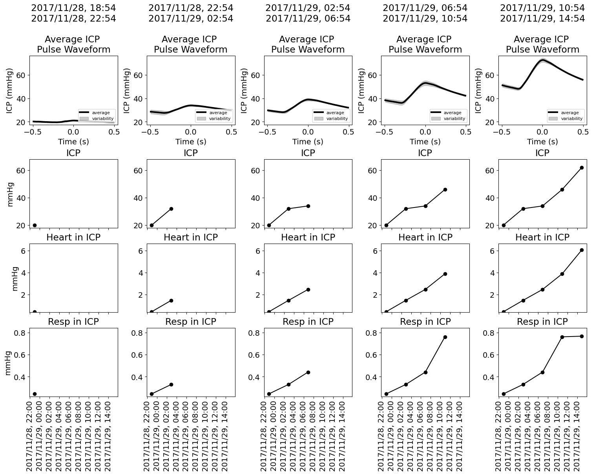
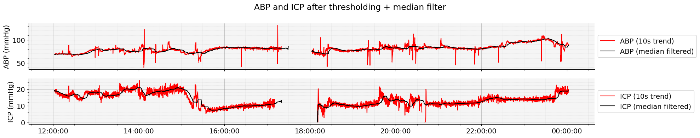
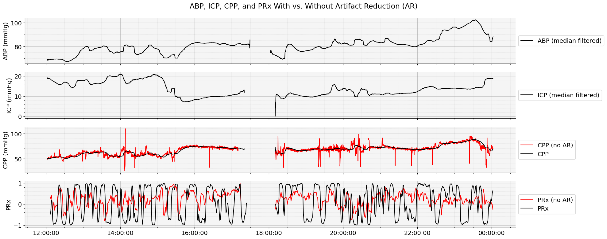
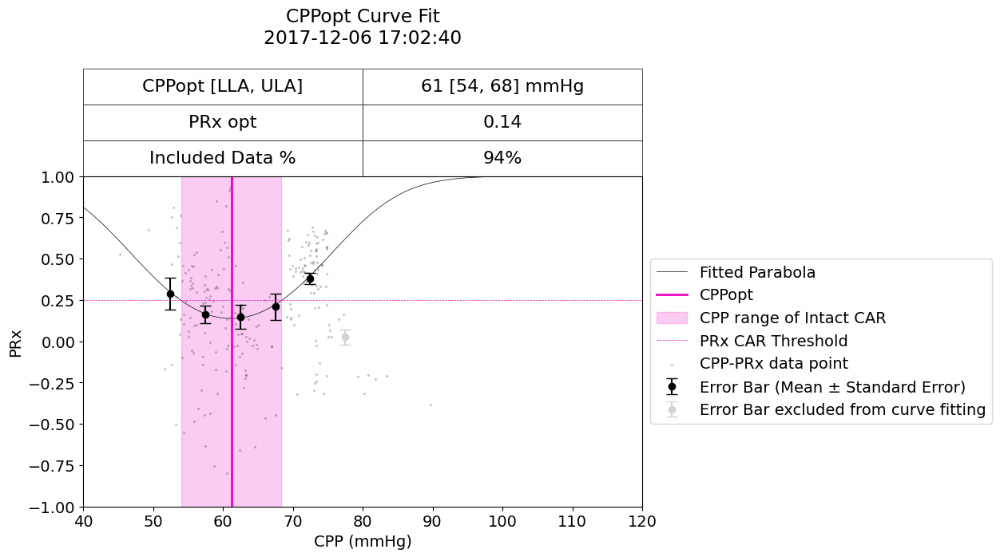

# Advanced Neuromonitoring in the Age of AI <br> Neuroinformatics and AI in the NeuroICU
2025 International Conference on Spreading Depolarizations (ICSD) \
December 8, 2025 in Old and Royal Windsor, UK.

## Notebook 3 - Feature Engineering

Transform raw signals into clinically meaningful biomarkers. You will compute cerebral compliance metrics from ICP and waveform morphology, and perform cerebral autoregulation analysis using techniques such as PRx-style correlation windows. This section focuses on deriving quantitative features that support mechanistic interpretation of brain physiology before, during, and after spreading depolarizations.

**For more information or help, please email support@moberganalytics.com**

What you'll learn:
* How to compute cerebral compliance features from ICP and arterial waveform morphology, including pulse amplitude and pressure–volume–related metrics.
* How to calculate the pressure reactivity index (PRx) ([Czosnyka et al.](https://pubmed.ncbi.nlm.nih.gov/9218290/)), a measure of cerebral autoregulation (CA).
* How to derive CPPopt, an estimate of the CPP where CA is most intact. ([Aries et al.](https://pubmed.ncbi.nlm.nih.gov/22622398/))
* The importance of excluding non-physiologic data prior to calculating PRx and CPPopt
* Extensions of the CPPopt algorithm: 
    - Calculating the limits of CA
    - Using a weighted multi-window approach ([Liu et al.](https://pubmed.ncbi.nlm.nih.gov/28486883/))
    - Non-invasive estimates of CA using near-infrared Spectroscopy (NIRS); Cerebral Oximetry Index (COx), MAPopt (optimal mean arterial pressure) ([Sekhon et al.](https://pubmed.ncbi.nlm.nih.gov/27255957/))

### Exercise 0: What is pycns?

**pycns** is an open-source Python library developed by Dr. Baptiste Balanca and his team (Lyon, CRNL, France) to make it easy to work with high-resolution physiologic data collected by the Natus CNS Monitor. It provides simple, standardized tools for loading, navigating, and analyzing data from the Moberg Clinical Platform (MCP) and legacy CNS Monitor archives.

The library handles the complex structure of multimodal ICU recordings—including waveforms (EEG, ABP, ICP, ECG), trends, annotations, and metadata—so users can focus on interpretation rather than file formats. With pycns, clinicians and researchers can efficiently:
* Load patient recordings from CNS or MCP archives
* Access synchronized multimodal signals with proper timestamps
* View annotations such as spreading depolarizations or clinical events
* Prepare data for signal processing, feature extraction, or AI models

In short, pycns is the foundational tool that enables fast, reproducible neuroinformatics workflows using Moberg data—powering everything from simple signal review to advanced research and machine-learning applications.

Where to Learn More
* GitHub repository: https://github.com/samuelgarcia/pycns
* Documentation & examples: https://pycns.readthedocs.io/en/latest/examples.html

These resources provide detailed usage examples, API references, and tutorials to help you get started quickly.

### Exercise 1: What is physio?

**physio** is an open-source Python library developed by by Dr. Baptiste Balanca and his team (Lyon, CRNL, France) to provide a unified toolbox for processing, annotating, and analyzing physiological signals commonly used in neuroscience and clinical research. Whereas *pycns* focuses on loading multimodal data from CNS/MCP archives, physio provides a rich collection of signal-processing methods designed specifically for physiologic time series such as ECG, respiration, blood pressure, EMG, and other biosignals.

The library includes high-level functions for event detection, filtering, quality assessment, resampling, and feature extraction—allowing users to quickly convert raw physiologic waveforms into clean, interpretable, and analysis-ready signals. With physio, clinicians and researchers can:

* Detect physiologic events such as ECG R-peaks, respiratory cycles, and pulse onsets
* Clean and preprocess noisy biosignals using standardized pipelines
* Extract features (heart rate, respiration rate, variability metrics, etc.) for downstream modeling
* Visualize waveforms and annotations interactively
* Build reproducible processing workflows for multimodal neurophysiology datasets

In short, physio is a flexible and powerful toolkit for transforming raw physiologic signals into structured information—ideal for research on autonomic function, multimodal monitoring, spreading depolarizations, and AI-based clinical analytics.

Where to Learn More

* **GitHub repository:** [https://github.com/samuelgarcia/physio](https://github.com/samuelgarcia/physio)
* **Documentation & examples:** [https://physio.readthedocs.io/en/latest/index.html](https://physio.readthedocs.io/en/latest/index.html)

These resources offer detailed tutorials, API references, and practical examples to help you integrate physio into your signal-processing workflows.

### Exercise 2: Setup Environment
Import the necessary libraries and functions we will need for the rest of the exercises


```python
# install from github
!pip install git+https://github.com/samuelgarcia/physio.git@4569869a3b1938d0fc35335ab71641873bae8639 > /dev/null

# import required libraries

# standard libraries
from datetime import timedelta, datetime
from pathlib import Path

# third-party libraries
import numpy as np
from pandas import Timestamp, Series, DataFrame
import pandas as pd

import matplotlib.pyplot as plt
import matplotlib.dates as mdates

import scipy
import xarray as xr

from scipy.stats import median_abs_deviation

# Lyon libraries
import pycns # Toolbox made in Lyon, CRNL, France, for reading and viewing Moberg raw data
import physio # Toolbox made in Lyon, CRNL, France, for processing ECG and Respiratory signals
from custom_view_moberg_hcl import iirfilt # Tools for plotting 2D representations of Heart / Resp rate variability and others ...
from custom_cerebral_compliance_hcl import compute_icp, compute_icp_waveform, compute_heart_resp_spectral_ratio_in_icp

# moberg libraries
from moberg_dsp.analytics import OptimalValueArgs, OptimalValueFlexArgs, cppopt_single_window, cppopt_multi_window, mapopt_multi_window, mapopt_single_window, prx as rolling_correlation
from cns_utils import CNSDataSource
from sam_tools.cppopt import (
    plot_data_frames,
    plot_cppopt_curve_fit,
    exclude_non_physiologic_values
)

# load data in
cppopt_cns_data_path = str(Path('data/04_cppopt').resolve())
mapopt_cns_data_path = str(Path('data/04_mapopt').resolve())
```

      Running command git clone --filter=blob:none --quiet https://github.com/samuelgarcia/physio.git /tmp/pip-req-build-bl3ae2cd
      Running command git rev-parse -q --verify 'sha^4569869a3b1938d0fc35335ab71641873bae8639'
      Running command git fetch -q https://github.com/samuelgarcia/physio.git 4569869a3b1938d0fc35335ab71641873bae8639
      Running command git checkout -q 4569869a3b1938d0fc35335ab71641873bae8639


### Exercise 1: Perform Cerebral Compliance Analysis

This section will create a figure that summarizes **how intracranial pressure (ICP) pulsatility and its cardiac and respiratory components evolve over time**. 

Initalize the patient by setting `patient_data_folder` to the path of a Natus CNS Archive. After going through this once, you can come back to this section to load in a different folder by exploring the directory structure in Notebook 1.


```python
patient_data_folder = f"/mnt/s3/tracktbi-data-main/35/cns/Patient_2017_Nov_28__19_45_15_437001"
patient_data_folder = Path(patient_data_folder)
```

Load data from Natus CNS Monitor format using the `pycns` library, which provides a `CnsReader` object.


```python
reader = pycns.CnsReader(patient_data_folder, event_time_zone = 'America/New_York')
```

The following parameters control how we segment the data, detect ICP pulses, and extract cardiac and respiratory features from the ICP waveform. All of these settings can be modified to tune the analysis for different sampling rates, noise conditions, or patient physiology.

#### Windowing Parameters

```python
n_windows = 5
window_duration_hour = 4
```

These settings define how the analysis is broken into time windows:

* `n_windows` — The number of consecutive windows that will be analyzed (e.g., 5 segments across the recording).
* `window_duration_hour` — The length of each analysis window, in hours.
  For example, `n_windows = 5` and `window_duration_hour = 4` means the algorithm will analyze five 4-hour windows (a total of 20 hours of data).

Windowing is especially useful for capturing **time-varying physiology**, such as evolving compliance or autoregulation changes.

#### Rolling Mean Parameters

```python
n_minutes_rolling_win_icp_mean = 3
```

This defines the size of the rolling window used to compute a **smoothed ICP mean**:

* A **3-minute rolling mean** reduces noise in the ICP trend and stabilizes downstream features like PRx, pulse amplitude, and excursion detection.

#### ICP Pulse Detection Parameters

```python
detect_icp_params = {
    'lowcut':0.1,
    'highcut':10,
    'order':4,
    'ftype':'butter',
    'peak_prominence' : 0.5,
    'h_distance_s' : 0.3,
    'rise_amplitude_limits' : (0,30),
    'amplitude_at_trough_low_limit' : -10,
}
```

These settings define how ICP pulses are filtered and detected:

#### Filtering

* `lowcut` / `highcut` — The frequency band (in Hz) used for ICP pulse isolation.
  A 0.1–10 Hz **Butterworth bandpass** removes very slow trends and high-frequency noise.
* `order` — Filter order (steepness of roll-off).
* `ftype` — Filter type (Butterworth is smooth and commonly used for physiologic waveforms).

#### Peak Detection

* `peak_prominence` — Minimum prominence required for identifying a valid ICP pulse (prevents false positives in noise).
* `h_distance_s` — Minimum allowed time (seconds) between successive pulses; prevents double-counting within one cardiac cycle.
* `rise_amplitude_limits` — Expected ICP pulse rise amplitude range (mmHg). Pulses outside this range are rejected.
* `amplitude_at_trough_low_limit` — A safeguard ensuring trough-to-peak transitions are physiologically plausible.

These settings ensure that only **valid cardiac-driven ICP pulses** are used for compliance and waveform analysis.

#### Extracting Heart & Respiratory Components from ICP

```python
heart_resp_in_icp_params = {
    'wsize_secs':60,
    'resp_fband':(0.12,0.6),
    'heart_fband':(0.8,2.5),
    'rolling_N_time':5,
    'scaling':'spectrum',
}
```

This block controls decomposition of the ICP signal into respiratory and cardiac components:

* `wsize_secs` — Window size (seconds) for spectral decomposition.
* `resp_fband` — Expected respiratory frequency range (Hz), typically 0.12–0.6 Hz.
* `heart_fband` — Expected cardiac frequency range (Hz), typically 0.8–2.5 Hz.
* `rolling_N_time` — Number of windows to smooth together over time for more stable estimates.
* `scaling` — How spectral amplitude is normalized (e.g., `"spectrum"` keeps energy proportional to physiologic oscillations).

This enables estimation of **respiratory amplitude**, **heart-rate–driven ICP pulsatility**, and the **relative contribution of each component**—useful markers of compliance.

#### ICP Waveform Shape Analysis

```python
icp_waveform_params = {
    'win_size_s':1,
    'add_jitter_s':0,
    'estimators':'robust',
}
```

These parameters define how individual ICP pulses are extracted and summarized:

* `win_size_s` — Length (seconds) of each extracted pulse window, typically centered around the detected peak.
* `add_jitter_s` — Optional random jitter for Monte-Carlo–style variability estimation (usually 0).
* `estimators` — Statistical method used to compute waveform features (“robust” methods reduce sensitivity to noise or misalignment).

These features are used for **compliance estimation** (e.g., pulse amplitude, P2/P1 ratio) and are important inputs for downstream AI/ML models.


```python
n_windows = 5
window_duration_hour = 4

n_minutes_rolling_win_icp_mean = 3

detect_icp_params = {
    'lowcut':0.1,
    'highcut':10,
    'order':4,
    'ftype':'butter',
    'peak_prominence' : 0.5,
    'h_distance_s' : 0.3,
    'rise_amplitude_limits' : (0,30),
    'amplitude_at_trough_low_limit' : -10,
}

heart_resp_in_icp_params = {
    'wsize_secs':60,
    'resp_fband':(0.12,0.6),
    'heart_fband':(0.8,2.5),
    'rolling_N_time':5,
    'scaling':'spectrum',
}

icp_waveform_params = {
    'win_size_s':1,
     'add_jitter_s':0,
    'estimators':'robust',
}
```

Load in a segment of data using **pycns**.


```python
icp_stream = reader.streams['ICP']
icp_mean_stream = reader.streams['ICP_Mean']

duration_analysis_hours = n_windows * window_duration_hour

datetimes_edges = icp_stream.get_times()[0], icp_stream.get_times()[-1]

d2 = datetimes_edges[1]
stop_date = d2.copy()
d2 = np.datetime64(stop_date) - np.timedelta64(20, 'h')
d1 = d2 - np.timedelta64(duration_analysis_hours, 'h')

all_icp_mean, all_icp_mean_datetimes = icp_mean_stream.get_data(sel = slice(d1,d2), with_times = True, apply_gain = True)
all_icp_mean = pd.Series(all_icp_mean).rolling(int(n_minutes_rolling_win_icp_mean * 60), center = True).median().bfill().ffill().values

start_datetimes_slices = np.arange(d1, d2, np.timedelta64(window_duration_hour, 'h'))
stop_datetimes_slices = start_datetimes_slices + np.timedelta64(window_duration_hour, 'h')
```

Use the tools to assess cerebral compliance over a set of windows. 


```python
color = 'k'
ncols = n_windows
nrows = 4
fmt = '%Y/%m/%d, %H:%M'

figsize = (ncols * 3, nrows * 3)

fig, axs = plt.subplots(nrows = nrows, ncols = ncols, figsize = figsize, constrained_layout = True)

df_time_series = pd.DataFrame(columns = ['ICP','Heart in ICP','Resp in ICP'], index = stop_datetimes_slices)

min_waveforms = []
max_waveforms = []
for c in range(ncols):
    local_d1 = start_datetimes_slices[c]
    local_d2 = stop_datetimes_slices[c]

    raw_icp, icp_times = icp_stream.get_data(sel = slice(local_d1, local_d2), with_times = True, apply_gain = True, time_as_second = True)
    if len(icp_times) == 0:
        continue
    
    icp_srate = 1 / np.median(np.diff(icp_times))
    icp_times -= icp_times[0]

    local_icp_detections = compute_icp(raw_icp, icp_srate, **detect_icp_params) 
    
    heart_resp_in_icp = compute_heart_resp_spectral_ratio_in_icp(raw_icp, icp_srate, **heart_resp_in_icp_params)

    df_time_series.loc[local_d2,'ICP'] = np.nanmedian(all_icp_mean[(all_icp_mean_datetimes >= local_d1) & (all_icp_mean_datetimes < local_d2)])
    df_time_series.loc[local_d2,'Heart in ICP'] = np.nanmedian(heart_resp_in_icp['heart_in_icp_spectrum'])
    df_time_series.loc[local_d2,'Resp in ICP'] =  np.nanmedian(heart_resp_in_icp['resp_in_icp_spectrum'])

    t_waveform, m_waveform, s_waveform = compute_icp_waveform(raw_icp, icp_srate, local_icp_detections, **icp_waveform_params)
    min_waveforms.append(np.min(m_waveform))
    max_waveforms.append(np.max(m_waveform))

    ax = axs[0,c]
    ax.plot(t_waveform, m_waveform, color = color, lw = 3, label = 'average')
    ax.fill_between(t_waveform, m_waveform - s_waveform, m_waveform + s_waveform, color = 'k', alpha = 0.2, label = 'variability')
    ax.set_ylabel('ICP (mmHg)')
    ax.set_xlabel('Time (s)')
    
    d1_title = np.datetime_as_string(local_d1, unit='m')
    d1_title = datetime.fromisoformat(d1_title)
    d2_title = np.datetime_as_string(local_d2, unit='m')
    d2_title = datetime.fromisoformat(d2_title)
    ax.set_title(f'{d1_title.strftime(fmt)}\n{d2_title.strftime(fmt)}\n\nAverage ICP \nPulse Waveform')
    ax.legend(loc = 'lower right', fontsize = 8)

    for i, colname in zip([1,2,3],df_time_series.columns):
        ax = axs[i,c]
        ax.plot(df_time_series.index, df_time_series[colname], color = color)
        ax.scatter(df_time_series.index, df_time_series[colname], color = color)
        ax.set_xlim(stop_datetimes_slices[0] - np.timedelta64(1, 'h'), stop_datetimes_slices[-1] + np.timedelta64(1, 'h'))
        ax.set_title(colname)

        if i == 3:
            ax.tick_params("x", rotation=90)
            ax.xaxis.set_major_formatter(mdates.DateFormatter(fmt))
        else:
            ax.set_xticklabels([])

        if c == 0:
            ax.set_ylabel('mmHg')


ymin, ymax = min(min_waveforms), max(max_waveforms)
for c in range(ncols):
    ax = axs[0,c]
    ax.set_ylim(ymin - ymin / 10, ymax + ymax / 20)

for c in range(ncols):
    for r, colname in zip([1,2,3],df_time_series.columns):
        ymin = df_time_series[colname].min()
        ymax = df_time_series[colname].max()
        ax = axs[r,c]
        ax.set_ylim(ymin - ymin / 10, ymax + ymax / 10)
```


    

    


This figure summarizes **how intracranial pressure (ICP) pulsatility and its cardiac and respiratory components evolve over time**. Each column represents a different analysis window, progressing chronologically from left to right.

#### 1. Average ICP Pulse Waveform (Top Row)

The top row shows the **representative ICP pulse waveform** (one cardiac beat) averaged across all pulses in that window.

* A **taller or sharper waveform** indicates increased pulsatility, often reflecting reduced cerebral compliance.
* **Variability shading** shows beat-to-beat consistency; higher variability may indicate instability or artifact.

Changes in pulse shape over time can help identify deterioration or improvement in compliance.

#### 2. Mean ICP Trend (Second Row)

These plots show how **mean ICP changes across windows**.

* An **upward trend** may suggest worsening intracranial hypertension.
* A **downward or stable trend** indicates more controlled pressure.

This provides context for interpreting waveform morphology.

#### 3. Heart-Driven Component in ICP (Third Row)

This row shows the amplitude of the **cardiac component** extracted from the ICP signal.

* Higher values reflect **stronger cardiac pulsatility**, which is often associated with **lower intracranial compliance**.
* A rising trajectory across windows can be an early sign of deteriorating compliance even before mean ICP increases.

This metric isolates the cardiac influence on ICP independent of noise or slow pressure trends.

#### 4. Respiratory Component in ICP (Bottom Row)

The bottom row shows the **respiratory oscillation amplitude** within ICP.

* Larger respiratory waves may occur with changes in ventilation, CO₂ levels, or thoracic pressure transmission.
* A stable respiratory component suggests consistent physiologic coupling.

Comparing cardiac vs. respiratory components helps differentiate whether increased pulsatility is due to **intracranial mechanics** (cardiac) or **systemic/respiratory factors**.

#### Putting It All Together

By scanning left to right, you can observe how a patient’s intracranial physiology evolves:

* **Flattened early waveforms** with low pulsatility → typically good compliance.
* **Increasing cardiac amplitude** and a more pronounced waveform → reduced compliance.
* **Consistent rise in ICP, cardiac ICP component, and waveform height** → strong indicators of worsening intracranial dynamics.
* **Relative changes between cardiac and respiratory components** help identify whether deterioration is intracranial, systemic, or ventilatory in origin.

This figure is useful for **trend-level interpretation**, helping clinicians detect early signs of deteriorating compliance or intracranial hypertension before they become obvious in standard trends.

### Exercise 2: Perform Cerebral Autoregulation Analysis

Calculate features for cerebral autoregulation including PRx, CPPOpt, COx, and MAPopt with and without artifact reduction.

#### Part 1: Data Loading and Cleaning
Load data from Moberg CNS format using the `cns_utils` library, which provides a `CNSDataSource` reader.


```python
# The CNSDataSource allows us to read data stored in Moberg CNS format.
cns_data_source = CNSDataSource(cppopt_cns_data_path)

# Create reviewer objects for ABP and ICP data.
abp_reviewer = cns_data_source.get_modality_data_reviewer("ABP,waveform")
icp_reviewer = cns_data_source.get_modality_data_reviewer("ICP,waveform")

# Read up to 12 hours of data from the patient archive.
limit = timedelta(hours=12)
raw_abp, _ = abp_reviewer.review_data_frame(abp_reviewer.start_time(), abp_reviewer.start_time() + limit.total_seconds()*1e6)
raw_icp, _ = icp_reviewer.review_data_frame(icp_reviewer.start_time(), icp_reviewer.start_time() + limit.total_seconds()*1e6)

# Visualize the data
subsection_start, subsection_end = Timestamp("2017-12-06 12:12:00"), Timestamp("2017-12-06 12:12:15")

plot_data_frames(
    data_frames=[raw_abp[subsection_start:subsection_end], raw_icp[subsection_start:subsection_end]], 
    legend_labels=["ABP","ICP"],
    axes=[0, 1],
    graph_y_labels=["ABP (mmHg)", "ICP (mmHg)"],
    figsize=(16, 4),
    sharex=True,
    title="Waveform view of raw ABP and ICP Data (15 seconds)"
)

plot_data_frames(
    data_frames=[raw_abp, raw_icp], 
    legend_labels=["ABP","ICP"],
    axes=[0, 1],
    graph_y_labels=["ABP (mmHg)", "ICP (mmHg)"],
    figsize=(16, 4),
    sharex=True,
    title="ABP and ICP Data (12 hours)"
)
```


    

    


    

    


#### Part 2: Apply basic artifact reduction

There are large spikes and clear non-physiologic data in the raw ABP and ICP signal. 

Any metrics we derive from this data (CPP, PRx, CPPopt) will be impacted by the non-physiologic data. 

We can apply basic thresholding to remove them.


```python
abp_ar = exclude_non_physiologic_values(raw_abp, valid_range=(40, 180))
icp_ar = exclude_non_physiologic_values(raw_icp, valid_range=(0, 30))

plot_data_frames(
    data_frames=[raw_abp, abp_ar, raw_icp, icp_ar], 
    legend_labels=["ABP (raw)", "ABP (with threshold)", "ICP (raw)", "ICP (with threshold)"],
    axes=[0, 0, 1, 1],
    colors=["red", "black", "red", "black"],
    graph_y_labels=["ABP (mmHg)", "ICP (mmHg)"],
    figsize=(20, 4),
    sharex=True,
    title="ABP and ICP Data After Artifact Reduction"
)

# Showing the 10-second trends of ABP and ICP makes it easier to visualize
abp_10s_trend = abp_ar.resample(timedelta(seconds=10), origin=Timestamp(0)).mean()
icp_10s_trend = icp_ar.resample(timedelta(seconds=10), origin=Timestamp(0)).mean()

plot_data_frames(
    data_frames=[abp_10s_trend, icp_10s_trend],
    legend_labels=["ABP (10-second average)", "ICP (10-second average)"],
    axes=[0, 1],
    graph_y_labels=["ABP (mmHg)", "ICP (mmHg)"],
    figsize=(20, 4),
    sharex=True,
    title="ABP and ICP 10-second average (after thresholding)"
)
```


    

    


    

    


#### Part 3: Apply a median filter

Basic thresholding helps, but does not remove the non-physiologic spikes that are at low amplitudes. We can apply an additional median filtering step to remove these residual spikes.

This is typical for CPPopt and MAPopt calculation, where the trend is most important, and high-frequency data is not needed.

In this case, a 10-minute median filter smooths over the majority of non-physiologic data, although it is a heavy-handed approach.


```python
abp_median_filter = abp_10s_trend.rolling(timedelta(minutes=10)).median()
icp_median_filter = icp_10s_trend.rolling(timedelta(minutes=10)).median()

plot_data_frames(
    data_frames=[abp_10s_trend, abp_median_filter, icp_10s_trend, icp_median_filter], 
    legend_labels=["ABP (10s trend)", "ABP (median filtered)", "ICP (10s trend)", "ICP (median filtered)"],
    axes=[0, 0, 1, 1],
    colors=["red", "black", "red", "black"],
    graph_y_labels=["ABP (mmHg)", "ICP (mmHg)"],
    figsize=(20, 4),
    sharex=True,
    title="ABP and ICP after thresholding + median filter"
)
```


    

    


*Interpretation: Most of the non-physiologic spikes can be reduced by applying simple thresholding and median filter processing.*

#### Part 4: Compute CPP and PRx

After artifact removal, CPP and PRx can be derived.

- CPP = ABP - ICP
- PRx = Rolling 5-minute correlation of ABP and ICP ([Czosnyka et al.](https://pubmed.ncbi.nlm.nih.gov/9218290/))


```python
aligned = DataFrame({"ABP": abp_median_filter, "ICP": icp_median_filter})
aligned_no_ar = DataFrame({"ABP": abp_10s_trend, "ICP": icp_10s_trend})
cpp = aligned["ABP"] - aligned["ICP"]
cpp_no_ar = aligned_no_ar["ABP"] - aligned_no_ar["ICP"]

prx = Series(*rolling_correlation(abp_median_filter, icp_median_filter, window=30, step=6))
prx_no_ar = Series(*rolling_correlation(abp_10s_trend, icp_10s_trend, window=30, step=6))

plot_data_frames(
    data_frames=[abp_median_filter, icp_median_filter, cpp_no_ar, cpp, prx_no_ar, prx], 
    legend_labels=["ABP (median filtered)", "ICP (median filtered)", "CPP (no AR)", "CPP", "PRx (no AR)", "PRx"],
    axes=[0, 1, 2, 2, 3, 3],
    colors=["black", "black", "red", "black", "red", "black"],
    graph_y_labels=["ABP (mmHg)", "ICP (mmHg)", "CPP (mmHg)", "PRx"],
    figsize=(20, 8),
    sharex=True,
    title="ABP, ICP, CPP, and PRx With vs. Without Artifact Reduction (AR)"
)
```


    

    


#### Part 5: Calculating and visualizing CPPopt
The CPPopt algorithm takes ABP and ICP as input, computes CPP and PRx, and finally CPPopt ([Aries et al.](https://pubmed.ncbi.nlm.nih.gov/22622398/)) using the parameters below.
1. Use the `moberg_dsp` library to calculate CPPopt and the limits of autoregulation (LLA, ULA) over time using a 4-hour moving window.


```python
prx_car_threshold=0.25 # The cutoff for PRx that determines intact vs. impaired Cerebrovascular Autoregulation (CAR)
window_size = timedelta(hours=4) # The amount of data to use in each CPPopt calculation.

arguments = OptimalValueArgs(
    window_size_samples=int(window_size.total_seconds() / 60), # The amount of data to use in the CPPopt calculation.
    min_bin=40, # Minimum value of CPP we are interested in.
    max_bin=120, # Maximum value of CPP.
    num_bins=16, # Spread out the CPP range into this number of bins.
    minimum_bin_percent=2, # If a bin has less than this % of data, exclude the bin from polynomial fitting.
    minimum_included_data_percentage=50, # If there is more than this % data missing, do not calculate an optimal value.
    y_overlap_region_min=-0.3, # The PRx values must overlap this lower bound.
    y_overlap_region_max=0.6, # The PRx values must overlap this upper bound.
    limits_y=prx_car_threshold, # The cutoff for PRx that determines intact vs. impaired Cerebrovascular Autoregulation (CAR).
    minimum_y_span=0.2, # The minimum variance in PRx required to calculate a value.
    missing_data_limit_samples=120, # If there are more than this many missing data points, CPPopt will not be calculated.
)

# Calculate CPPopt, CPP, and PRx
cppopt_composite, cpp, prx = cppopt_single_window(abp_median_filter, icp_median_filter, arguments)
cppopt_composite_no_ar, cpp_no_ar, prx_no_ar = cppopt_single_window(raw_abp, raw_icp, arguments)

plot_data_frames(
    data_frames=[cppopt_composite_no_ar["CPPOpt"], cppopt_composite_no_ar["LLA"], cppopt_composite_no_ar["ULA"], cppopt_composite["CPPOpt"], cppopt_composite["LLA"], cppopt_composite["ULA"]], 
    legend_labels=["CPPOpt (no AR)", "CPPOpt_LLA (no AR)", "CPPOpt_ULA (no AR)", "CPPOpt (AR)", "CPPopt_LLA (AR)", "CPPOpt_ULA (AR)"], 
    colors=["#EA03C0", "#FCA5EC", "#FCA5EC","#EA03C0", "#FCA5EC", "#FCA5EC"],
    axes=[0, 0, 0, 1, 1, 1,],
    y_limits=[(40, 120), (40, 120)],
    graph_y_labels=["CPPopt (mmHg)", "CPPopt (mmHg)"],
    figsize=(20, 6),
    sharex=True,
    title="CPPopt Over Time (without vs. with AR)"
)
```


    

    


*Interpretation:*
- *The CPPopt algorithm produces more stable output when non-physiologic spikes are reduced.*
- *Including non-physiologic data in CPPopt calculation could produce misleading CPPopt values, which could alter clinical decision-making.*
- *Artifact reduction is critical to producing reliable estimates of cerebral autoregulation.*

3. Visualize how CPPopt and the limits of autoregulation are calculated. *(Re-run the cell below to see a different CPPopt curve fit from the trend above)*


```python
# Filter out any concave parabolic fits and choose a successful one at random.
successful_fits = cppopt_composite_no_ar[cppopt_composite_no_ar["Coefficient_0"] > 0]
random_index = np.random.choice(range(len(successful_fits)), size=1, replace=False)[0]

# These times represent the range of data that went into the CPPopt calculation.
end_time = successful_fits.index[random_index]
start_time = end_time - window_size

plot_cppopt_curve_fit(
    cppopt_composite_no_ar[:end_time].iloc[-1], 
    title=f"CPPopt Curve Fit\n{end_time}", 
    prx_threshold=prx_car_threshold,
    cpp=cpp_no_ar[start_time:end_time],
    prx=prx_no_ar[start_time:end_time]
)
```


    

    


- PRx is plotted against CPP and a parabolic curve fit is used to find the CPP where PRx is most negative, indicating intact CA. 
- Bins of CPP that do not have enough data are excluded from curve fitting to prevent fitting non-physiologic data. 
- Lower and upper limits of autoregulation (LLA and ULA) are the CPP values where PRx = 0.25, often used as a cutoff between intact and impaired CA.

*Interpretation: The CPPopt, LLA, and ULA create an individualized target range for CPP over time- which can be used to predict patient outcomes, or be used as a guide for real-time blood pressure management at the bedside.*

#### Part 6: Calculating CPPopt with a Multi-Window algorithm
Despite interest in using CPPopt in real-time, the single-window CPPopt algorithm only produces CPPopt values for 50-60% of the monitoring period. Instead, a multi-window algorithm increased the CPPopt yield to >90%, vastly increasing its usability ([Liu et al.](https://pubmed.ncbi.nlm.nih.gov/28486883/)).
1. Calculate CPPopt using a multi-window algorithm (This may take a little longer).


```python
minimum_window_size = timedelta(hours=2) 
maximum_window_size = timedelta(hours=8)
window_increment = timedelta(minutes=10)

multi_window_arguments = OptimalValueFlexArgs(
    missing_data_limit_samples=120, # How many missing data points are acceptable
    min_bin=40, # Minimum value of CPP we are interested in
    max_bin=120, # Maximum value of CPP
    num_bins=16, # Spread out the CPP range into this number of bins
    minimum_bin_percent=2, # If a bin has less than this % of data, exclude the bin from polynomial fitting.
    minimum_included_data_percentage=50, # If there is more than this % data missing, do not calculate an optimal value.
    y_overlap_region_min=-0.3, # The PRx values must overlap this lower bound.
    y_overlap_region_max=0.6, # The PRx values must overlap this upper bound.
    limits_y=prx_car_threshold, # The cutoff for PRx that determines intact vs. impaired Cerebrovascular Autoregulation (CAR)
    minimum_y_span=0.2, # The minimum variance in PRx required to calculate a value.
    window_size_samples=int(maximum_window_size.total_seconds() / 60), # The maximum amount of data to use in each weighted CPPopt calculation.
    min_window_samples=int(minimum_window_size.total_seconds() / 60), # The minimum amount of data to use in each weighted CPPopt calculation
    window_grow_samples=int(window_increment.total_seconds() / 60), # The amount each window will increase by until the maximum window size.
    minimum_r_squared=0.2, # If the r-squared value (goodness of fit) of the curve fit is less than this, no CPPopt value will be suggested.
    non_parabolic_window_weight=0.1 # The weight applied to CPPopt curve fits where the estimated CPPopt is outside of the CPP range (lower quality estimate).
)

cppopt_composite, cpp, prx = cppopt_multi_window(abp_median_filter, icp_median_filter, multi_window_arguments)

plot_data_frames(
    data_frames=[cppopt_composite["Weighted CPPOpt"], cppopt_composite["Weighted LLA"], cppopt_composite["Weighted ULA"]], 
    legend_labels=["CPPopt (weighted)", "LLA (weighted)", "ULA (weighted)"], 
    colors=["#EA03C0", "#FCA5EC", "#FCA5EC"],
    axes=[0, 0, 0],
    y_limits=[(40, 120)],
    graph_y_labels=["CPP (mmHg)"],
    figsize=(20, 4),
    title="CPPopt (multi-window algorithm)"
)
```


    

    


*Interpretation: The multi-window algorithm produces a more continuous CPPopt estimation, aiding real-time bedside use.*

#### Part 7: Non-invasive CPPopt (MAPopt)
Instead of CPP and PRx, ABP and Brain tissue saturation of oxygen (StO2) from near-infrared spectroscopy (NIRS) can be used to calculate the cerebral oximetry index (COx) and derive the mean arterial pressure (MAP) where CA is most intact, termed MAPopt ([Sekhon et al.](https://pubmed.ncbi.nlm.nih.gov/27255957/)).

This is done extraordinarily similarly to CPPopt:
1. Load ABP and StO2 data (left and right bilateral NIRS), 
    - optionally, average the left and right signals together if the patient's injury affects both sides of the brain equally, such as in cardiac arrest.
2. Reduce the influence of non-physiologic spikes.
3. Derive COx with a 5-minute rolling correlation between ABP and StO2.
4. Plot COx vs. MAP and apply a curve fit to find the optimal MAP.


```python
# Step 1 - Load Data
cns = CNSDataSource(mapopt_cns_data_path)
abp = cns.get_modality_data_reviewer("ART1,na")
stO2_l = cns.get_modality_data_reviewer("StO2,1_Left_Brain")
stO2_r = cns.get_modality_data_reviewer("StO2,2_Right_Brain")

raw_abp, _ = abp.review_data_frame(abp.start_time(), abp.end_time())
raw_stO2_l, _ = stO2_l.review_data_frame(stO2_l.start_time(), stO2_l.end_time())
raw_stO2_r, _ = stO2_r.review_data_frame(stO2_r.start_time(), stO2_r.end_time())

abp_10s = raw_abp.resample(timedelta(seconds=10), origin=Timestamp(0)).mean() 
sto2_10s_l = raw_stO2_l.resample(timedelta(seconds=10), origin=Timestamp(0)).mean() 
sto2_10s_r = raw_stO2_r.resample(timedelta(seconds=10), origin=Timestamp(0)).mean()
 
# Step 2 - Apply Artifact Reduction
abp_ar = exclude_non_physiologic_values(abp_10s, valid_range=(50,100)).rolling(timedelta(minutes=15)).median()
stO2_l_ar = exclude_non_physiologic_values(sto2_10s_l, valid_range=(60,100)).rolling(timedelta(minutes=15)).median()
stO2_r_ar = exclude_non_physiologic_values(sto2_10s_r, valid_range=(60,100)).rolling(timedelta(minutes=15)).median()

# Step 3 - Calculate MAPopt over time
window_size = timedelta(hours=4)

arguments = OptimalValueArgs(
    window_size_samples=int(window_size.total_seconds() / 60), # The amount of data to use in the MAPopt calculation (in minutes)
    min_bin=40, # Minimum value of MAP we are interested in
    max_bin=120, # Maximum value of MAP used in the curve fit
    num_bins=50, # Spread out the MAP range into this number of bins
    minimum_bin_percent=2, # If a bin has less than this % of data, exclude the bin from polynomial fitting.
    minimum_included_data_percentage=50, # If there is more than this % data missing, do not calculate an optimal value.
    y_overlap_region_min=-0.3, # The COx values must overlap this lower bound.
    y_overlap_region_max=0.6, # The COx values must overlap this upper bound.
    limits_y=0.25, # The cutoff for COx that determines intact vs. impaired Cerebrovascular Autoregulation (CAR)
    minimum_y_span=0.2, # The minimum variance in COx required to calculate a value.
    missing_data_limit_samples=120, # How many missing data points are acceptable
)

# Step 4 - Calculate MAPopt
mapopt_l, map, cox_l  = mapopt_single_window(raw_abp, raw_stO2_l, arguments)
mapopt_r, _, cox_r = mapopt_single_window(raw_abp, raw_stO2_r, arguments)
mapopt_l_ar, map_ar, cox_l_ar = mapopt_single_window(abp_ar, stO2_l_ar, arguments)
mapopt_r_ar, _, cox_r_ar = mapopt_single_window(abp_ar, stO2_r_ar, arguments)

plot_data_frames(
    data_frames=[abp_10s, abp_ar, raw_stO2_l, stO2_l_ar, raw_stO2_r, stO2_r_ar, map, map_ar, cox_l, cox_l_ar, cox_r, cox_r_ar, mapopt_l["MAPOpt"], mapopt_r["MAPOpt"], mapopt_l_ar["MAPOpt"], mapopt_r_ar["MAPOpt"]],
    axes=[0, 0, 1, 1, 2, 2, 3, 3, 4, 4, 5, 5, 6, 6, 7, 7],
    legend_labels=["ABP", "ABP (AR)", "StO2 L", "StO2 L (AR)", "StO2 R", "StO2 R (AR)", "MAP", "MAP (AR)", "COx (L)", "COx (L) (AR)", "COx (R)", "COx (R) (AR)","MAPopt (L)", "MAPopt (R)", "MAPopt (L) (AR)", "MAPopt (R) (AR)"],
    colors=["red", "black", "red", "black", "red", "black", "red", "black", "red", "black", "red", "black", "blue", "red", "blue", "red"],
    graph_y_labels=["ABP (mmHg)", "StO2 (%)", "StO2 (%)", "MAP (mmHg)", "COx", "COx", "MAP (mmHg)", "MAP (mmHg)"],
    y_limits=[(0, 150), (50, 100), (50, 100), (50, 100), (-1, 1), (-1, 1), (50, 100), (50, 100)],
    title="MAPopt Calculation",
    figsize=(20, 12),
    sharex=True
)
```


    

    

