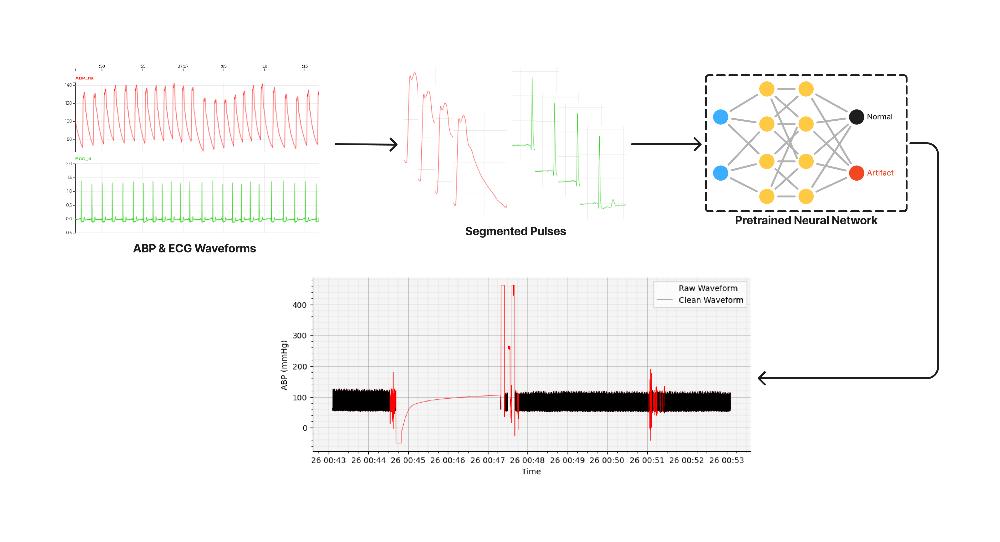
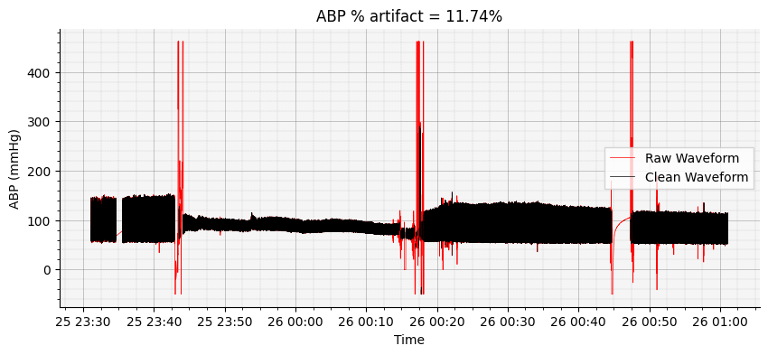
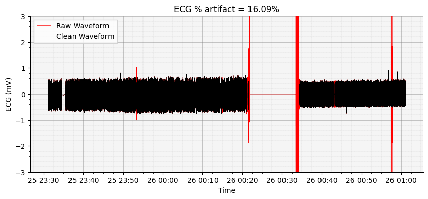
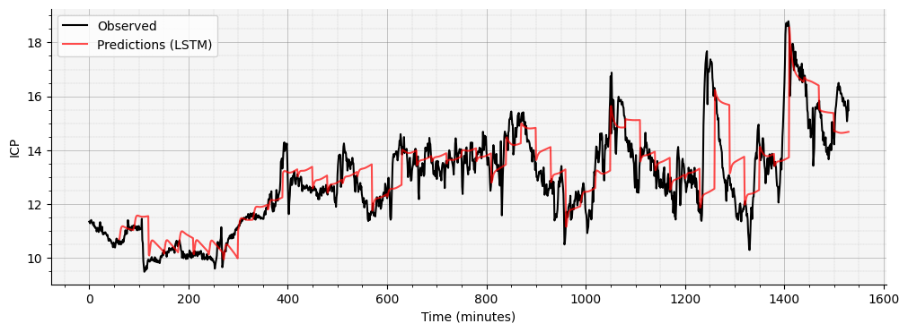
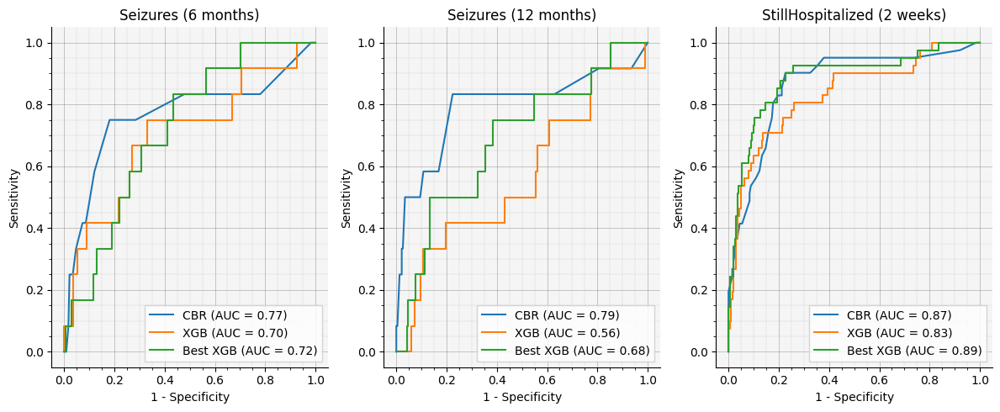

# Advanced Neuromonitoring in the Age of AI <br> Neuroinformatics and AI in the NeuroICU
2025 International Conference on Spreading Depolarizations (ICSD) \
December 8, 2025 in Old and Royal Windsor, UK.

## Notebook 4 - Clinical AI Applications

Explore modern machine-learning tools for automating neuromonitoring analysis. You will apply pretrained models for ABP/ECG waveform cleaning, perform short-term ICP forecasting using sequence models, and experiment with approaches for patient outcome prediction from multimodal physiologic features. This section highlights how AI can augment expert interpretation by scaling analysis across long, noisy ICU recordings.

**For more information or help, please email support@moberganalytics.com**

What you'll learn:
* How to clean ABP and ECG waveforms using pretrained AI models to remove artifacts and improve downstream analyses.
* How to perform ICP forecasting using sequence-based machine learning models to anticipate short-term changes in intracranial pressure.
* How to engineer multimodal physiologic features (ICP, ABP, ECG, respiratory, event markers) that serve as inputs to clinical prediction models.
* How to build and evaluate models for patient outcome prediction, using interpretable techniques suited for clinical research.
* How AI can complement clinical workflows by automating data cleanup, identifying patterns not visible in raw signals, and supporting early detection of secondary injury.

### Exercise 0: Setup Environment
Import the necessary libraries and functions we will need for the rest of the exercises


```python
# import required libraries

# standard libraries
from datetime import timedelta
from pathlib import Path

# third-party libraries
import matplotlib.pyplot as plt
import numpy as np
import pandas as pd
import torch

from sklearn.model_selection import RandomizedSearchCV, train_test_split
from sklearn.multioutput import MultiOutputClassifier
from xgboost import XGBClassifier

# moberg libraries
import sam_tools.plt as splt
from sam_tools import artifact, cbr, forecast
from cns_utils.readCNS import CNSDataSource, read_time_series_data
```


```python
%load_ext autoreload
%autoreload 2
```


```python
# set random seeds to ensure reproducibility
random_state = 42
np.random.seed(random_state);
torch.manual_seed(random_state);
```

### Exercise 1: Cleaning Waveform Data (ABP & ECG)

**Why this step?** ICU waveforms are rich but messy—flushes, re-zeroing, motion, poor contact, and electrical noise can all masquerade as physiology. Seeing how a modern detector flags likely artifacts (and how a threshold changes what you keep) is useful context for any downstream analysis.

#### How the models work

* **ABP model (`okekeclean-abp-ensemble-v1`):** an **ensemble** of fine-tuned image classifiers (pretrained CNN backbones) operating on **pulse-level snippets** rendered as fixed-size images. Ensembling stabilizes sensitivity/specificity across artifact types.
* **ECG model (`okekeclean-ecg-efficientnet-b0-v1`):** a fine-tuned image classifier (pretrained EfficientNet-B0) operating on **10-s spectrogram images** (time–frequency representation) of ECG windows.

Both models are trained on expert-labeled ICU data and output **P(artifact)** for each snippet/window. The models are available in the `moberg_dsp.quality` package.

#### How this method works

1. **Segment the waveform** into short, overlapping snippets
    * ABP → detect individual pulses and cut **pulse-level** segments.
    * ECG → cut **10-second** windows suitable for time–frequency analysis.

2. **Convert to images**
    * ABP → render the pulse trace to a standardized canvas (preserves morphology).
    * ECG → compute a short-time Fourier transform (STFT) **spectrogram** and render as an image.

3. **Classify with a pre-trained CNN** (fine-tuned on our labels) → get **P(artifact)** per snippet/window.
    * ABP uses an **ensemble**; ECG uses a single **EfficientNet-B0**.

4. **Map probabilities back to time** to obtain a **time-aligned Series** with the same datetime index as the raw waveform.

5. **Threshold and visualize** using `splt.overlay_clean_signal_on_waveform(...)`:
    * raw = red, thresholded “clean” = black.



#### What you can tweak

* **`threshold`** (e.g., 0.3 / 0.5 / 0.7 / 0.9):
  * The threshold is the cut-off probability for classifying a data point as an artifact. Regions with P(artifact) > threshold are classified as artifacts.
  * Lower threshold → more aggressive removal (higher sensitivity, more false positives).
  * Higher threshold → more conservative (retain more data, risk leaving artifact).

#### Tips & caveats

* Treat the model output as a **guide**, not ground truth. Use the overlay to sanity-check that you aren’t discarding physiologic content or keeping obvious junk.
* If you later apply this cleaning outside the notebook, **calibrate the threshold** to your dataset/task.
* Remember: the artifacts demo is **educational only** here; the forecasting and outcomes sections do **not** depend on its outputs.

> Check out our poster for more details on the artifact detection models:  
> **POSTER	21:** Transfer Learning for Artifact Detection in ICU-Collected Arterial Blood Pressure Waveforms

First, let's load the models we will use for detecting artifacts


```python
# this tells PyTorch to use the GPU if available, otherwise use the CPU
device = torch.device("cuda") if torch.cuda.is_available() else torch.device("cpu")

abp_model = artifact.load_model("okekeclean-abp-ensemble-v1", device=device)
ecg_model = artifact.load_model("okekeclean-ecg-efficientnet_b0-v1", device=device)
```

Next, we'll load some data from a CNS archive.


```python
# define the path to the CNS archive
archive = "/mnt/s3/tracktbi-data-main/121/cns/Patient_2017_Jul_25__22_46_41_896995"
# archive = "/mnt/s3/tracktbi-data-main/86/cns/Patient_03-1185"
# archive = "/mnt/s3/tracktbi-data-main/114/cns/Patient_03-1309"

# create a CNSDataSource object
data_source = CNSDataSource(str(archive))

# check the start and end times of the recording (times are in microseconds)
start_time = data_source.start_time()
end_time = data_source.end_time()

print(f"Start time: {pd.Timestamp(start_time, unit='us')}")
print(f"End time: {pd.Timestamp(end_time, unit='us')}")
```

    Start time: 2017-07-25 23:01:05.896995
    End time: 2017-07-26 16:34:42.526602


We'll list out the available modalities in the CNS archive to make sure we have ABP (or ART) and ECG data


```python
for m in sorted(data_source.get_basenames()):
    if m.startswith("ABP") or m.startswith("ART") or m.startswith("ECG"):
        print(m)
```

    ABP,Dias,Numeric,Float,IntelliVue
    ABP,Mean,Numeric,Float,IntelliVue
    ABP,Syst,Numeric,Float,IntelliVue
    ABP,na,SampleSeries,Integer,IntelliVue
    ECG,II,SampleSeries,Integer,IntelliVue


We'll read the first 2 hours of data from the recording


```python
duration_hrs = 2
duration_us = 2 * 60 * 60 * 10**6

abp_waveform = read_time_series_data(
    modality="ABP,na,SampleSeries,Integer,IntelliVue",
    patient_data_source=data_source,
    patient_is_admitted=False,
    start_time_us=start_time,
    end_time_us=start_time + duration_us,
)
ecg_waveform = read_time_series_data(
    modality="ECG,II,SampleSeries,Integer,IntelliVue",
    patient_data_source=data_source,
    patient_is_admitted=False,
    start_time_us=start_time,
    end_time_us=start_time + duration_us,
)
```

Next, we need to calculate the sampling rates of the waveforms. Since the raw waveform may exhibit variable sampling rate, we'll use the median sampling rate.


```python
abp_sampling_rate = 1.0 / abp_waveform.index.to_series().diff().dt.total_seconds().dropna().median()
print(f"Sampling rate for ABP waveform: {abp_sampling_rate:.2f} Hz")

ecg_sampling_rate = 1.0 / ecg_waveform.index.to_series().diff().dt.total_seconds().dropna().median()
print(f"Sampling rate for ECG waveform: {ecg_sampling_rate:.2f} Hz")
```

    Sampling rate for ABP waveform: 124.94 Hz
    Sampling rate for ECG waveform: 499.78 Hz


Now we can use the artifact detection models to remove artifacts from the waveforms.


```python
abp_artifacts = artifact.detect_artifacts(
    waveform=abp_waveform,
    modality="ABP",
    model=abp_model,
    params=artifact.ABPParams(sampling_rate=abp_sampling_rate),
    device=device,
    return_type="probability",
    batch_size=1024,
)
```


    running artifact detection…:   0%|          | 0/60 [00:00<?, ?it/s]


```python
# detect_artifacts returns a pandas Series containing the probability of each sample being an artifact
# it uses the same datetime index as the input waveform
abp_artifacts
```


    2017-07-25 23:31:07.851348992    0.0
    2017-07-25 23:31:07.859352320    0.0
    2017-07-25 23:31:07.867355392    0.0
    2017-07-25 23:31:07.875358720    0.0
    2017-07-25 23:31:07.883361792    0.0
                                    ... 
    2017-07-26 01:01:05.858174720    0.0
    2017-07-26 01:01:05.866178304    0.0
    2017-07-26 01:01:05.874181888    0.0
    2017-07-26 01:01:05.882185472    0.0
    2017-07-26 01:01:05.890189056    0.0
    Name: probability, Length: 652052, dtype: float64


The `splt.overlay_clean_signal_on_waveform` function can be used to overlay the clean signal on the raw waveform. It will plot the raw waveform in red with the cleaned signal overlaid in black.

The `threshold` value is used to binarize the probabilities produced by the artifact detection models. By adjusting the threshold, we can control the sensitivity of the models' predictions


```python
fig, ax = splt.overlay_clean_signal_on_waveform("ABP", abp_waveform, abp_artifacts, threshold=0.5)
ax.set_ylabel("ABP (mmHg)")
plt.show()
```


    

    


We can just as easily do the same for the ECG waveform.


```python
ecg_artifacts = artifact.detect_artifacts(
    waveform=ecg_waveform,
    modality="ECG",
    model=ecg_model,
    params=artifact.ECGParams(sampling_rate=ecg_sampling_rate),
    device=device,
    return_type="probability",
    batch_size=1024,
)
ecg_artifacts
```


    running artifact detection…:   0%|          | 0/60 [00:00<?, ?it/s]


    2017-07-25 23:31:07.851348992    0.326781
    2017-07-25 23:31:07.853349888    0.326781
    2017-07-25 23:31:07.855350528    0.326781
    2017-07-25 23:31:07.857351424    0.326781
    2017-07-25 23:31:07.859352320    0.326781
                                       ...   
    2017-07-26 01:01:05.888188416    0.000000
    2017-07-26 01:01:05.890189312    0.000000
    2017-07-26 01:01:05.892190208    0.000000
    2017-07-26 01:01:05.894191104    0.000000
    2017-07-26 01:01:05.896192000    0.000000
    Name: probability, Length: 2609744, dtype: float64


```python
fig, ax = splt.overlay_clean_signal_on_waveform("ECG", ecg_waveform, ecg_artifacts, threshold=0.5)
ax.set_ylabel("ECG (mV)")
plt.show()
```


    

    


ou may observe that some ECG artifacts exhibit significantly higher amplitude than the surrounding signal. We can modify the y-axis scale to better visualize the waveform.


```python
fig, ax = splt.overlay_clean_signal_on_waveform("ECG", ecg_waveform, ecg_artifacts, threshold=0.5)
ax.set_ylim(-3, 3)
ax.set_ylabel("ECG (mV)")
plt.show()
```


    

    


### Exercise 2: Time series Forecasting (ICP)

**Why this task?** Short-horizon ICP forecasts help you sanity-check trends, spot regime changes, and prototype decision logic (alerts, drain management) without committing to a heavy model. This demo uses a compact pretrained Long-Short-Term-Memory (LSTM) model and focuses on the **data preparation and interpretation** you’ll need in practice.

#### Model at a glance

* **Architecture:** encoder–decoder LSTM mapping 60 min of history → 30 min ahead.
* **Training:** pre-trained and packaged in forecast.load_model() so we can concentrate on preprocessing, windowing, and evaluation rather than training loops.
* **Output:** a sequence forecast that we overlay on the cleaned signal for visual QA, plus a simple numeric error (MAE).


#### How this method works

1. **Load & resample ICP:** Read one patient's ICP waveform from a CNS archive and resample to 50 Hz for a uniform sampling rate.
2. **Preprocess:** clean implausible values, smooth outliers, and downsample to minute-level resolution.
3. **Segment the recording:** Use `forecast.segment_icp_data` to create overlapping windows:
    * **Input length:** 60 minutes
    * **Output length:** 30 minutes
    * **Stride:** 5 minutes (more samples without too much overlap)
      For visualization, we then take every 6th example (`x[::6]`) so predictions are spaced 30 minutes apart.
4. Load the pretrained LSTM
5. **Predict & Overlay:**
    * `forecast.create_prediction` produces 30-min forecasts for each selected window
    * `splt.overlay_forecast_on_waveform` draws these predictions on top of the preprocessed waveform so you can see where the model tracks vs drifts.
6. **Evaluate:**
    * `forecast.mae` reports Mean Absolute Error over the aligned forecasted interval - this is good for quick sanity checks.

> *van Leeuwen, F. D., Bhattacharyay, S., Carriero, A., Moyer, E. J., & Moberg, R. (2024). Predicting the trajectory of intracranial pressure in patients with traumatic brain injury: evaluation of a foundation model for time series. arXiv preprint arXiv:2410.14333.*

We'll start by loading the ICP waveform for one of the patients.


```python
archive = "/mnt/s3/tracktbi-data-main/121/cns/Patient_2017_Jul_27__9_53_25_692335"

# create a CNSDataSource object
data_source = CNSDataSource(str(archive))

# check the start and end times of the recording (times are in microseconds)
start_time = data_source.start_time()
end_time = data_source.end_time()

print(f"Start time: {pd.Timestamp(start_time, unit='us')}")
print(f"End time: {pd.Timestamp(end_time, unit='us')}")
```

    Start time: 2017-07-27 10:07:49.692335
    End time: 2017-07-28 12:05:48.240480


```python
# in this case, we will load the entire recording
icp_waveform = read_time_series_data(
    "ICP,na", data_source, False, start_time_us=start_time, end_time_us=end_time
)

# we can take a look at the raw waveform
fig, ax = splt.plot_waveform(icp_waveform)
ax.set_ylabel("ICP (mmHg)")
plt.show()
```


    

    


### Preprocessing ICP Data

Before we can run the ICP waveform through the LSTM model, we need to preprocess it. To do so we will implement the `preprocess_icp_data` function which will:

1. **Guard rails:** set implausible values (e.g., < -5 or > 50 mmHg) to NaN, then forward/back-fill short gaps.
2. **Outlier smoothing:** sliding window replacement of >3*std outliers (here windows of ~20 min at 50 Hz; step ~1 min) to dampen spikes without erasing structure.
3. **Downsample:** aggregate to 1 value per minute, which matches the forecasting horizon and keeps the model small/stable.


```python
def preprocess_icp_data(icp_data, sampling_rate=50):
    """
    Preprocess ICP data according to the described method.

    Parameters:
    icp_data (np.array): Raw ICP data
    sampling_rate (int): Target sampling rate of the data (default 50 Hz)

    Returns:
    np.array: Preprocessed and downsampled ICP data
    """

    # Step 1: Global thresholding and forward filling
    def global_threshold_and_fill(data):
        thresholded_data = np.where((data >= -5) & (data <= 50), data, np.nan)
        return pd.Series(thresholded_data).ffill().bfill().values

    icp_data = global_threshold_and_fill(icp_data)

    # Step 2: Smoothing algorithm
    def smooth_data(data, window_size=60000, step_size=3000):
        smoothed_data = np.copy(data)
        for i in range(0, len(data) - window_size + 1, step_size):
            window = smoothed_data[i:i+window_size]
            window_mean = np.mean(window)
            window_std = np.std(window)

            # Replace outliers with window mean
            outlier_mask = np.abs(window - window_mean) > 3 * window_std
            window[outlier_mask] = window_mean

            smoothed_data[i:i+window_size] = window

        return smoothed_data

    icp_data = smooth_data(icp_data)

    # Step 3: Downsampling
    def downsample_data(data, sampling_rate=50, target_rate=1/60):
        points_per_sample = int(sampling_rate / target_rate)
        num_samples = len(data) // points_per_sample
        downsampled_data = np.array([np.mean(data[i*points_per_sample:(i+1)*points_per_sample])
                                     for i in range(num_samples)])
        return downsampled_data

    icp_data = downsample_data(icp_data, sampling_rate)

    return icp_data
```


```python
# first, we need to resample waveform to a constant sampling rate of 50Hz
icp_data_50Hz = icp_waveform.resample(timedelta(seconds=1/50)).mean()
clean_icp_waveform = preprocess_icp_data(icp_data_50Hz)
```


```python
# compare the original and preprocessed ICP waveforms
fig, axes = plt.subplots(2, 1, figsize=(6, 6))

for ax, data, title in zip(axes, [icp_data_50Hz, clean_icp_waveform], ["Raw ICP Waveform", "Preprocessed ICP Waveform"]):
    ax.plot(data)
    ax.set_xlabel("Time")
    ax.set_ylabel("ICP (mm Hg)")
    ax.set_title(f"{title}")
    splt.style_axis(ax)

fig.tight_layout()
plt.show()
```


    

    


Now we can see the shape of the signal a lot better.

The LSTM model was trained to predict the next 30 minutes of ICP data, given the previous 60 minutes of ICP data.

Before we can make predictions, we need to segment the data into chunks that can be used as input for the model.

To train the model we need to divide part of the signal as input and part of the signal as output. We do this by taking the first 60 minutes and input (X) and the next 30 minutes as output (Y). We can then move the start of the input, e.g., 30 minutes and then do the same this. 


```python
# we need to supply the following variables:
# - input length: 60, as we use 60 minutes of data
# - output length: 30, as we predict the next 30 minutes.
# - stride length: 5, we move 5 minutes every time to create a lot of examples.
X, Y = forecast.segment_icp_data(clean_icp_waveform, input_length=60, images/output_length=30, stride_len=5)

# we will extract samples every 30 minutes from the data and format them for the LSTM model
X_every_30_min = X[::6]
X_every_30_min = torch.permute(X_every_30_min, (0, 2, 1))
```

Next, let's load the model and make some predictions.


```python
forecast_model = forecast.load_model()
```


```python
preds_lstm = forecast.create_prediction(X_every_30_min, forecast_model)
```


```python
splt.overlay_forecast_on_waveform(clean_icp_waveform, preds_lstm)
plt.show()
```


    

    


Finally, we can evaluate the performance of the model by computing the Mean Absolute Error.


```python
forecast.mae(clean_icp_waveform, preds_lstm)
```

     The mean absolute error for one data point is 0.74
     For the 90th percentile the absolute error is 1.61
     For the 99th percentile the absolute error is 4.71


    

    


### Exercise 3: Predicting Patient Outcomes

**Why this task?** Beyond signal quality and short-horizon forecasting, many analyses require patient-level predictions from tabular features (demographics, injury details, early clinical variables). Here we compare two complementary approaches on the TRACK-TBI cohort: a transparent Case-Based Reasoning (CBR) method and a strong off-the-shelf baseline, XGBoost.

> This section is independent of the waveform demos above. It uses preprocessed Common Data Elements from a subset of TRACK-TBI patients (features + labeled endpoints) rather than outputs from artifact cleaning or ICP forecasting.

#### Data at a glance
* **Features:** one-hot encoded clinical & study variables (374 columns).
* **Endpoints:** continued hospitalization at 2 weeks; seizures at 6 months; seizures at 12 months.
* **Cohort:** 1,217 patients with aligned features/endpoints.
* We split patients 80/20 into train/test with a fixed random seed for reproducibility.

#### How the models work

* **Case-Based Reasoning (CBR):**
    * Compute **feature weights** that reflect predictive value.
    * For a query patient, compute **weighted Euclidean distances** to all training patients.
    * Select up to **n** closest “**doppelgangers**” under a **distance threshold**.
    * Predict endpoint probabilities by averaging the endpoints of those neighbors.
    * **Knobs you can adjust:** `dist_thr` (closeness criterion) and `n_dpgrs` (max neighbors).
    * **Strengths:** interpretable and easy to audit (“who did we match and why?”).
    * **Caveats:** depends on sensible weights; very tight thresholds may yield no neighbors for rare phenotypes.
    


* **XGBoost (multi-output):**
    * A gradient-boosted tree classifier trained per endpoint (wrapped in MultiOutputClassifier).
    * **Baseline** model uses modest depth and learning rate to avoid overfitting.
    * We also run a `RandomizedSearchCV` over `n_estimators`, `max_depth`, and `learning_rate` to produce a **tuned** model.
    * **Strengths:** strong tabular baseline; handles nonlinearity and interactions.
    * **Caveats:** less directly interpretable at the patient level; tuning can be compute-intensive.

#### What you can tweak

* **CBR**
    * `dist_thr`: widen (e.g., 3→3.5) to avoid empty neighbor sets; narrow to enforce stricter analogs.
    * `n_dpgrs`: larger n reduces variance but risks including less-similar cases.
* **XGBoost**
    * **Search space:** extend `n_estimators` (e.g., include 800) or `max_depth` (2–8) and observe diminishing returns.

We'll start by loading the dataset


```python
# load  data
features, endpoints = cbr.load_tracktbi_data()

print("features.shape", features.shape)
print("endpoints.shape", endpoints.shape)
```

    features.shape (1217, 374)
    endpoints.shape (1217, 3)


The `features` dataframe includes 374 features (columns) for each patient (identified by a unique `GUID`). These include [one-hot encoded](https://en.wikipedia.org/wiki/One-hot#Machine_learning_and_statistics) variables from electronic health records and clinical assessments.


```python
features.head()
```


<div>
<style scoped>
    .dataframe tbody tr th:only-of-type {
        vertical-align: middle;
    }

    .dataframe tbody tr th {
        vertical-align: top;
    }

    .dataframe thead th {
        text-align: right;
    }
</style>
<table border="1" class="dataframe">
  <thead>
    <tr style="text-align: right;">
      <th></th>
      <th>AOCInd_No</th>
      <th>AOCInd_Suspected</th>
      <th>AOCInd_Yes</th>
      <th>ActiveMilitary_No</th>
      <th>ActiveMilitary_Yes</th>
      <th>AdmitTyp_ED Discharge</th>
      <th>AdmitTyp_Hospital admit no ICU</th>
      <th>AdmitTyp_Hospital admit with ICU</th>
      <th>AirbagDplyInd_No</th>
      <th>AirbagDplyInd_Not applicable</th>
      <th>...</th>
      <th>TBIMechTyp_Other penetrating brain injury</th>
      <th>EDIVBlood</th>
      <th>MarshallCTScore</th>
      <th>Site</th>
      <th>InjSeverScore</th>
      <th>ISSNonHeadNeckDer</th>
      <th>ISSHeadNeckDer</th>
      <th>CTDaysSinceBaseline</th>
      <th>MidlneShftSuprtentorialMeasr</th>
      <th>Age</th>
    </tr>
    <tr>
      <th>GUID</th>
      <th></th>
      <th></th>
      <th></th>
      <th></th>
      <th></th>
      <th></th>
      <th></th>
      <th></th>
      <th></th>
      <th></th>
      <th></th>
      <th></th>
      <th></th>
      <th></th>
      <th></th>
      <th></th>
      <th></th>
      <th></th>
      <th></th>
      <th></th>
      <th></th>
    </tr>
  </thead>
  <tbody>
    <tr>
      <th>TBIXE036AJV</th>
      <td>0</td>
      <td>0</td>
      <td>1</td>
      <td>1</td>
      <td>0</td>
      <td>0</td>
      <td>1</td>
      <td>0</td>
      <td>0</td>
      <td>0</td>
      <td>...</td>
      <td>0</td>
      <td>0.0</td>
      <td>0.0</td>
      <td>0.352941</td>
      <td>-1.142930</td>
      <td>-0.706743</td>
      <td>-0.888251</td>
      <td>-0.329068</td>
      <td>-0.266744</td>
      <td>1.030861</td>
    </tr>
    <tr>
      <th>TBIAY573HGX</th>
      <td>0</td>
      <td>0</td>
      <td>1</td>
      <td>1</td>
      <td>0</td>
      <td>0</td>
      <td>1</td>
      <td>0</td>
      <td>0</td>
      <td>1</td>
      <td>...</td>
      <td>0</td>
      <td>0.0</td>
      <td>0.2</td>
      <td>0.117647</td>
      <td>-0.473442</td>
      <td>-0.706743</td>
      <td>0.087075</td>
      <td>-0.475092</td>
      <td>-0.266744</td>
      <td>1.725183</td>
    </tr>
    <tr>
      <th>TBIVR731TY9</th>
      <td>0</td>
      <td>0</td>
      <td>1</td>
      <td>1</td>
      <td>0</td>
      <td>1</td>
      <td>0</td>
      <td>0</td>
      <td>0</td>
      <td>1</td>
      <td>...</td>
      <td>0</td>
      <td>0.0</td>
      <td>0.0</td>
      <td>0.117647</td>
      <td>NaN</td>
      <td>NaN</td>
      <td>NaN</td>
      <td>-0.037020</td>
      <td>-0.266744</td>
      <td>-0.994245</td>
    </tr>
    <tr>
      <th>TBIDB434JFX</th>
      <td>0</td>
      <td>0</td>
      <td>1</td>
      <td>1</td>
      <td>0</td>
      <td>0</td>
      <td>0</td>
      <td>1</td>
      <td>0</td>
      <td>0</td>
      <td>...</td>
      <td>0</td>
      <td>0.0</td>
      <td>0.2</td>
      <td>0.000000</td>
      <td>5.743233</td>
      <td>-0.151500</td>
      <td>8.133512</td>
      <td>-0.548104</td>
      <td>-0.266744</td>
      <td>-1.052105</td>
    </tr>
    <tr>
      <th>TBIEP236EMW</th>
      <td>0</td>
      <td>0</td>
      <td>1</td>
      <td>1</td>
      <td>0</td>
      <td>0</td>
      <td>1</td>
      <td>0</td>
      <td>0</td>
      <td>1</td>
      <td>...</td>
      <td>0</td>
      <td>0.0</td>
      <td>0.2</td>
      <td>0.117647</td>
      <td>-0.951647</td>
      <td>-0.706743</td>
      <td>-0.522504</td>
      <td>-0.329068</td>
      <td>-0.266744</td>
      <td>0.915141</td>
    </tr>
  </tbody>
</table>
<p>5 rows × 374 columns</p>
</div>


```python
endpoints.head()
```


<div>
<style scoped>
    .dataframe tbody tr th:only-of-type {
        vertical-align: middle;
    }

    .dataframe tbody tr th {
        vertical-align: top;
    }

    .dataframe thead th {
        text-align: right;
    }
</style>
<table border="1" class="dataframe">
  <thead>
    <tr style="text-align: right;">
      <th></th>
      <th>Seizures_6_months</th>
      <th>Seizures_12_months</th>
      <th>StillHospitalized_2_weeks</th>
    </tr>
    <tr>
      <th>GUID</th>
      <th></th>
      <th></th>
      <th></th>
    </tr>
  </thead>
  <tbody>
    <tr>
      <th>TBIXE036AJV</th>
      <td>0.0</td>
      <td>0.0</td>
      <td>0.0</td>
    </tr>
    <tr>
      <th>TBIAY573HGX</th>
      <td>0.0</td>
      <td>0.0</td>
      <td>0.0</td>
    </tr>
    <tr>
      <th>TBIVR731TY9</th>
      <td>0.0</td>
      <td>0.0</td>
      <td>0.0</td>
    </tr>
    <tr>
      <th>TBIDB434JFX</th>
      <td>0.0</td>
      <td>0.0</td>
      <td>0.0</td>
    </tr>
    <tr>
      <th>TBIEP236EMW</th>
      <td>0.0</td>
      <td>0.0</td>
      <td>0.0</td>
    </tr>
  </tbody>
</table>
</div>


Let's take a look at the distribution of positive and negative cases for each endpoint


```python
cbr.plot_endpoint_distribution(endpoints)
```


    

    


Continued hospitalization after 2 weeks is uncommon, with only about 17% of patients experiencing it. While seizures at 6 and 12 months are more rare, only occurring in 5% of patients. 

#### Train/test split

In order to evaluate the performance of the model fairly, we will split the data into separate training and test sets (80/20 split).

* For the CBR model, the training set will be used to compute feature weights. Patients in this set will serve as doppelgangers for the test set.
* For the XGBoost model, the training set will be used to train the initial model and to perform hyperparameter optimization via `RandomizedSearchCV`.
* Both models will be evaluated based on their performance in predicting the endpoints of patients in the test set.


```python
# use sklearn's train_test_split function to split the data
F_train, F_test, E_train, E_test = train_test_split(
    features.values, endpoints.values, test_size=0.2, random_state=42
)

print("train:", F_train.shape, E_train.shape)
print("test:", F_test.shape, E_test.shape)
```

    train: (973, 374) (973, 3)
    test: (244, 374) (244, 3)


#### Case-Based Reasoning Algorithm

To implement the CBR algorithm we will need to:

1. **Compute feature weights:** 
    * The weights for the CBR algorithm were obtained by training separate random forests for each endpoint end extracting the feature importance scores from each model. These scores were then normalized to sum to 1.
    * We will load pre-comuted feature weights using the `cbr.load_cbr_weights()` function.
2. **Calculate similarity between patients:**  We will use the `weighted_distance()` function to calculate the weighted Euclidean distance between the query patient and all other patients in the training set.
3. **Prediction:** For each test patient, we will identify the closest doppelgangers (sorting by distance, selecting up to `n_dpgrs`) and average labels to obtain per-endpoint probabilities.


```python
def weighted_distance(u: np.ndarray, v: np.ndarray, w: np.ndarray) -> np.ndarray:
    """"Compute the euclidean distance between u and v, weighted by w"""
    diff = np.nan_to_num(u - v, nan=0.0)  # deal with nan features
    wsdist = (diff**2) * w  # weighted, squared distances
    dist = wsdist.sum(axis=1) ** 0.5 # sqrt (sum, squared distances)
    return dist


def predict_endpoints(
    query: np.array,
    weights: np.array,
    features: np.array,
    endpoints: np.array,
    dist_thr: int = 3,
    n_dpgrs: int = 100,
) -> np.array:
    """Predict endpoints for a given patient (the query)

    Args:
        query: feature vector for a new (query) patient
        weights: weights for the CBR algorithm
        features: feature matrix for known patients
        endpoints: endpoint matrix for known patients
        dist_thr: distance threshold for selecting doppelgangers
        n_dpgrs: the maximum number of doppelgangers to use for endpoint prediction

    Returns:
        np.ndarray: predicted endpoint probabilities for the query patient
    """

    # compute weighted distances from other patients
    dist = weighted_distance(features, query, weights)

    # find the patients that are most similar to the query patient
    I = dist.argsort()[:n_dpgrs]  # get the indices of the patients sorted by distance
    dpgrs = I[dist[I] <= dist_thr]

    if len(dpgrs) == 0:
        raise ValueError("No doppelgangers found")

    # determine endpoint probabilities
    y_hat = endpoints[dpgrs, :].sum(axis=0) / len(dpgrs)

    return y_hat
```


```python
# load the feature weights
weights = cbr.load_cbr_weights()
weights.shape
```


    (374,)


```python
# evaluate the model

y_true_cbr, preds_cbr, probs_cbr = [], [], []

# loop over patients in the test set
for i in range(E_test.shape[0]):
    prob = predict_endpoints(F_test[i], weights, F_train, E_train)
    y_true_cbr.append(E_test[i])
    preds_cbr.append((prob > 0.5).astype(int))
    probs_cbr.append(prob)

cbr_metrics = cbr.evaluate_model(y_true_cbr, preds_cbr, probs_cbr)
print(cbr_metrics)
```

    AUC: 0.8086
    Sensitivity: 0.0407
    Specificity: 1.0000
    Accuracy: 0.8074


#### XGBoost

We need to train a separate XGBoost model for each endpoint. Wrapping the `XGBClassifier` in a` MultiOutputClassifier` allows us to train a model for each endpoint at the same time.


```python
clf = MultiOutputClassifier(XGBClassifier(
    n_estimators=200,
    max_depth=2,
    learning_rate=0.4,
    tree_method="hist",
    random_state=random_state,
))

# train the model
clf.fit(F_train, E_train)

# make predictions for the test set
probs = [est.predict_proba(F_test) for est in clf.estimators_]
```


```python
# evaluate the model
y_true_xgb, preds_xgb, probs_xgb = [], [], []

# loop over patients in the test set
for i in range(E_test.shape[0]):
    y_true_xgb.append(E_test[i])
    endpoint_probs = np.array([p[i][1] for p in probs])
    preds_xgb.append((endpoint_probs > 0.5).astype(int))
    probs_xgb.append(endpoint_probs)

xgb_metrics = cbr.evaluate_model(y_true_xgb, preds_xgb, probs_xgb)
print(xgb_metrics)
```

    AUC: 0.6995
    Sensitivity: 0.2148
    Specificity: 0.9579
    Accuracy: 0.7828


#### Hyperparameter Optimization for XGBoost

We've now trained a simple XGBoost model. The parameters used above were just an initial guess. We can improve the performance of the model by tuning the hyperparameters.

The `RandomizedSearchCV` function will try different combinations of the hyperparameters and select the best one based on the ROC AUC score.


```python
# define the distribution of hyperparameters to try
param_dist = {
    "estimator__n_estimators": [500, 800],
    "estimator__max_depth": [6, 8],
    "estimator__learning_rate": [0.005, 0.01],
}
```


```python
# run the search
clf_search = RandomizedSearchCV(
    MultiOutputClassifier(XGBClassifier(
        tree_method="hist",
        random_state=random_state,
    )),
    param_distributions=param_dist,
    n_iter=3,
    cv=2,
    scoring="roc_auc",
    random_state=random_state,
    n_jobs=1,
)

# identify the best model
clf_search.fit(F_train, E_train)
best_clf = clf_search.best_estimator_

# print best parameters
print("best parameters found:")
print(clf_search.best_params_)
```

    best parameters found:
    {'estimator__n_estimators': 800, 'estimator__max_depth': 6, 'estimator__learning_rate': 0.005}


```python
# make predictions for the test set
probs = [est.predict_proba(F_test) for est in best_clf.estimators_]
```


```python
# evaluate the model
y_true_best, preds_best, probs_best = [], [], []

for i in range(E_test.shape[0]):
    y_true_best.append(E_test[i])
    endpoint_probs = np.array([p[i][1] for p in probs])
    preds_best.append((endpoint_probs > 0.5).astype(int))
    probs_best.append(endpoint_probs)

tuned_xgb = cbr.evaluate_model(y_true_best, preds_best, probs_best)
print(tuned_xgb)
```

    AUC: 0.7632
    Sensitivity: 0.1870
    Specificity: 0.9762
    Accuracy: 0.8197


#### Compare CBR Algorithm with XGBoost

Now, we can compare our algorithm against the machine learning approach by taking a look at the Receiver Operating Characteristic (ROC) curves for each endpoint.

* The ROC curve is a graphical plot that illustrates the diagnostic ability of a binary classifier system as its discrimination threshold is varied.
* We'll plot the ROC curves for both our Case-Based Reasoning (CBR) algorithm and the XGBoost model side by side for each endpoint.
* This comparison will allow us to visually assess how well each model distinguishes between the positive and negative classes across different thresholds.
* We'll also compare the Area Under the Curve (AUC) scores, which provide a single scalar value representing the overall discriminative ability of each model.


```python
cbr.compare_models(endpoints, [cbr_metrics, xgb_metrics, tuned_xgb], ["CBR", "XGB", "Best XGB"])
```


    

    

