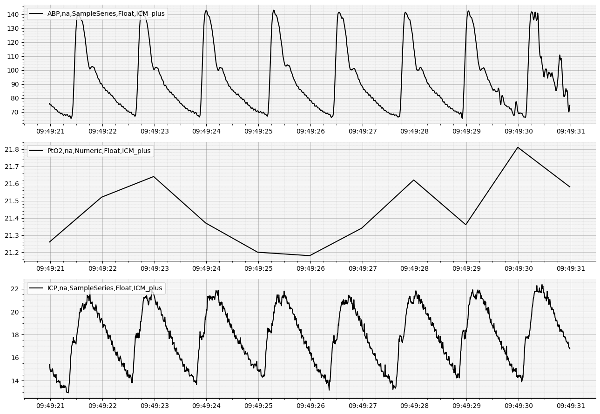

# INTS Neuromonitoring Workshop - ICM+ and Moberg Analytics
## Moberg Analytics Sandbox - Lab Exercise 01
## Converting data from ICMH5 to Moberg CNS format

**For more information or help, please email support@moberganalytics.com**

- In this lab, we will show you how to convert data from ICM+ HDF5 output into Moberg CNS format through the use of our `cns_utils` library.

### Initial setup


```python
# import libraries we'll use in this exercise
import matplotlib.pyplot as plt
import h5py
import os
from pathlib import Path

from sam_tools.cns import (
    load_h5_dataset_as_data_frame,
    explore_hdf5_group,
    style_plot,
    reset,
)
from cns_utils import CNSDataSource
```


```python
# Define paths to the data and output
hdf5_data_path = str(Path('data/icm_plus/patient1.hdf5').resolve())
output_cns_directory_path = str(Path('data/01_output').resolve())

# Create the output folder
os.makedirs(output_cns_directory_path, exist_ok=True) # Create the directory if it doesn't exist already.

# Set up the CNS data source (for when we read back the output)
output_cns_data_source = CNSDataSource(output_cns_directory_path)
```

### Explore the HDF5 Data

There are many ways to explore HDF5 data, in this case, we can just look recursively through the file to see what groups and datasets exist.

HDF5 files are organized into datasets (which contain actual data) and groups (similar to folders). We can use the `explore_hdf5_group` function to recursively travese the file tree, displaying information about each group and dataset encountered in the HDF5 file.


```python
# we can load the file into python
with h5py.File(hdf5_data_path) as file:
    # and then pass it to the function
    explore_hdf5_group(file)
```

    Group: annotations
        Dataset: events, Shape: (2,), Dtype: [('eventname', 'O'), ('starttime', '<u8'), ('duration', '<u8'), ('comment', 'O')]
        Dataset: notes, Shape: (1,), Dtype: [('starttime', '<u8'), ('duration', '<u4'), ('text', 'O')]
    Group: aux
        Group: ICM+
            Dataset: DTAFilesLog, Shape: (11,), Dtype: object
            Dataset: dataSetsInfo, Shape: (1,), Dtype: [('starttime', '<u8'), ('endtime', '<u8'), ('interval', '<f8'), ('signalscfg', 'O'), ('analysiscfg', 'O')]
            Dataset: displayLayout, Shape: (1,), Dtype: object
            Dataset: icmevents, Shape: (1,), Dtype: object
            Dataset: icmtests, Shape: (1,), Dtype: object
    Group: definitions
        Dataset: eventTypes, Shape: (2,), Dtype: [('event', 'O'), ('description', 'O')]
        Dataset: indexStruct, Shape: (4,), Dtype: [('field', 'O'), ('description', 'O')]
        Dataset: qualityRef, Shape: (25,), Dtype: [('indicator', '<u4'), ('description', 'O')]
        Dataset: qualityStruct, Shape: (2,), Dtype: [('field', 'O'), ('description', 'O')]
    Dataset: global.quality, Shape: (1,), Dtype: [('time', '<u8'), ('value', '<u4')]
    Group: numerics
        Dataset: pto2, Shape: (87773,), Dtype: float32
    Dataset: packaging.log, Shape: (16,), Dtype: object
    Dataset: patient.info, Shape: (10,), Dtype: [('Field', 'O'), ('Value', 'O')]
    Dataset: patient.notes, Shape: (4,), Dtype: object
    Group: summaries
        Dataset: minutes, Shape: (6105,), Dtype: [('datetime', '<f8'), ('slow', '<f4'), ('ICP', '<f4'), ('CPP', '<f4'), ('ABP', '<f4'), ('AMP', '<f4'), ('RA', '<f4'), ('HR', '<f4'), ('RR', '<f4'), ('RAP', '<f4'), ('PRx', '<f4'), ('sABP', '<f4'), ('dABP', '<f4'), ('ICPmax', '<f4'), ('ICPmin', '<f4'), ('ppABP', '<f4'), ('CPPmed5m', '<f4'), ('PbtO2', '<f4'), ('ECG', '<f4')]
    Group: waves
        Dataset: abp, Shape: (10532794,), Dtype: float32
        Dataset: icp, Shape: (10532794,), Dtype: float32


### Convert Datasets to CNS Format

The Moberg CNS format can store time series data and events. It is a file and directory-based system where each signal or event type is stored as a collection of files. The CNS format is useful for storing time series data efficiently and also for reading sections of large recordings with minimal latency.

*Let's extract the ABP, ICP, and PtO2 Datasets from ICM+ and convert them to CNS format.*


```python
# this class will handle writing the data to the CNS format
from cns_utils import ModalityRecorder

# reset the output directory so that this cell can be run repeatedly
reset(output_cns_data_source)

# open the file
with h5py.File(hdf5_data_path) as file:
    # Get all the datasets and give each of them a CNS-style file name (Modality, Location, Type, Representation, Source)
    abp = file["waves/abp"], "ABP,na,SampleSeries,Float,ICM_plus"
    icp = file["waves/icp"], "ICP,na,SampleSeries,Float,ICM_plus"
    ptO2 = file["numerics/pto2"], "PtO2,na,Numeric,Float,ICM_plus"

    # iterate over the modalities and convert them to CNS format
    for dataset, data_id in (abp, icp, ptO2):
        # Load each dataset as a DataFrame
        data_frame = load_h5_dataset_as_data_frame(dataset)

        # Create a ModalityRecorder for each modality
        recorder = ModalityRecorder(output_cns_directory_path, data_id, units=dataset.attrs["units"])

        # Write the data to the CNS format
        recorder.store_data_frame(data_frame)
        print(f"Successfully converted {data_id}")
```

    Successfully converted ABP,na,SampleSeries,Float,ICM_plus
    Successfully converted ICP,na,SampleSeries,Float,ICM_plus
    Successfully converted PtO2,na,Numeric,Float,ICM_plus


### Aside: CNS Format Documentation

**Modality** - the title of the measurement or measurement group (EEG, ECG, etc.)

**Location** - the location of the measurement, if applicable (Left, Right, etc.). Occasionally, the location field will be used as an alternative attribute (e.g. ABP,Systolic, ABP,Diastolic)

**Type** - the type of measurement being stored (Numeric, SparseNumeric, SampleSeries, Event, NumericQuality, WaveQuality, or Impedance).

**Representation** - the underlying bit representation of the data (Composite, Integer, Float, and Char). Composite files contain multiple data points collected at the same time from different locations.

**Source** - the name of the monitoring device from which the measurement originated

### Read the data from CNS format

The Python data science library `pandas` provides `DataFrame` and `Series` objects for analyzing time series data. These objects also integrate seamlessly with `numpy`, `matplotlib`, `scipy`, and many other Python libraries for data analysis. Since `cns_utils` understands how to read raw data into `DataFrame` or `Series` objects appropriately, we can take full advantage of both the efficiency of the Moberg CNS format and also the Python data science ecosystem.

Standalone signals (ABP, ICP) will be read by `cns-utils` as a pandas `Series` object, while composite data (like EEG) will be returned as a `DataFrame` because all channels share the same timestamps.

The timing information is not stored in its own column. Instead, it is the index of the `DataFrame` or `Series` as a `DatetimeIndex`.


```python
# define the duration of the data we want to review
duration = 10 * 1e6 # 10 seconds

# basenames are all of the signals that are detected inside of the CNS directory.
basenames = output_cns_data_source.get_basenames()

# We can create a plot for each signal by using "subplots" and 
fig, axes = plt.subplots(nrows=len(basenames), figsize=(13,9))

# loop over each signal and plot it
for axis, modality in zip(axes, basenames):
    # get the reviewer object for the modality
    reviewer = output_cns_data_source.get_modality_data_reviewer(modality)

    # create a dataframe with the data from the desired recording period
    data_frame, _ = reviewer.review_data_frame(reviewer.start_time(), reviewer.start_time() + duration)

    # plot the data
    axis.plot(data_frame, label=modality, color="black", lw=1.5)

    # style the axis to make it look nice
    style_plot(axis)

# show the plot
plt.tight_layout()
plt.show()
```


    

    

