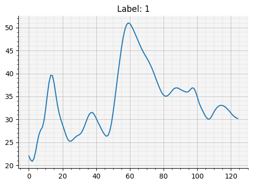
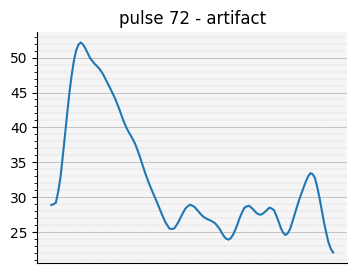
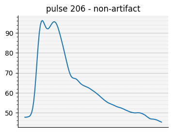
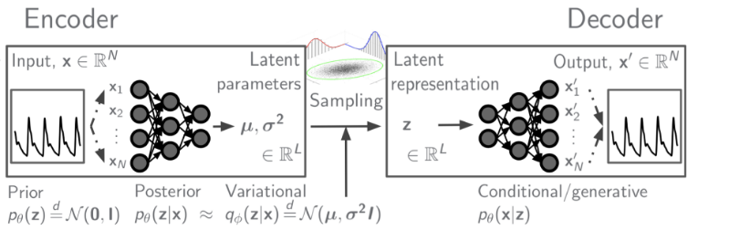
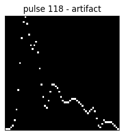
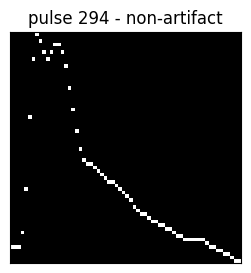
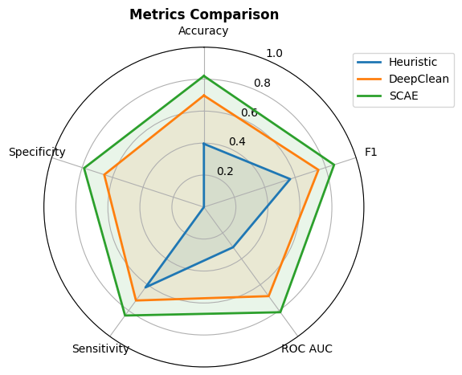
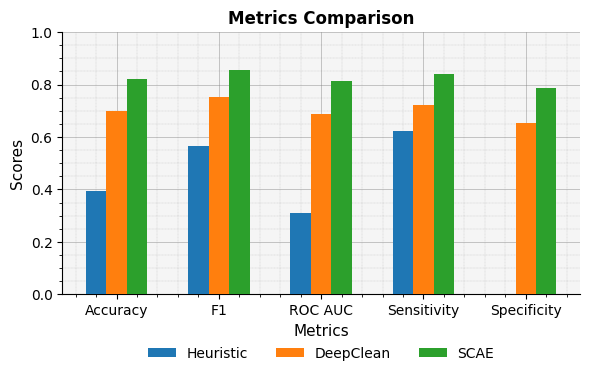

# INTS Neuromonitoring Workshop - ICM+ and Moberg Analytics
## Moberg Analytics Sandbox - Lab Exercise 02
## Evaluating Artifact Detection Algorithms for Arterial Blood Pressure Signals

**For more information or help, please email support@moberganalytics.com**

- In this lab, we will evaluate the performance of different algorithms for detecting artifacts in ABP waveforms.

> The anonymized PRECICECAP data used in this notebook was graciously provided by Dr Jonathan Elmer of Univeristy of Pittsburgh under NIH grant 1R01NS119825-01, "PREcision Care In Cardiac ArrEst - ICECAP (PRECICECAP)".

### Import required libraries


```python
from pathlib import Path
import matplotlib.pyplot as plt
import numpy as np

from sam_tools.artifact.models import (
    DeepClean,
    SCAEClassifier,
    HeuristicModel
)
from sam_tools.artifact.training import train_model, evaluate_model, plot_model_metrics
from sam_tools.artifact.dataset import PulseDataset
from sam_tools.utils import plot
```


```python
# set random seeds for reproducibility
np.random.seed(42)

# set the data path
data_path = Path('data/precicecap').resolve()
```

### Data Exploration

- We are working with data from 5 patients from the [PRECICECAP](https://pubmed.ncbi.nlm.nih.gov/35229231/) dataset 
  - Segments of ABP recordings were taken from each patient and underwent preprocessing to identify and extract ABP pulses
  - This dataset includes 1573 pulses (about 310 recordings per patient)
  - Pulses have been marked as 'artifact' (1) or 'non-artifact' (0) by clinical experts.
- We will be using a custom [PyTorch dataset](https://pytorch.org/tutorials/beginner/basics/data_tutorial.html), `PulseDataset` to access these pulses.

#### Creating a `PulseDataset`


```python
# first, we need to define the list of patient identifiers to load
train_patients = [
    "50_Patient_2023-06-12_21:10",
    "74_Patient_2023-08-05_06:00",
    "90_Patient_2023-03-21_12:19",
    "110_Patient_2023_Sep_28__23_52_07_705708",
]
test_patient = "4_Patient_2022-02-05_08:59"

# now, we can create a `PulseDataset` for one of the patients (e.g. 4_Patient_2022-02-05_08:59)
ds = PulseDataset(data_path=data_path, patient=test_patient)

# metadata about the dataset can be accessed via `ds.pulses`
display(ds.pulses.head(3))
```


<div>
<style scoped>
    .dataframe tbody tr th:only-of-type {
        vertical-align: middle;
    }

    .dataframe tbody tr th {
        vertical-align: top;
    }

    .dataframe thead th {
        text-align: right;
    }
</style>
<table border="1" class="dataframe">
  <thead>
    <tr style="text-align: right;">
      <th></th>
      <th>plot_id</th>
      <th>patient</th>
      <th>mode</th>
      <th>start_artifact</th>
      <th>end_artifact</th>
      <th>start_ts</th>
      <th>est_start_time</th>
      <th>label</th>
      <th>pulse_data</th>
    </tr>
  </thead>
  <tbody>
    <tr>
      <th>0</th>
      <td>0</td>
      <td>4_Patient_2022-02-05_08:59</td>
      <td>ART</td>
      <td>481060</td>
      <td>481169</td>
      <td>1644055438314314</td>
      <td>2022-02-05 05:03:58</td>
      <td>1</td>
      <td>[22.0, 21.0, 20.75, 21.9375, 24.3125, 26.5, 27...</td>
    </tr>
    <tr>
      <th>1</th>
      <td>1</td>
      <td>4_Patient_2022-02-05_08:59</td>
      <td>ART</td>
      <td>481169</td>
      <td>481229</td>
      <td>1644055439186721</td>
      <td>2022-02-05 05:03:59</td>
      <td>1</td>
      <td>[30.0625, 30.0625, 30.3125, 30.625, 31.0625, 3...</td>
    </tr>
    <tr>
      <th>2</th>
      <td>2</td>
      <td>4_Patient_2022-02-05_08:59</td>
      <td>ART</td>
      <td>340523</td>
      <td>340581</td>
      <td>1644054313493427</td>
      <td>2022-02-05 04:45:13</td>
      <td>1</td>
      <td>[40.75, 41.0625, 41.0625, 41.0, 41.875, 44.375...</td>
    </tr>
  </tbody>
</table>
</div>


```python
# we can also access the raw signal data via `ds[idx]`
# where `idx` is the index of the pulse in the dataset
pulse, label = ds[0]

# let's take a look at the first pulse
fig, ax = plot(pulse)
ax.set_title(f"Label: {label}")
plt.show()
```


    

    


#### Visualize pulses

Artifacts are distortions in the data not representing actual blood pressure activity, often caused by external factors like patient movement or equipment issues. Non-artifacts are the true physiological signals that accurately reflect the patient's condition.


```python
# we can visualize a random sample from the dataset
ds.plot_pulse(label='artifact')
ds.plot_pulse(label='non-artifact')
```


    

    


    

    


Figure 1 (top): Artifact example
- Irregular pattern with sharp spikes and sudden drops, indicating non-physiological distortions in the data

Figure 2 (bottom): Non-artifact example
- Smooth, regular pattern typical of a normal pulse waveform, representing genuine physiological data


### Model Development

##### Heuristics

First, we will attempt to identify artifacts using simple rule-based heuristics:

- Heuristics are straightforward, interpretable rules for classifying artifacts
- We'll implement several common heuristics for ABP artifact detection:
  - Minimum threshold: Flag pulses that drop below a certain pressure
  - Maximum range: Identify pulses with abnormally large pressure swings
  - Minimum range: Detect flat or near-flat line segments
  - Number of peaks: Identify pulses with an unusual number of peaks
- These heuristics can be combined to create a more robust classifier
- We'll use the `HeuristicModel` class to implement and test these rules
- Advantages of heuristics include simplicity and minimal computational requirements
- However, they may lack the flexibility to capture all artifact types


```python
# first, lets create a `HeuristicModel`. We will set default thresholds for each heuristic
# you can modify these thresholds to see how they affect the model's performance
model = HeuristicModel(
    min_threshold=10,
    max_range=200,
    min_range=15,
    n_peaks=5,
)

# here's how we can run this model on a pulse from our test patient
idx = 100
pred = model.predict(ds[idx][0])  # ds[idx][0] is the pulse, ds[idx][1] is the label
if pred == 1:
    print(f"pulse {idx} is an artifact")
else:
    print(f"pulse {idx} is not an artifact")
```

    pulse 100 is an artifact


```python
# we can use the `evaluate_model` function to compute performance metrics for the model
heuristic_metrics = evaluate_model(model, data_path, test_patient)
print(heuristic_metrics)
```


    Evaluating:   0%|          | 0/311 [00:00<?, ?it/s]


    Accuracy: 0.3955
    F1: 0.5668
    ROC AUC: 0.3106
    Sensitivity: 0.6212
    Specificity: 0.0000
    


#### Variational Autoencoder - DeepClean

- Next, we will implement an artifact detection algorithm that is based on a Variational Autoencoder. This model was originally developed by .
- The model is trained on "clean" ABP segments (no obvious artifacts) to learn a generative model of normal ABP waveforms. 
- During inference, the model processes each pulse to create a reconstruction. The mean-squared error (MSE) between the original pulse and the reconstruction is calculated. If the MSE exceeds a threshold (set based on 90th percentile of training data MSE), then the pulse is classified as an artifact.

Next, we will implement an artifact detection algorithm based on a Variational Autoencoder (VAE). This model was originally developed by [Edinburgh et al.](http://arxiv.org/abs/1908.03129)

The VAE architecture consists of two main components:

1. Encoder:
   - The encoder network maps the input to latent parameters μ and σ²
   - These parameters define a posterior distribution that we can sample from.

2. Decoder:
   - The decoder network reconstructs the input
   - This represents the conditional/generative distribution

Key aspects:
- The model is trained on "clean" ABP segments (no obvious artifacts) to learn a generative model of normal ABP waveforms.
- Sampling from the latent space allows the model to generate new, realistic ABP waveforms

Artifact detection process:
1. During inference, the model processes each pulse to create a reconstruction.
2. The mean-squared error (MSE) between the original pulse and the reconstruction is calculated.
3. If the MSE exceeds a threshold (set based on 90th percentile of training data MSE), the pulse is classified as an artifact.

This approach leverages the VAE's ability to learn a compact representation of normal ABP waveforms, making it effective at identifying anomalous or artifactual signals.




```python
# first, we'll initialize the model
model = DeepClean()

# now we can train the model with the `train_model` function. this function automatically
# handles loading the data and training the model
train_model(model, data_path, train_patients, epochs=100)
```


    Training:   0%|          | 0/100 [00:00<?, ?it/s]


```python
# next, we'll evaluate the model on the test patient
deepclean_metrics = evaluate_model(model, data_path, test_patient)
print(deepclean_metrics)
```


    Evaluating:   0%|          | 0/5 [00:00<?, ?it/s]


    Accuracy: 0.6977
    F1: 0.7526
    ROC AUC: 0.6885
    Sensitivity: 0.7222
    Specificity: 0.6549
    


#### Stacked Convolutional Autoencoder

Here, we will implement a model developed for removing artifacts in ICP and ABP waveforms by [Lee et al.](https://thejns.org/view/journals/j-neurosurg/132/6/article-p1952.xml). This model for detecting artifacts in different waveforms works as follows:

1. Preprocessing:
    - Onset detection: The ICP/ABP signal is analyzed to identify individual pulses.
    - Pulse normalization: Each detected pulse is normalized to a standard format.
    - The waveforms were preprocessed prior to annotation by our clinical collaborators.

2. Generation of representation image:
    - Segmented pulses: The normalized pulses are segmented into a series of images. This is handled automatically by out `PulseDataset` class
    - Autoencoder: An autoencoder neural network processes these segmented pulses.
      - Input: 64x64 image
      - Architecture: Convolutional layers, max pooling, unpooling, and more convolutional layers
      - Output: 64x64 representation image

3. Artifact classification:
    - The representation image is fed into a convolutional neural network.
    - The CNN classifies each pulse as either "Normal" or "Artifact".


```python
# we'll create a new `PulseDataset` with return_images=True to access the images
ds = PulseDataset(data_path=data_path, patient=test_patient, return_images=True)

# we can visualize a random sample from the dataset
ds.plot_pulse(label='artifact')
ds.plot_pulse(label='non-artifact')
```


    

    


    

    


```python
# next, we can initialize the model
model = SCAEClassifier()

# next, we'll train the model using our custom `train_model` function
train_model(model, data_path, train_patients, epochs=100)
```


    Training:   0%|          | 0/100 [00:00<?, ?it/s]


```python
# next, `evaluate_model` will automatically handle loading the test data and computing the metrics
scae_metrics = evaluate_model(model, data_path, test_patient)
print(scae_metrics)
```


    Evaluating:   0%|          | 0/5 [00:00<?, ?it/s]


    Accuracy: 0.8199
    F1: 0.8557
    ROC AUC: 0.8130
    Sensitivity: 0.8384
    Specificity: 0.7876
    


#### Comparison of Different Models

Finally, let's create some plots to compare the performance of each of these models.

We will evaluate and compare the performance of our models using the following key metrics:

- **Accuracy**: The proportion of correct predictions (both true positives and true negatives) among the total number of cases examined.
- **Specificity**: The proportion of actual negatives that were correctly identified (true negative rate).
- **Sensitivity**: The proportion of actual positives that were correctly identified (true positive rate, also known as recall).
- **F1 Score**: The harmonic mean of precision and recall, providing a single score that balances both metrics.
- **ROC AUC**: Area Under the Receiver Operating Characteristic curve, measuring the model's ability to distinguish between classes across various thresholds.


```python
plot_model_metrics(
    metrics_list=[heuristic_metrics, deepclean_metrics, scae_metrics],
    labels=['Heuristic', 'DeepClean', 'SCAE'],
    kind="spider"
)
```


    

    


```python
plot_model_metrics(
    metrics_list=[heuristic_metrics, deepclean_metrics, scae_metrics],
    labels=['Heuristic', 'DeepClean', 'SCAE'],
    kind="bar"
)
```


    

    

