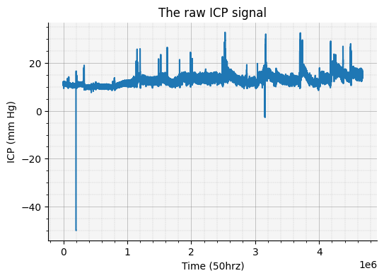
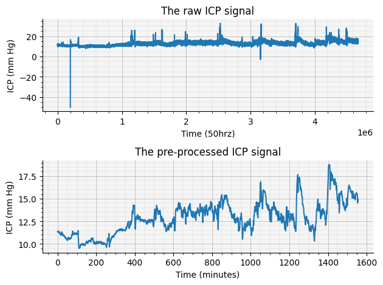
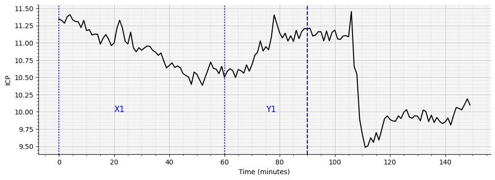
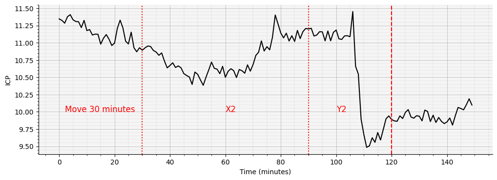
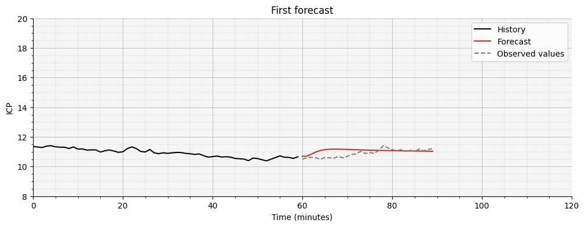
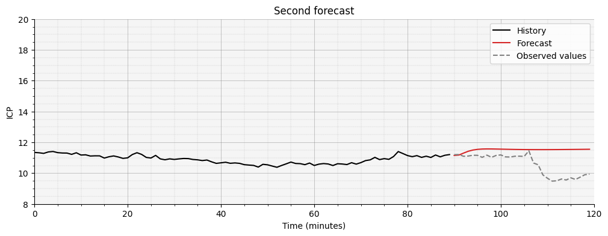
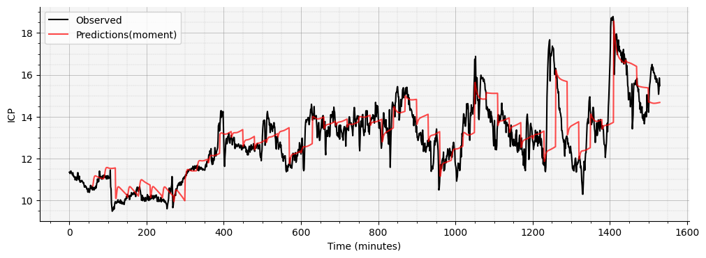

# INTS Neuromonitoring Workshop - ICM+ and Moberg Analytics
## Moberg Analytics Sandbox - Lab Exercise 03
### ICP-Forecasting
#### For more information or help, please email support@moberganalytics.com
- This lab creates a forecasting algorithm for ICP forecasting.
- The data is first pre-preprocessed and sampled down to one sample per minute. 
- After the data is pre-preprocessed, it is segmented to use for training purposes.
- The model (LSTM) is then trained based on the segmented data.
- lastly, the performance of the model is assessed. 

#### Import required libraries


```python
import pandas as pd
import numpy as np
import torch

from pathlib import Path

from sam_tools.forecast import data, plots, predict
```


```python
# set the data path
data_path = Path('data/tracktbi-icp').resolve()
```

#### Load the data

- We use the TRACK-TBI dataset, where we select one patient. 
- The patient has a recording of 25 hours.


```python
# load the ICP signal from patient 121
raw_signal_df = pd.read_csv(data_path / 'ICP_121.csv.gz', compression = "gzip")

# add some column names
raw_signal_df.columns =['Time stamp', 'ICP value']

raw_signal = raw_signal_df['ICP value'].values
```


```python
# inspect the data
raw_signal_df.head()
```


<div>
<style scoped>
    .dataframe tbody tr th:only-of-type {
        vertical-align: middle;
    }

    .dataframe tbody tr th {
        vertical-align: top;
    }

    .dataframe thead th {
        text-align: right;
    }
</style>
<table border="1" class="dataframe">
  <thead>
    <tr style="text-align: right;">
      <th></th>
      <th>Time stamp</th>
      <th>ICP value</th>
    </tr>
  </thead>
  <tbody>
    <tr>
      <th>0</th>
      <td>2017-07-27 10:07:52.160</td>
      <td>11.187500</td>
    </tr>
    <tr>
      <th>1</th>
      <td>2017-07-27 10:07:52.180</td>
      <td>11.187500</td>
    </tr>
    <tr>
      <th>2</th>
      <td>2017-07-27 10:07:52.200</td>
      <td>11.145833</td>
    </tr>
    <tr>
      <th>3</th>
      <td>2017-07-27 10:07:52.220</td>
      <td>11.062500</td>
    </tr>
    <tr>
      <th>4</th>
      <td>2017-07-27 10:07:52.240</td>
      <td>11.000000</td>
    </tr>
  </tbody>
</table>
</div>


We see that there is one ICP signal which has an observation every 0.02 seconds.


```python
# plot the raw data
plots.plot_raw_signal(raw_signal)
```


    

    


- From the plot we can see that there are some artifacts in the data. 

#### Pre-process the data

We use a pre-process algorithm.

- Step 1: Remove values below -5 and above 50. We deem these values artifacts. 
- Step 2: Run a smoothing algorithm to remove some of the noise in the signal.
- Step 3: Downsample the signal to one observation per minute.


```python
def preprocess_icp_data(icp_data, sampling_rate=50):
    """
    Preprocess ICP data according to the described method.
    
    Parameters:
    icp_data (np.array): Raw ICP data
    sampling_rate (int): Sampling rate of the data (default 50 Hz)
    
    Returns:
    np.array: Preprocessed and downsampled ICP data
    """
    
    # Step 1: Global thresholding and forward filling
    def global_threshold_and_fill(data):
        thresholded_data = np.where((data >= -5) & (data <= 50), data, np.nan)
        return pd.Series(thresholded_data).ffill().bfill().values
    
    icp_data = global_threshold_and_fill(icp_data)
    
    # Step 2: Smoothing algorithm
    def smooth_data(data, window_size=60000, step_size=3000):
        smoothed_data = np.copy(data)
        for i in range(0, len(data) - window_size + 1, step_size):
            window = smoothed_data[i:i+window_size]
            window_mean = np.mean(window)
            window_std = np.std(window)
            
            # Replace outliers with window mean
            outlier_mask = np.abs(window - window_mean) > 3 * window_std
            window[outlier_mask] = window_mean
            
            smoothed_data[i:i+window_size] = window
        
        return smoothed_data
    
    icp_data = smooth_data(icp_data)
    
    # Step 3: Downsampling
    def downsample_data(data, sampling_rate=50, target_rate=1/60):
        points_per_sample = int(sampling_rate / target_rate)
        num_samples = len(data) // points_per_sample
        downsampled_data = np.array([np.mean(data[i*points_per_sample:(i+1)*points_per_sample]) 
                                     for i in range(num_samples)])
        return downsampled_data
    
    icp_data = downsample_data(icp_data, sampling_rate)
    
    return icp_data
```


```python
# run to pre-process the data
signal_clean = preprocess_icp_data(raw_signal)
```


```python
# plot the raw and pre-processed singals
plots.plot_clean_signal(signal_clean, raw_signal)
```


    

    


Now we can see the shape of the signal a lot better. 

## Segment the data

To train the model we need to devide part of the signal as input and part of the signal as output. We do this by taking the first 60 minutes and input (X) and the next 30 minutes as output (Y). We can then move the start of the input, e.g., 30 minutes and then do the same this. This is shown in the Figure below:


```python
# show the segmentation
plots.plot_segment(signal_clean)
```


    

    


    

    


In the function to create the X and Y variables, we supply the following variables:
- input length: 60, as we use 60 minutes of data
- output length: 30, as we predict the next 30 minutes.
- stride lenght: 5, we move 5 minutes every time to create a lot of training examples.


```python
# run the segmentation algorithm 
X, Y = data.cut_data(signal_clean, input_length = 60, images/output_length = 30, stride_len = 5)

print(f"There are now {X.shape[0]} samples with a length of {X.shape[2]} for X and {Y.shape[2]} for Y.")
```

    There are now 294 samples with a length of 60 for X and 30 for Y.


## Load the model

The model we use is an recurrent neural network, with a LSTM cell. The architecture of the model is displayed below. The RNN consists of two parts:
- Encorder: takes in one ICP value at a time, all inputs are condensed in a encoder vector which should contain all information about the signals. in our case we use 60 minutes worth of ICP data to make a prediction, so we use 60 LSTM cells in the encoder. 
- Decoder: takes in the encoder vector and predicts the next value of ICP one by one. The predicted value of y1 is used as input for the prediction at y2.
 


```python
# Some initiation, we set the device to cuda fro quick training
device = torch.device('cuda' if torch.cuda.is_available() else 'cpu')

# We only use one variable to the input and output dimentions are 1
input_dim = 1  
images/output_dim = 1

# these are hyper parameters of the RNN
hidden_dim, num_layers = 512, 1

# Load encoder and decoder
encoder = predict.Encoder(input_dim, hidden_dim, num_layers)
decoder = predict.Decoder(images/output_dim, hidden_dim, num_layers)

# "build" the full model
model_LSTM = predict.Seq2Seq(encoder, decoder, device)
```

## Train the model


```python
# train the model
model_trained = predict.train_model(X, Y, model_LSTM, num_epochs=5)
```

    100%|██████████| 1470/1470 [00:15<00:00, 97.23it/s]


#### Make predictions

We can now make a prediction for every 30 minutes and plot the forecast vs the observed signal.


```python
# predictions for an entire sequence every 30 minutes, we select the data and change it to the right format for the LSTM
X_every_30_min = X[::6]
X_every_30_min = torch.permute(X_every_30_min, (0, 2, 1))
```


```python
# Set the model to evaluation mode
model_trained.eval() 

# make some predictions
preds_lstm = predict.create_prediction(X_every_30_min, model_trained)
preds_lstm_clean_LSTM = preds_lstm.reshape(-1)
```

Let's look at how well the model can forecast after one hour:


```python
plots.plot_predictions_segments(signal_clean, preds_lstm_clean_LSTM)
```


    

    


    

    


No we look at the forecast versus the observed values for the entire signal:


```python
# see all predictions
plots.plot_predictions_all(signal_clean, preds_lstm_clean_LSTM)
```


    

    


```python
# calculate the performance
predict.mae(signal_clean, preds_lstm_clean_LSTM)
```

     The mean absolute error for one data point is 0.74
     For the 90th percentile the absolute error is 1.61
     For the 99th percentile the absolute error is 4.71


    

    

