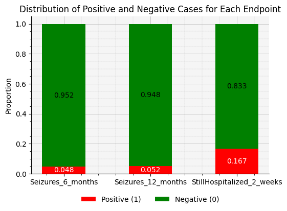
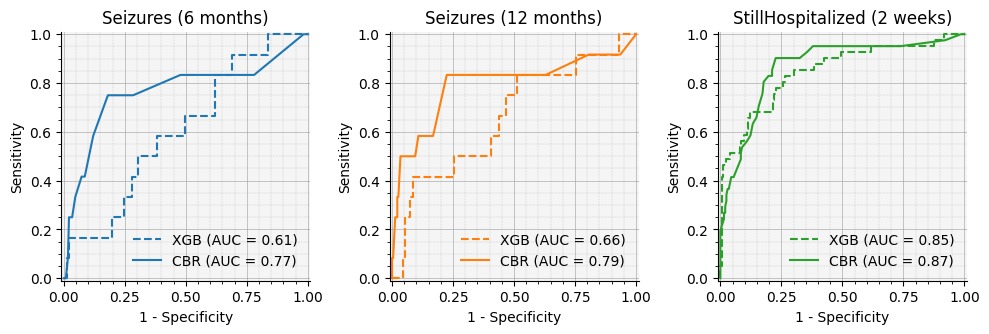

# INTS Neuromonitoring Workshop - ICM+ and Moberg Analytics
## Moberg Analytics Sandbox - Lab Exercise 04
## Predicting TBI Patient Outcomes with Case-Based Reasoning

**For more information or help, please email support@moberganalytics.com**

- In this lab, we will implement a novel algorithm for predicting intermediate endpoints for patients with Traumatic Brain Injury (TBI) using Case-Based Reasoning.

- Traditional TBI treatment planning methods have limitations:
  - Reliance on fallible human memory
  - Lack of strong predictive recommendations in clinical guidelines

- Our novel case-based reasoning (CBR) algorithm:
  - Finds similar patients in the database
  - Makes personalized predictions based on similar cases

- In this notebook we will:
  1. Load TBI patient data from TRACKTBI
  2. Compare traditional machine learning to our CBR algorithm

### Import required libraries


```python
from sklearn.model_selection import train_test_split
from xgboost import XGBClassifier
import numpy as np

from pathlib import Path

from sam_tools import cbr
```


```python
# set the data path
data_path = Path('data/tracktbi-cbr').resolve()
```

### Data Exploration

We'll be working with data from the TRACK-TBI $^1$ dataset, which includes:

- 1,217 patients
- 374 preprocessed features
- 3 key intermediate endpoints: Seizures at 6 and 12 months, and Hospitalization at 2 weeks

We obtained this data through the FITBIR $^2$ Informatics System under a data use agreement.

Let's load and examine our data:

$^1$ TRACK-TBI = Transforming Research and Clinical Knowledge in Traumatic Brain Injury  
$^2$ FITBIR = Federal Interagency Traumatic Brain Injury Research


```python
# load data
features, endpoints = cbr.load_tracktbi_data(data_path)

# check shape of data
print("features.shape", features.shape)
print("endpoints.shape", endpoints.shape)
```

    features.shape (1217, 374)
    endpoints.shape (1217, 3)


```python
# display first 5 rows of data
display(features.head())
```


<div>
<style scoped>
    .dataframe tbody tr th:only-of-type {
        vertical-align: middle;
    }

    .dataframe tbody tr th {
        vertical-align: top;
    }

    .dataframe thead th {
        text-align: right;
    }
</style>
<table border="1" class="dataframe">
  <thead>
    <tr style="text-align: right;">
      <th></th>
      <th>AOCInd_No</th>
      <th>AOCInd_Suspected</th>
      <th>AOCInd_Yes</th>
      <th>ActiveMilitary_No</th>
      <th>ActiveMilitary_Yes</th>
      <th>AdmitTyp_ED Discharge</th>
      <th>AdmitTyp_Hospital admit no ICU</th>
      <th>AdmitTyp_Hospital admit with ICU</th>
      <th>AirbagDplyInd_No</th>
      <th>AirbagDplyInd_Not applicable</th>
      <th>...</th>
      <th>TBIMechTyp_Other penetrating brain injury</th>
      <th>EDIVBlood</th>
      <th>MarshallCTScore</th>
      <th>Site</th>
      <th>InjSeverScore</th>
      <th>ISSNonHeadNeckDer</th>
      <th>ISSHeadNeckDer</th>
      <th>CTDaysSinceBaseline</th>
      <th>MidlneShftSuprtentorialMeasr</th>
      <th>Age</th>
    </tr>
    <tr>
      <th>GUID</th>
      <th></th>
      <th></th>
      <th></th>
      <th></th>
      <th></th>
      <th></th>
      <th></th>
      <th></th>
      <th></th>
      <th></th>
      <th></th>
      <th></th>
      <th></th>
      <th></th>
      <th></th>
      <th></th>
      <th></th>
      <th></th>
      <th></th>
      <th></th>
      <th></th>
    </tr>
  </thead>
  <tbody>
    <tr>
      <th>TBIXE036AJV</th>
      <td>0</td>
      <td>0</td>
      <td>1</td>
      <td>1</td>
      <td>0</td>
      <td>0</td>
      <td>1</td>
      <td>0</td>
      <td>0</td>
      <td>0</td>
      <td>...</td>
      <td>0</td>
      <td>0.0</td>
      <td>0.0</td>
      <td>0.352941</td>
      <td>-1.142930</td>
      <td>-0.706743</td>
      <td>-0.888251</td>
      <td>-0.329068</td>
      <td>-0.266744</td>
      <td>1.030861</td>
    </tr>
    <tr>
      <th>TBIAY573HGX</th>
      <td>0</td>
      <td>0</td>
      <td>1</td>
      <td>1</td>
      <td>0</td>
      <td>0</td>
      <td>1</td>
      <td>0</td>
      <td>0</td>
      <td>1</td>
      <td>...</td>
      <td>0</td>
      <td>0.0</td>
      <td>0.2</td>
      <td>0.117647</td>
      <td>-0.473442</td>
      <td>-0.706743</td>
      <td>0.087075</td>
      <td>-0.475092</td>
      <td>-0.266744</td>
      <td>1.725183</td>
    </tr>
    <tr>
      <th>TBIVR731TY9</th>
      <td>0</td>
      <td>0</td>
      <td>1</td>
      <td>1</td>
      <td>0</td>
      <td>1</td>
      <td>0</td>
      <td>0</td>
      <td>0</td>
      <td>1</td>
      <td>...</td>
      <td>0</td>
      <td>0.0</td>
      <td>0.0</td>
      <td>0.117647</td>
      <td>NaN</td>
      <td>NaN</td>
      <td>NaN</td>
      <td>-0.037020</td>
      <td>-0.266744</td>
      <td>-0.994245</td>
    </tr>
    <tr>
      <th>TBIDB434JFX</th>
      <td>0</td>
      <td>0</td>
      <td>1</td>
      <td>1</td>
      <td>0</td>
      <td>0</td>
      <td>0</td>
      <td>1</td>
      <td>0</td>
      <td>0</td>
      <td>...</td>
      <td>0</td>
      <td>0.0</td>
      <td>0.2</td>
      <td>0.000000</td>
      <td>5.743233</td>
      <td>-0.151500</td>
      <td>8.133512</td>
      <td>-0.548104</td>
      <td>-0.266744</td>
      <td>-1.052105</td>
    </tr>
    <tr>
      <th>TBIEP236EMW</th>
      <td>0</td>
      <td>0</td>
      <td>1</td>
      <td>1</td>
      <td>0</td>
      <td>0</td>
      <td>1</td>
      <td>0</td>
      <td>0</td>
      <td>1</td>
      <td>...</td>
      <td>0</td>
      <td>0.0</td>
      <td>0.2</td>
      <td>0.117647</td>
      <td>-0.951647</td>
      <td>-0.706743</td>
      <td>-0.522504</td>
      <td>-0.329068</td>
      <td>-0.266744</td>
      <td>0.915141</td>
    </tr>
  </tbody>
</table>
<p>5 rows × 374 columns</p>
</div>


```python
# display first 5 rows of endpoints
display(endpoints.head())
```


<div>
<style scoped>
    .dataframe tbody tr th:only-of-type {
        vertical-align: middle;
    }

    .dataframe tbody tr th {
        vertical-align: top;
    }

    .dataframe thead th {
        text-align: right;
    }
</style>
<table border="1" class="dataframe">
  <thead>
    <tr style="text-align: right;">
      <th></th>
      <th>Seizures_6_months</th>
      <th>Seizures_12_months</th>
      <th>StillHospitalized_2_weeks</th>
    </tr>
    <tr>
      <th>GUID</th>
      <th></th>
      <th></th>
      <th></th>
    </tr>
  </thead>
  <tbody>
    <tr>
      <th>TBIXE036AJV</th>
      <td>0.0</td>
      <td>0.0</td>
      <td>0.0</td>
    </tr>
    <tr>
      <th>TBIAY573HGX</th>
      <td>0.0</td>
      <td>0.0</td>
      <td>0.0</td>
    </tr>
    <tr>
      <th>TBIVR731TY9</th>
      <td>0.0</td>
      <td>0.0</td>
      <td>0.0</td>
    </tr>
    <tr>
      <th>TBIDB434JFX</th>
      <td>0.0</td>
      <td>0.0</td>
      <td>0.0</td>
    </tr>
    <tr>
      <th>TBIEP236EMW</th>
      <td>0.0</td>
      <td>0.0</td>
      <td>0.0</td>
    </tr>
  </tbody>
</table>
</div>


```python
# here we can look at the distribution of positive and negative cases for each endpoint
# positive cases are patient who experienced the endpoint, negative cases are patient who did not

cbr.plot_endpoint_distribution(endpoints)
```


    

    


### Prepare Data for Training & Testing

- To train and evaluate our model, we first need to split the data into training and testing sets. 
- We'll use 80% of the patients to train the models, and the remaining 20% to evaluate the models' performance.


```python
# use sklearn's train_test_split function to split the data
F_train, F_test, E_train, E_test = train_test_split(
    features.values, endpoints.values, test_size=0.2, random_state=42
)

print("train:", F_train.shape, E_train.shape)
print("test:", F_test.shape, E_test.shape)
```

    train: (973, 374) (973, 3)
    test: (244, 374) (244, 3)


### Model Development


#### Traditional Machine Learning Approach
 
- First, we will implement an XGBoost classifier, a powerful gradient boosting algorithm known for its performance with complex datasets.


```python
# create the model
model = XGBClassifier()

# train the model
# - this function will train the XGBoost classifier and return the trained model
model = cbr.train_XGB_classifier(model, F_train, E_train)
```


    Training:   0%|          | 0/3 [00:00<?, ?it/s]


```python
# evaluate the model
# - to evaluate the model, we first need to make predictions on the test set
# - we will also calculate the probability of each outcome for the AUC metric
E_pred = model.predict(F_test)
E_pred_proba = model.predict_proba(F_test)

# we will use the evaluate_model function to calculate the metrics
xgb_metrics = cbr.evaluate_model(E_test, E_pred, E_pred_proba)
cbr.print_metrics(xgb_metrics)
```

    AUC: 0.7050
    Sensitivity: 0.1985
    Specificity: 0.9702
    Accuracy: 0.8074


#### Case-Based Reasoning Algorithm

Our CBR algorithm works by:

1. Computing feature weights
2. Calculating similarity between patients
3. Identifying similar cases ("doppelgangers")
4. Predicting outcomes based on these similar cases

Let's implement the key functions for our algorithm:


```python
# step 1: compute weights for the CBR algorithm
# - this will train machine learning models to predict each endpoint from the features
# - and extract the feature importances as our weights

weights = cbr.compute_CBR_weights(F_train, E_train)
```


    Training:   0%|          | 0/3 [00:00<?, ?it/s]


```python
# step 2 & 3: for this step, we will implement the function below.
# this function takes the following inputs:
#   query - the feature vector for a new (query) patient
#   weights - the weights for the CBR algorithm
#   features - the feature matrix for all known patients
#   endpoints - the endpoint matrix for all known patients
# and returns the predicted endpoint probabilities for the query patient

DIST_THR = 3
N_DPGRS = 100


def predict_endpoints(
    query: np.array,
    weights: np.array,
    features: np.array,
    endpoints: np.array,
) -> np.array:
    """Predict endpoints for a given query patient"""

    # step 2: compute weighted distances from other patients
    dist = cbr.weighted_euclidean(features, query, weights)

    # step 3: find the patients that are most similar to the query patient
    I = dist.argsort()[:N_DPGRS]  # get the indices of the patients sorted by distance
    dpgrs = I[dist[I] <= DIST_THR]

    if len(dpgrs) == 0:
        raise ValueError("No doppelgangers found")

    # step 4: determine endpoint probabilities
    y_hat = endpoints[dpgrs, :].sum(axis=0) / len(dpgrs)

    return y_hat
```


```python
# evaluate the model
true_labels = []
pred_labels = []
pred_probs = []

for i in range(len(E_test)):
    y_hat = predict_endpoints(F_test[i], weights, F_train, E_train)
    true_labels.append(E_test[i])
    pred_labels.append((y_hat > 0.5).astype(int))
    pred_probs.append(y_hat)

cbr_metrics = cbr.evaluate_model(true_labels, pred_labels, pred_probs)
cbr.print_metrics(cbr_metrics)
```

    AUC: 0.8086
    Sensitivity: 0.0407
    Specificity: 1.0000
    Accuracy: 0.8074


#### Compare CBR Algorithm with XGBoost

- Now, we can compare our algorithm against the machine learning approach by taking a look at the Receiver Operating Characteristic (ROC) curves for each endpoint.
- The ROC curve is a graphical plot that illustrates the diagnostic ability of a binary classifier system as its discrimination threshold is varied.
- We'll plot the ROC curves for both our Case-Based Reasoning (CBR) algorithm and the XGBoost model side by side for each endpoint.
- This comparison will allow us to visually assess how well each model distinguishes between the positive and negative classes across different thresholds.
- We'll also compare the Area Under the Curve (AUC) scores, which provide a single scalar value representing the overall performance of each model.


```python
# plot ROC curves for each endpoint comparing the XGBoost and CBR models
cbr.plot_model_comparison(xgb_metrics, cbr_metrics, endpoints)
```


    

    


- Our Case-Based Reasoning approach shows promising results, consistently outperforming the traditional XGBoost model across all endpoints. 
- This suggests that leveraging similar historical cases can provide more accurate and interpretable predictions for TBI outcomes.
- Future work could focus on further validation and refinement of the similarity metrics.
