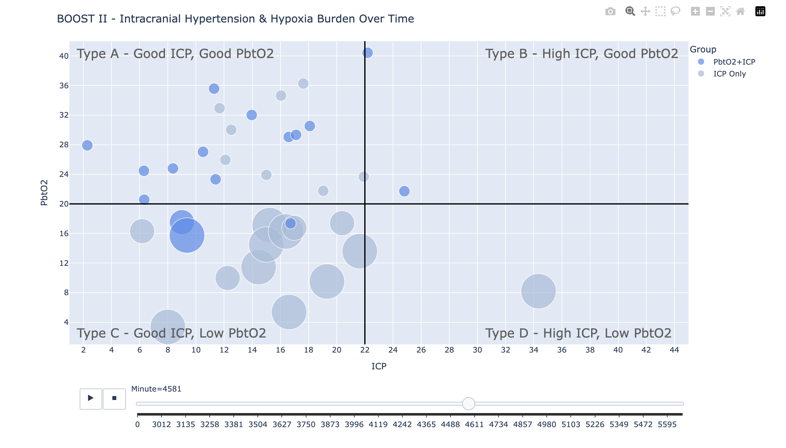

# INTS Neuromonitoring Workshop - ICM+ and Moberg Analytics
## Moberg Analytics Sandbox - Lab Exercise 05
### Multi-Patient (BOOST II) Animation
**For more information or help, please email support@moberganalytics.com**
- This lab creates a "time-lapse" annimation using BOOST II ICP and PbtO2 data and shows that monitoring PbtO2 makes a clear difference in the level of brain hypoxia.
- Each patient is represented by a dot. Dark blue dots inicate the patient had ICP and PbtO2 monitoring. Light blue dots indicate that only ICP monitoring was done.
- ICP is along the x axis is ICP and PbtO2 is along the y axis. This creates a "good" zone in the upper left quadrant, labeled "Type A".
- As the patient spends more time out of the "good zone" their dot grows from small to medium (15 minutes outside the good zone) and medium to large (60 minutes).
- Time data has been synchonized to relative minute of stay. 
- The slider at the bottom can be used to play the animation or be draged forward and back through the timeline.
- Basic Python data manipulation is done with Pandas and data visualization with Plotly.

Below is an image of the animation you will create.
 
 
 > The anonymized BOOSTII data used in this notebook was graciously provided by Dr Ramon Diaz-Arrastia of Penn Medicine under Department of Defense grant W81XWH1920013, A New "Medical Record for the Brain" Enabling Precision Management of TBI, awarded to Moberg Analytics.


#### Install required libraries


```python
!pip install plotly | tail -n 1
```

    Successfully installed plotly-5.23.0 tenacity-9.0.0


#### Import required libraries


```python
import plotly.express as px
import pandas as pd
import numpy as np
```

#### Set data path


```python
DATA_PATH = "/mnt/shared-data/boost2"
```

#### Use "!" to run local OS commands.
Show local files


```python
# list csv files in the data path
!ls -l $DATA_PATH/*.csv
```

    -rw-r--r-- 1 jovyan users 44498393 Aug 28 16:49 /mnt/shared-data/boost2/boost2-1a.csv
    -rw-r--r-- 1 jovyan users 51979705 Aug 23 21:26 /mnt/shared-data/boost2/boost2-1.csv
    -rw-r--r-- 1 jovyan users     1853 Aug 23 21:23 /mnt/shared-data/boost2/boost2-study-groups.csv
    -rw-r--r-- 1 jovyan users  5734262 Aug 26 18:29 /mnt/shared-data/boost2/dfp2.csv


Show first few lines of file containing 1-minues means 


```python
# display the first 5 rows of 
!head -n 5 $DATA_PATH/boost2-1.csv
```

    patient,mod,timestamp,value
    1001,ICP_na,2010-09-20 14:02:00,16.75
    1001,ICP_na,2010-09-20 14:03:00,18.41304347826087
    1001,ICP_na,2010-09-20 14:04:00,18.04255319148936
    1001,ICP_na,2010-09-20 14:05:00,18.148936170212767


#### Load 1-minute means into Pandas dataframe


```python
# load the csv file into a pandas dataframe
df = pd.read_csv(DATA_PATH+'/boost2-1.csv',
    dtype={'patient': str, 'mod': str, 'value': float},
    parse_dates=['timestamp'])
```

#### Display the first 5 rows
Patient ID, Modality, Timestamp, Value


```python
df.head()
```


<div>
<style scoped>
    .dataframe tbody tr th:only-of-type {
        vertical-align: middle;
    }

    .dataframe tbody tr th {
        vertical-align: top;
    }

    .dataframe thead th {
        text-align: right;
    }
</style>
<table border="1" class="dataframe">
  <thead>
    <tr style="text-align: right;">
      <th></th>
      <th>patient</th>
      <th>mod</th>
      <th>timestamp</th>
      <th>value</th>
    </tr>
  </thead>
  <tbody>
    <tr>
      <th>0</th>
      <td>1001</td>
      <td>ICP_na</td>
      <td>2010-09-20 14:02:00</td>
      <td>16.750000</td>
    </tr>
    <tr>
      <th>1</th>
      <td>1001</td>
      <td>ICP_na</td>
      <td>2010-09-20 14:03:00</td>
      <td>18.413043</td>
    </tr>
    <tr>
      <th>2</th>
      <td>1001</td>
      <td>ICP_na</td>
      <td>2010-09-20 14:04:00</td>
      <td>18.042553</td>
    </tr>
    <tr>
      <th>3</th>
      <td>1001</td>
      <td>ICP_na</td>
      <td>2010-09-20 14:05:00</td>
      <td>18.148936</td>
    </tr>
    <tr>
      <th>4</th>
      <td>1001</td>
      <td>ICP_na</td>
      <td>2010-09-20 14:06:00</td>
      <td>18.521739</td>
    </tr>
  </tbody>
</table>
</div>


#### Display the dimensions of the dataframe (rows, columns) 


```python
df.shape
```


    (1027530, 4)


```python
# set the maximum number of rows to display to 20
pd.options.display.max_rows = 20
```

#### Use "groupby" to count the number of elements by Patient ID, show the top 10


```python
# Count the number of records for each patient, sort in descending order, and show the 
# top 10 patients with the most records
df.groupby(['patient'])['patient'].count().sort_values(ascending=False).head(10)
```


    patient
    2003    25035
    1012    22389
    3011    20136
    9013    20122
    2011    19434
    9007    18176
    8004    17547
    2001    17346
    3002    16856
    8005    16273
    Name: patient, dtype: int64


#### Load the study groups from CSV into a Pandas dataframe


```python
dfg = pd.read_csv(DATA_PATH+'/boost2-study-groups.csv',
    dtype={'id': str, 'group': str})
```


```python
# display the first 5 rows of the dataframe
dfg.head()
```


<div>
<style scoped>
    .dataframe tbody tr th:only-of-type {
        vertical-align: middle;
    }

    .dataframe tbody tr th {
        vertical-align: top;
    }

    .dataframe thead th {
        text-align: right;
    }
</style>
<table border="1" class="dataframe">
  <thead>
    <tr style="text-align: right;">
      <th></th>
      <th>id</th>
      <th>group</th>
    </tr>
  </thead>
  <tbody>
    <tr>
      <th>0</th>
      <td>1002</td>
      <td>ICP Only</td>
    </tr>
    <tr>
      <th>1</th>
      <td>1003</td>
      <td>ICP Only</td>
    </tr>
    <tr>
      <th>2</th>
      <td>1004</td>
      <td>ICP Only</td>
    </tr>
    <tr>
      <th>3</th>
      <td>1007</td>
      <td>ICP Only</td>
    </tr>
    <tr>
      <th>4</th>
      <td>1008</td>
      <td>ICP Only</td>
    </tr>
  </tbody>
</table>
</div>


#### Merge the dataframes using the Patient ID as the key


```python
dfm = pd.merge(df, dfg, how='left', left_on=['patient'], right_on=['id'])
```

#### Show the merged dataframe shape and sample data


```python
dfm.shape
```


    (1027530, 6)


```python
dfm.head()
```


<div>
<style scoped>
    .dataframe tbody tr th:only-of-type {
        vertical-align: middle;
    }

    .dataframe tbody tr th {
        vertical-align: top;
    }

    .dataframe thead th {
        text-align: right;
    }
</style>
<table border="1" class="dataframe">
  <thead>
    <tr style="text-align: right;">
      <th></th>
      <th>patient</th>
      <th>mod</th>
      <th>timestamp</th>
      <th>value</th>
      <th>id</th>
      <th>group</th>
    </tr>
  </thead>
  <tbody>
    <tr>
      <th>0</th>
      <td>1001</td>
      <td>ICP_na</td>
      <td>2010-09-20 14:02:00</td>
      <td>16.750000</td>
      <td>1001</td>
      <td>PbtO2+ICP</td>
    </tr>
    <tr>
      <th>1</th>
      <td>1001</td>
      <td>ICP_na</td>
      <td>2010-09-20 14:03:00</td>
      <td>18.413043</td>
      <td>1001</td>
      <td>PbtO2+ICP</td>
    </tr>
    <tr>
      <th>2</th>
      <td>1001</td>
      <td>ICP_na</td>
      <td>2010-09-20 14:04:00</td>
      <td>18.042553</td>
      <td>1001</td>
      <td>PbtO2+ICP</td>
    </tr>
    <tr>
      <th>3</th>
      <td>1001</td>
      <td>ICP_na</td>
      <td>2010-09-20 14:05:00</td>
      <td>18.148936</td>
      <td>1001</td>
      <td>PbtO2+ICP</td>
    </tr>
    <tr>
      <th>4</th>
      <td>1001</td>
      <td>ICP_na</td>
      <td>2010-09-20 14:06:00</td>
      <td>18.521739</td>
      <td>1001</td>
      <td>PbtO2+ICP</td>
    </tr>
  </tbody>
</table>
</div>


#### Use Pandas pivot function to organize ICP and PbtO2 row-wise  
We want to chart ICP and PbtO2 over time together <br>
Put them on the same row to make it easier


```python
dfp = pd.pivot_table(dfm,index=["patient","timestamp","group"], columns="mod", values="value") 
```


```python
# reset the index to make the "patient" column a column again
dfp.reset_index(inplace=True)
```


```python
# rename the columns to remove the _na suffix
dfp.rename(columns={"ICP_na": "ICP", "PbtO2_na": "PbtO2"},inplace=True)
```


```python
# display the first 5 rows of the dataframe
dfp.head()
```


<div>
<style scoped>
    .dataframe tbody tr th:only-of-type {
        vertical-align: middle;
    }

    .dataframe tbody tr th {
        vertical-align: top;
    }

    .dataframe thead th {
        text-align: right;
    }
</style>
<table border="1" class="dataframe">
  <thead>
    <tr style="text-align: right;">
      <th>mod</th>
      <th>patient</th>
      <th>timestamp</th>
      <th>group</th>
      <th>ICP</th>
      <th>PbtO2</th>
    </tr>
  </thead>
  <tbody>
    <tr>
      <th>0</th>
      <td>1001</td>
      <td>2010-09-20 14:02:00</td>
      <td>PbtO2+ICP</td>
      <td>16.750000</td>
      <td>35.597200</td>
    </tr>
    <tr>
      <th>1</th>
      <td>1001</td>
      <td>2010-09-20 14:03:00</td>
      <td>PbtO2+ICP</td>
      <td>18.413043</td>
      <td>34.670358</td>
    </tr>
    <tr>
      <th>2</th>
      <td>1001</td>
      <td>2010-09-20 14:04:00</td>
      <td>PbtO2+ICP</td>
      <td>18.042553</td>
      <td>34.384186</td>
    </tr>
    <tr>
      <th>3</th>
      <td>1001</td>
      <td>2010-09-20 14:05:00</td>
      <td>PbtO2+ICP</td>
      <td>18.148936</td>
      <td>34.288620</td>
    </tr>
    <tr>
      <th>4</th>
      <td>1001</td>
      <td>2010-09-20 14:06:00</td>
      <td>PbtO2+ICP</td>
      <td>18.521739</td>
      <td>33.976945</td>
    </tr>
  </tbody>
</table>
</div>


#### Pandas "dtypes" shows the data type of each column
Note: "objects" are usually strings


```python
dfp.dtypes
```


    mod
    patient              object
    timestamp    datetime64[ns]
    group                object
    ICP_na              float64
    PbtO2_na            float64
    dtype: object


#### Calculate variables to create a relative "minute of stay" for all patients so we can display them all on the same graph
- admitdate - the miminum date by patient
- mints - the earliest timestamp by patient
- day - the relative day of the patient monitoring
- minute - the relative minute of the patient monitoring


```python
# calculate the admitdate for each patient by determining the minimum timestamp for each patient
dfp['admitdate'] = dfp.groupby('patient')['timestamp'].transform('min').dt.date
```


```python
# convert the admitdate column to a datetime
dfp[['admitdate']] = dfp[['admitdate']].apply(pd.to_datetime)
```


```python
# calculate the mints for each patient by determining the minimum timestamp for each patient
dfp['mints'] = dfp.groupby('patient')['timestamp'].transform('min')
```


```python
# calculate the relative day of the patient monitoring 
dfp['day'] = (dfp['timestamp'] - dfp['admitdate']) / np.timedelta64(1, 'D')
```


```python
# convert the day to an integer
dfp['day'] = dfp['day'].apply(np.floor).astype(int)
```


```python
# calculate the relative minute of the patient monitoring
dfp['minute'] = ((dfp['timestamp'] - dfp['mints']) / np.timedelta64(1, 'm')).astype(int)
```


```python
# show the first 5 rows of the dataframe
dfp.head()
```


<div>
<style scoped>
    .dataframe tbody tr th:only-of-type {
        vertical-align: middle;
    }

    .dataframe tbody tr th {
        vertical-align: top;
    }

    .dataframe thead th {
        text-align: right;
    }
</style>
<table border="1" class="dataframe">
  <thead>
    <tr style="text-align: right;">
      <th>mod</th>
      <th>patient</th>
      <th>timestamp</th>
      <th>group</th>
      <th>ICP</th>
      <th>PbtO2</th>
      <th>admitdate</th>
      <th>mints</th>
      <th>day</th>
      <th>minute</th>
    </tr>
  </thead>
  <tbody>
    <tr>
      <th>0</th>
      <td>1001</td>
      <td>2010-09-20 14:02:00</td>
      <td>PbtO2+ICP</td>
      <td>16.750000</td>
      <td>35.597200</td>
      <td>2010-09-20</td>
      <td>2010-09-20 14:02:00</td>
      <td>0</td>
      <td>0</td>
    </tr>
    <tr>
      <th>1</th>
      <td>1001</td>
      <td>2010-09-20 14:03:00</td>
      <td>PbtO2+ICP</td>
      <td>18.413043</td>
      <td>34.670358</td>
      <td>2010-09-20</td>
      <td>2010-09-20 14:02:00</td>
      <td>0</td>
      <td>1</td>
    </tr>
    <tr>
      <th>2</th>
      <td>1001</td>
      <td>2010-09-20 14:04:00</td>
      <td>PbtO2+ICP</td>
      <td>18.042553</td>
      <td>34.384186</td>
      <td>2010-09-20</td>
      <td>2010-09-20 14:02:00</td>
      <td>0</td>
      <td>2</td>
    </tr>
    <tr>
      <th>3</th>
      <td>1001</td>
      <td>2010-09-20 14:05:00</td>
      <td>PbtO2+ICP</td>
      <td>18.148936</td>
      <td>34.288620</td>
      <td>2010-09-20</td>
      <td>2010-09-20 14:02:00</td>
      <td>0</td>
      <td>3</td>
    </tr>
    <tr>
      <th>4</th>
      <td>1001</td>
      <td>2010-09-20 14:06:00</td>
      <td>PbtO2+ICP</td>
      <td>18.521739</td>
      <td>33.976945</td>
      <td>2010-09-20</td>
      <td>2010-09-20 14:02:00</td>
      <td>0</td>
      <td>4</td>
    </tr>
  </tbody>
</table>
</div>


#### Grab the fourth day for display purposes


```python
# select only the data for the fourth day
# in python, the first entry is index 0, so the fourth entry is index 3
dfp = dfp[dfp['day'].isin([3])].copy()
```


```python
# show the first 5 rows of the dataframe
dfp.head()
```


<div>
<style scoped>
    .dataframe tbody tr th:only-of-type {
        vertical-align: middle;
    }

    .dataframe tbody tr th {
        vertical-align: top;
    }

    .dataframe thead th {
        text-align: right;
    }
</style>
<table border="1" class="dataframe">
  <thead>
    <tr style="text-align: right;">
      <th>mod</th>
      <th>patient</th>
      <th>timestamp</th>
      <th>group</th>
      <th>ICP</th>
      <th>PbtO2</th>
      <th>admitdate</th>
      <th>mints</th>
      <th>day</th>
      <th>minute</th>
    </tr>
  </thead>
  <tbody>
    <tr>
      <th>6616</th>
      <td>1002</td>
      <td>2010-11-12 00:00:00</td>
      <td>ICP Only</td>
      <td>13.021739</td>
      <td>17.323387</td>
      <td>2010-11-09</td>
      <td>2010-11-09 07:56:00</td>
      <td>3</td>
      <td>3844</td>
    </tr>
    <tr>
      <th>6617</th>
      <td>1002</td>
      <td>2010-11-12 00:01:00</td>
      <td>ICP Only</td>
      <td>12.340426</td>
      <td>17.317907</td>
      <td>2010-11-09</td>
      <td>2010-11-09 07:56:00</td>
      <td>3</td>
      <td>3845</td>
    </tr>
    <tr>
      <th>6618</th>
      <td>1002</td>
      <td>2010-11-12 00:02:00</td>
      <td>ICP Only</td>
      <td>12.765957</td>
      <td>17.152871</td>
      <td>2010-11-09</td>
      <td>2010-11-09 07:56:00</td>
      <td>3</td>
      <td>3846</td>
    </tr>
    <tr>
      <th>6619</th>
      <td>1002</td>
      <td>2010-11-12 00:03:00</td>
      <td>ICP Only</td>
      <td>13.369565</td>
      <td>16.879203</td>
      <td>2010-11-09</td>
      <td>2010-11-09 07:56:00</td>
      <td>3</td>
      <td>3847</td>
    </tr>
    <tr>
      <th>6620</th>
      <td>1002</td>
      <td>2010-11-12 00:04:00</td>
      <td>ICP Only</td>
      <td>12.851064</td>
      <td>16.605099</td>
      <td>2010-11-09</td>
      <td>2010-11-09 07:56:00</td>
      <td>3</td>
      <td>3848</td>
    </tr>
  </tbody>
</table>
</div>


#### Count and drop null values


```python
# get the names of the columns that have null values
null_columns=dfp.columns[dfp.isnull().any()]

# show the number of null values in each column
dfp[null_columns].isnull().sum()
```


    mod
    ICP      7476
    PbtO2    6706
    dtype: int64


```python
# drop the rows with null values
dfp.dropna(inplace=True)
```

#### Function to get the Type (A,B,C,D) depending on ICP and PbtO2 Values
- Type A - ICP and PbtO2 in desired range
- Type B - High ICP, Good PbtO2
- Type C - Good ICP, Low, PbtO2
- Type D - High ICP, Low PbtO2


```python
def getTypeByMod(icp, pbt):
    if icp <= 22:
        if pbt >= 20:
            return 'A'
        else:
            return 'C'
    else:
        if pbt >= 20:
            return 'B'
        else:
            return 'D'
```

#### Vectorize the getTypeByMod function 
This turns the function from a row-wise function (very slow) to a column-wise "vectored" function (much faster)


```python
vtypemod = np.vectorize(getTypeByMod)
```


```python
# apply the getTypeByMod function to the ICP and PbtO2 columns
dfp['type'] = vtypemod(dfp['ICP'], dfp['PbtO2'])
```

#### Display a few rows in the middle of the dataframe


```python
dfp[1018:1025]
```


<div>
<style scoped>
    .dataframe tbody tr th:only-of-type {
        vertical-align: middle;
    }

    .dataframe tbody tr th {
        vertical-align: top;
    }

    .dataframe thead th {
        text-align: right;
    }
</style>
<table border="1" class="dataframe">
  <thead>
    <tr style="text-align: right;">
      <th>mod</th>
      <th>patient</th>
      <th>timestamp</th>
      <th>group</th>
      <th>ICP</th>
      <th>PbtO2</th>
      <th>admitdate</th>
      <th>mints</th>
      <th>day</th>
      <th>minute</th>
      <th>type</th>
    </tr>
  </thead>
  <tbody>
    <tr>
      <th>14247</th>
      <td>1005</td>
      <td>2011-03-11 10:22:00</td>
      <td>PbtO2+ICP</td>
      <td>14.260870</td>
      <td>19.999714</td>
      <td>2011-03-08</td>
      <td>2011-03-08 02:22:00</td>
      <td>3</td>
      <td>4800</td>
      <td>C</td>
    </tr>
    <tr>
      <th>14248</th>
      <td>1005</td>
      <td>2011-03-11 10:23:00</td>
      <td>PbtO2+ICP</td>
      <td>14.000000</td>
      <td>20.001699</td>
      <td>2011-03-08</td>
      <td>2011-03-08 02:22:00</td>
      <td>3</td>
      <td>4801</td>
      <td>A</td>
    </tr>
    <tr>
      <th>14249</th>
      <td>1005</td>
      <td>2011-03-11 10:24:00</td>
      <td>PbtO2+ICP</td>
      <td>14.000000</td>
      <td>19.787166</td>
      <td>2011-03-08</td>
      <td>2011-03-08 02:22:00</td>
      <td>3</td>
      <td>4802</td>
      <td>C</td>
    </tr>
    <tr>
      <th>14250</th>
      <td>1005</td>
      <td>2011-03-11 10:25:00</td>
      <td>PbtO2+ICP</td>
      <td>14.000000</td>
      <td>19.884747</td>
      <td>2011-03-08</td>
      <td>2011-03-08 02:22:00</td>
      <td>3</td>
      <td>4803</td>
      <td>C</td>
    </tr>
    <tr>
      <th>14251</th>
      <td>1005</td>
      <td>2011-03-11 10:26:00</td>
      <td>PbtO2+ICP</td>
      <td>14.000000</td>
      <td>20.245403</td>
      <td>2011-03-08</td>
      <td>2011-03-08 02:22:00</td>
      <td>3</td>
      <td>4804</td>
      <td>A</td>
    </tr>
    <tr>
      <th>14252</th>
      <td>1005</td>
      <td>2011-03-11 10:27:00</td>
      <td>PbtO2+ICP</td>
      <td>14.106383</td>
      <td>20.630169</td>
      <td>2011-03-08</td>
      <td>2011-03-08 02:22:00</td>
      <td>3</td>
      <td>4805</td>
      <td>A</td>
    </tr>
    <tr>
      <th>14253</th>
      <td>1005</td>
      <td>2011-03-11 10:28:00</td>
      <td>PbtO2+ICP</td>
      <td>14.000000</td>
      <td>20.867150</td>
      <td>2011-03-08</td>
      <td>2011-03-08 02:22:00</td>
      <td>3</td>
      <td>4806</td>
      <td>A</td>
    </tr>
  </tbody>
</table>
</div>


#### Check to make sure the getTypeByMod function is working correctly
Get the min/max values by Type. They should match the desired ranges


```python
dfp.groupby(['type']).ICP.agg(["min","max"])
```


<div>
<style scoped>
    .dataframe tbody tr th:only-of-type {
        vertical-align: middle;
    }

    .dataframe tbody tr th {
        vertical-align: top;
    }

    .dataframe thead th {
        text-align: right;
    }
</style>
<table border="1" class="dataframe">
  <thead>
    <tr style="text-align: right;">
      <th></th>
      <th>min</th>
      <th>max</th>
    </tr>
    <tr>
      <th>type</th>
      <th></th>
      <th></th>
    </tr>
  </thead>
  <tbody>
    <tr>
      <th>A</th>
      <td>-44.666667</td>
      <td>22.000000</td>
    </tr>
    <tr>
      <th>B</th>
      <td>22.021277</td>
      <td>191.488372</td>
    </tr>
    <tr>
      <th>C</th>
      <td>-32.978723</td>
      <td>22.000000</td>
    </tr>
    <tr>
      <th>D</th>
      <td>22.021277</td>
      <td>218.318182</td>
    </tr>
  </tbody>
</table>
</div>


```python
dfp.groupby(['type']).PbtO2.agg(["min","max"])
```


<div>
<style scoped>
    .dataframe tbody tr th:only-of-type {
        vertical-align: middle;
    }

    .dataframe tbody tr th {
        vertical-align: top;
    }

    .dataframe thead th {
        text-align: right;
    }
</style>
<table border="1" class="dataframe">
  <thead>
    <tr style="text-align: right;">
      <th></th>
      <th>min</th>
      <th>max</th>
    </tr>
    <tr>
      <th>type</th>
      <th></th>
      <th></th>
    </tr>
  </thead>
  <tbody>
    <tr>
      <th>A</th>
      <td>20.000450</td>
      <td>220.309055</td>
    </tr>
    <tr>
      <th>B</th>
      <td>20.002547</td>
      <td>190.586106</td>
    </tr>
    <tr>
      <th>C</th>
      <td>-3.132963</td>
      <td>19.999714</td>
    </tr>
    <tr>
      <th>D</th>
      <td>-2.456367</td>
      <td>19.996471</td>
    </tr>
  </tbody>
</table>
</div>


#### Copy one patient or all patients (for testing)


```python
# Copy one
#dfp2 = dfp[dfp['patient'].isin(['1002'])].copy()
```


```python
# Copy all
dfp2 = dfp[~dfp['patient'].isin(['9999'])].copy()
```

#### Drop unneeded columns


```python
dfp2.drop(columns=['timestamp','admitdate', 'mints'], inplace=True)
```


```python
dfp2.shape
```


    (78294, 7)


```python
dfp2.head()
```


<div>
<style scoped>
    .dataframe tbody tr th:only-of-type {
        vertical-align: middle;
    }

    .dataframe tbody tr th {
        vertical-align: top;
    }

    .dataframe thead th {
        text-align: right;
    }
</style>
<table border="1" class="dataframe">
  <thead>
    <tr style="text-align: right;">
      <th>mod</th>
      <th>patient</th>
      <th>group</th>
      <th>ICP</th>
      <th>PbtO2</th>
      <th>day</th>
      <th>minute</th>
      <th>type</th>
    </tr>
  </thead>
  <tbody>
    <tr>
      <th>6616</th>
      <td>1002</td>
      <td>ICP Only</td>
      <td>13.021739</td>
      <td>17.323387</td>
      <td>3</td>
      <td>3844</td>
      <td>C</td>
    </tr>
    <tr>
      <th>6617</th>
      <td>1002</td>
      <td>ICP Only</td>
      <td>12.340426</td>
      <td>17.317907</td>
      <td>3</td>
      <td>3845</td>
      <td>C</td>
    </tr>
    <tr>
      <th>6618</th>
      <td>1002</td>
      <td>ICP Only</td>
      <td>12.765957</td>
      <td>17.152871</td>
      <td>3</td>
      <td>3846</td>
      <td>C</td>
    </tr>
    <tr>
      <th>6619</th>
      <td>1002</td>
      <td>ICP Only</td>
      <td>13.369565</td>
      <td>16.879203</td>
      <td>3</td>
      <td>3847</td>
      <td>C</td>
    </tr>
    <tr>
      <th>6620</th>
      <td>1002</td>
      <td>ICP Only</td>
      <td>12.851064</td>
      <td>16.605099</td>
      <td>3</td>
      <td>3848</td>
      <td>C</td>
    </tr>
  </tbody>
</table>
</div>


```python
dfp2.reset_index(inplace=True)
```


```python
# add a time column to the dataframe and set it to zero for now
dfp2['time'] = 0
```

#### Calculate how many minutes the patient has been in the current state/tier
- Loop through the dataframe incrementing the minute counter
- Reset the minute counter to zero if the patient is in Tier A (Good ICP, Good PbtO2)


```python
for i in range(dfp2.shape[0]-1):
    if dfp2['type'][i] == 'A':
        # if the patient is in Tier A, set the time to zero
        dfp2.iloc[i, dfp2.columns.get_loc('time')] = 0
    else:
        # if the patient is not in Tier A, increment the time by 1
        dfp2.iloc[i+1, dfp2.columns.get_loc('time')] = dfp2.iloc[i, dfp2.columns.get_loc('time')] + 1
```


```python
dfp2.head()
```


<div>
<style scoped>
    .dataframe tbody tr th:only-of-type {
        vertical-align: middle;
    }

    .dataframe tbody tr th {
        vertical-align: top;
    }

    .dataframe thead th {
        text-align: right;
    }
</style>
<table border="1" class="dataframe">
  <thead>
    <tr style="text-align: right;">
      <th>mod</th>
      <th>index</th>
      <th>patient</th>
      <th>group</th>
      <th>ICP</th>
      <th>PbtO2</th>
      <th>day</th>
      <th>minute</th>
      <th>type</th>
      <th>time</th>
    </tr>
  </thead>
  <tbody>
    <tr>
      <th>0</th>
      <td>6616</td>
      <td>1002</td>
      <td>ICP Only</td>
      <td>13.021739</td>
      <td>17.323387</td>
      <td>3</td>
      <td>3844</td>
      <td>C</td>
      <td>0</td>
    </tr>
    <tr>
      <th>1</th>
      <td>6617</td>
      <td>1002</td>
      <td>ICP Only</td>
      <td>12.340426</td>
      <td>17.317907</td>
      <td>3</td>
      <td>3845</td>
      <td>C</td>
      <td>1</td>
    </tr>
    <tr>
      <th>2</th>
      <td>6618</td>
      <td>1002</td>
      <td>ICP Only</td>
      <td>12.765957</td>
      <td>17.152871</td>
      <td>3</td>
      <td>3846</td>
      <td>C</td>
      <td>2</td>
    </tr>
    <tr>
      <th>3</th>
      <td>6619</td>
      <td>1002</td>
      <td>ICP Only</td>
      <td>13.369565</td>
      <td>16.879203</td>
      <td>3</td>
      <td>3847</td>
      <td>C</td>
      <td>3</td>
    </tr>
    <tr>
      <th>4</th>
      <td>6620</td>
      <td>1002</td>
      <td>ICP Only</td>
      <td>12.851064</td>
      <td>16.605099</td>
      <td>3</td>
      <td>3848</td>
      <td>C</td>
      <td>4</td>
    </tr>
  </tbody>
</table>
</div>


#### Rename columns so they look nicer in the graph


```python
dfp2.rename(columns={
    "ICP_na": "ICP", 
    "PbtO2_na": "PbtO2", 
    "tier":"Tier", 
    "minute":"Minute",
    "time":"Time",
    "patient":"Patient", 
    "type":"Type", 
    "group":"Group"
    }, inplace=True)
```

#### Sort by time/patient because those are our annimation frame and group 


```python
dfp2.sort_values(by=['Minute', 'Patient'], inplace=True)
```

#### Functions to set the patient "tier" and dot size, based on how long the patient has been in that state
Tier was graphed in a previous iteration of this notebook, not used here


```python
def gettier(time):
    if time <= 15:
        return 1
    else:
        if time <= 60:
            return 2
        else:
            return 3
        
def tierdot(tier):
    if tier == 1:
        return 2
    else:
        if tier == 2:
            return 10
        else:
            if tier == 3:
                return 20
            else:
                return 100
```

#### Set the Tier based on how long the patient has been in that state


```python
dfp2['Tier'] = dfp2['Time'].apply(gettier)
```

#### Set the dot size based on the Tier


```python
dfp2['dot'] = dfp2['Tier'].apply(tierdot)
```


```python
dfp2.tail()
```


<div>
<style scoped>
    .dataframe tbody tr th:only-of-type {
        vertical-align: middle;
    }

    .dataframe tbody tr th {
        vertical-align: top;
    }

    .dataframe thead th {
        text-align: right;
    }
</style>
<table border="1" class="dataframe">
  <thead>
    <tr style="text-align: right;">
      <th>mod</th>
      <th>index</th>
      <th>Patient</th>
      <th>Group</th>
      <th>ICP</th>
      <th>PbtO2</th>
      <th>day</th>
      <th>Minute</th>
      <th>Type</th>
      <th>Time</th>
      <th>Tier</th>
      <th>dot</th>
    </tr>
  </thead>
  <tbody>
    <tr>
      <th>5840</th>
      <td>46584</td>
      <td>1012</td>
      <td>PbtO2+ICP</td>
      <td>8.829787</td>
      <td>22.838860</td>
      <td>3</td>
      <td>5668</td>
      <td>A</td>
      <td>0</td>
      <td>1</td>
      <td>2</td>
    </tr>
    <tr>
      <th>5841</th>
      <td>46585</td>
      <td>1012</td>
      <td>PbtO2+ICP</td>
      <td>8.978723</td>
      <td>21.445486</td>
      <td>3</td>
      <td>5669</td>
      <td>A</td>
      <td>0</td>
      <td>1</td>
      <td>2</td>
    </tr>
    <tr>
      <th>5842</th>
      <td>46586</td>
      <td>1012</td>
      <td>PbtO2+ICP</td>
      <td>8.782609</td>
      <td>22.628009</td>
      <td>3</td>
      <td>5670</td>
      <td>A</td>
      <td>0</td>
      <td>1</td>
      <td>2</td>
    </tr>
    <tr>
      <th>5843</th>
      <td>46587</td>
      <td>1012</td>
      <td>PbtO2+ICP</td>
      <td>9.787234</td>
      <td>23.418375</td>
      <td>3</td>
      <td>5671</td>
      <td>A</td>
      <td>0</td>
      <td>1</td>
      <td>2</td>
    </tr>
    <tr>
      <th>5844</th>
      <td>46588</td>
      <td>1012</td>
      <td>PbtO2+ICP</td>
      <td>9.957447</td>
      <td>24.140203</td>
      <td>3</td>
      <td>5672</td>
      <td>A</td>
      <td>0</td>
      <td>1</td>
      <td>2</td>
    </tr>
  </tbody>
</table>
</div>


#### Work around a bug in plotly
Plotly sets the scale based on the first group (patient in our case). <br>
If the first group doesn't have all possibilities in the scale, they aren't shown.<br>
This code puts a dummy patient at the top of the dataframe with all combinations to work around the problem.

Copy the first three rows


```python
dffix = dfp2.iloc[0:3].copy().reset_index()
```

Set the data values


```python
dffix.loc[0, 'Tier'] = 1
dffix.loc[1, 'Tier'] = 2
dffix.loc[2, 'Tier'] = 3
dffix['Patient'] = '0000'
dffix['Minute'] = 0
dffix['Group'] = "ICP Only"
```

Copy them to main dataframe


```python
# creates a new dataframe with the dummy patient at the top
dfp2 = pd.concat([dffix, dfp2], ignore_index=True, sort=False)
```

Set data values again


```python
dffix.loc[0, 'Tier'] = 1
dffix.loc[1, 'Tier'] = 2
dffix.loc[2, 'Tier'] = 3
dffix['Patient'] = '0001'
dffix['Minute'] = 0
dffix['Group'] = "PbtO2+ICP	"
```

Copy them to the main dataframe


```python
dfp2 = pd.concat([dffix, dfp2], ignore_index=True, sort=False)
```

#### Create the chart


```python
fig = px.scatter(
    dfp2, 
    x="ICP", 
    y="PbtO2", 
    animation_frame="Minute", 
    animation_group="Patient",
    range_x=[1,45], 
    range_y=[1,42], 
    size="dot", 
    size_max=40, 
    width=1200, 
    height=700,
    color="Group", 
    color_discrete_sequence=["cornflowerblue", "lightsteelblue"], 
    hover_name="Patient", 
    hover_data={
        "Type":True, 
        "Time":True, 
        "Tier":True, 
        "dot":False, 
        "Minute":False,
        "ICP":':.2f',
        "PbtO2":':.2f'
        }
) 

# add a horizontal line at PbtO2 = 20
fig.add_shape(type="line", line_color="black", line_width=2, opacity=1, line_dash="solid", x0=0, x1=1, xref="paper", y0=20, y1=20, yref="y")

# add a vertical line at ICP = 22
fig.add_shape(type="line", line_color="black", line_width=2, opacity=1, line_dash="solid", x0=22, x1=22, xref="x", y0=0, y1=1, yref="paper")

# update the x-axis to use a linear tick mode with a tick at 0 and a tick spacing of 2
fig.update_layout(xaxis = dict(tickmode = 'linear',tick0 = 0,dtick = 2))

# update the y-axis to use a linear tick mode with a tick at 0 and a tick spacing of 4
fig.update_layout(yaxis = dict(tickmode = 'linear',tick0 = 0,dtick = 4))

# update the title to be more descriptive
fig.update_layout(title_text='BOOST II - Intracranial Hypertension & Hypoxia Burden Over Time')

# update the legend to be more descriptive
fig.update_layout(legend=dict(yanchor="top", y=1, xanchor="left", x=1))

# add annotations for the Type A, B, C, and D zones
fig.add_annotation(dict(font=dict(color='dimgrey',size=20),x=.01,y=.99,showarrow=False,text="Type A - Good ICP, Good PbtO2",textangle=0,xanchor='left',xref="paper",yref="paper"))
fig.add_annotation(dict(font=dict(color='dimgrey',size=20),x=.67,y=.99,showarrow=False,text="Type B - High ICP, Good PbtO2",textangle=0,xanchor='left',xref="paper",yref="paper"))
fig.add_annotation(dict(font=dict(color='dimgrey',size=20),x=.01,y=.01,showarrow=False,text="Type C - Good ICP, Low PbtO2",textangle=0,xanchor='left',xref="paper",yref="paper"))
fig.add_annotation(dict(font=dict(color='dimgrey',size=20),x=.67,y=.01,showarrow=False,text="Type D - High ICP, Low PbtO2",textangle=0,xanchor='left',xref="paper",yref="paper"))

fig.show(renderer='iframe')


```


<iframe
    scrolling="no"
    width="1220px"
    height="720"
    src="iframe_figures/figure_93.html"
    frameborder="0"
    allowfullscreen
></iframe>


#### Show the final dataframe and save it as a csv


```python
dfp2.head()
```


<div>
<style scoped>
    .dataframe tbody tr th:only-of-type {
        vertical-align: middle;
    }

    .dataframe tbody tr th {
        vertical-align: top;
    }

    .dataframe thead th {
        text-align: right;
    }
</style>
<table border="1" class="dataframe">
  <thead>
    <tr style="text-align: right;">
      <th>mod</th>
      <th>level_0</th>
      <th>index</th>
      <th>Patient</th>
      <th>Group</th>
      <th>ICP</th>
      <th>PbtO2</th>
      <th>day</th>
      <th>Minute</th>
      <th>Type</th>
      <th>Time</th>
      <th>Tier</th>
      <th>dot</th>
    </tr>
  </thead>
  <tbody>
    <tr>
      <th>0</th>
      <td>65601.0</td>
      <td>476560</td>
      <td>0001</td>
      <td>PbtO2+ICP\t</td>
      <td>12.586957</td>
      <td>7.225385</td>
      <td>3</td>
      <td>0</td>
      <td>C</td>
      <td>0</td>
      <td>1</td>
      <td>2</td>
    </tr>
    <tr>
      <th>1</th>
      <td>65602.0</td>
      <td>476561</td>
      <td>0001</td>
      <td>PbtO2+ICP\t</td>
      <td>12.297872</td>
      <td>7.096022</td>
      <td>3</td>
      <td>0</td>
      <td>C</td>
      <td>1</td>
      <td>2</td>
      <td>2</td>
    </tr>
    <tr>
      <th>2</th>
      <td>65603.0</td>
      <td>476562</td>
      <td>0001</td>
      <td>PbtO2+ICP\t</td>
      <td>11.787234</td>
      <td>7.147448</td>
      <td>3</td>
      <td>0</td>
      <td>C</td>
      <td>2</td>
      <td>3</td>
      <td>2</td>
    </tr>
    <tr>
      <th>3</th>
      <td>65601.0</td>
      <td>476560</td>
      <td>0000</td>
      <td>ICP Only</td>
      <td>12.586957</td>
      <td>7.225385</td>
      <td>3</td>
      <td>0</td>
      <td>C</td>
      <td>0</td>
      <td>1</td>
      <td>2</td>
    </tr>
    <tr>
      <th>4</th>
      <td>65602.0</td>
      <td>476561</td>
      <td>0000</td>
      <td>ICP Only</td>
      <td>12.297872</td>
      <td>7.096022</td>
      <td>3</td>
      <td>0</td>
      <td>C</td>
      <td>1</td>
      <td>2</td>
      <td>2</td>
    </tr>
  </tbody>
</table>
</div>


```python
dfp2.to_csv(DATA_PATH+'/dfp2.csv', index=False)
```


```python
!ls -l $DATA_PATH/*.csv
```

    -rw-r--r-- 1 jovyan users 44498393 Aug 28 16:49 /mnt/shared-data/boost2/boost2-1a.csv
    -rw-r--r-- 1 jovyan users 51979705 Aug 23 21:26 /mnt/shared-data/boost2/boost2-1.csv
    -rw-r--r-- 1 jovyan users     1853 Aug 23 21:23 /mnt/shared-data/boost2/boost2-study-groups.csv
    -rw-r--r-- 1 jovyan users  5734262 Aug 28 22:47 /mnt/shared-data/boost2/dfp2a.csv
    -rw-r--r-- 1 jovyan users  5734262 Aug 26 18:29 /mnt/shared-data/boost2/dfp2.csv

