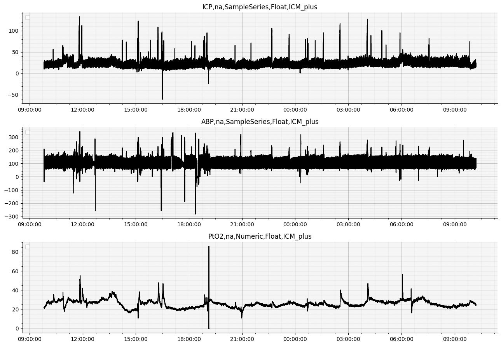
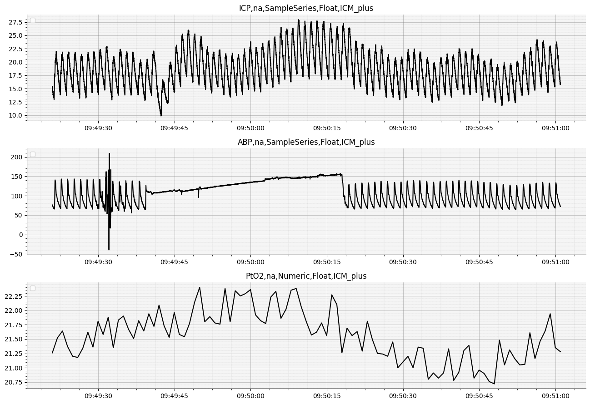
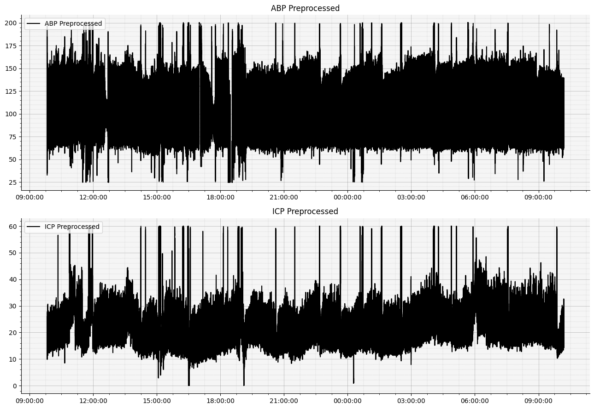
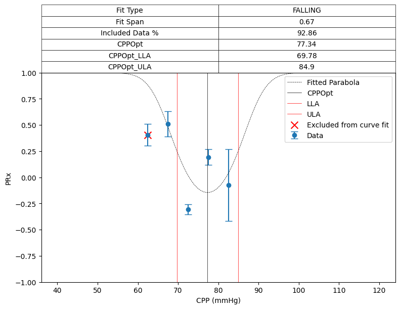
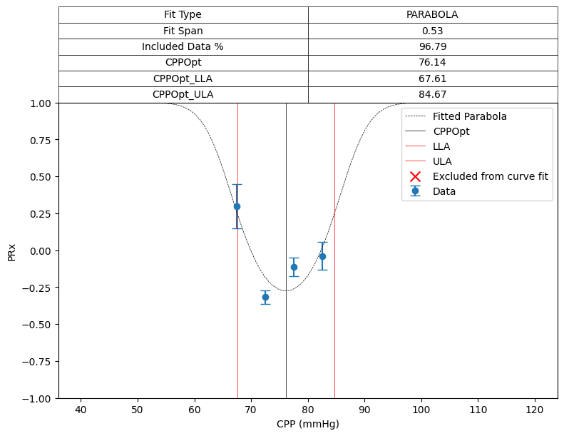
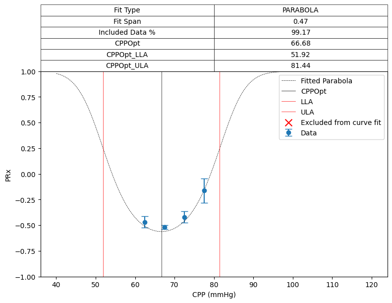
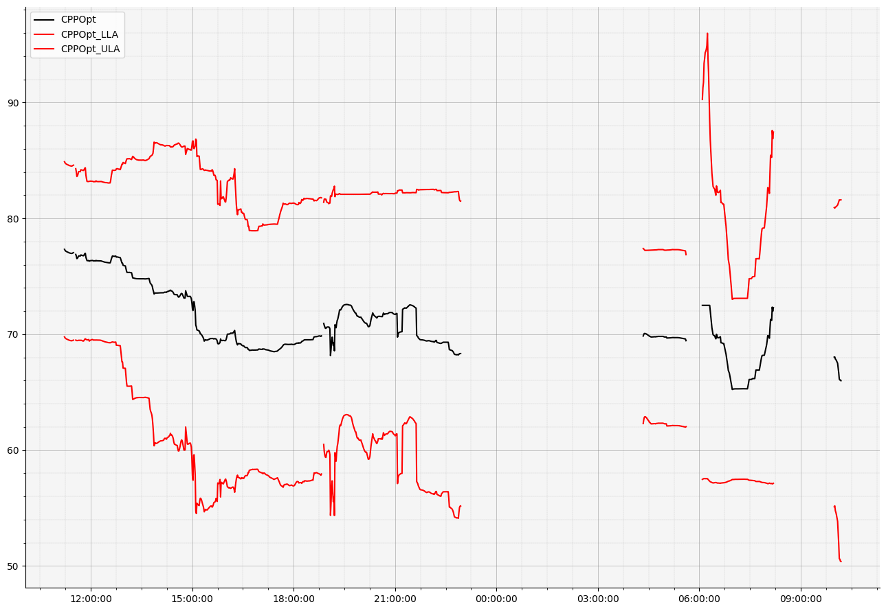
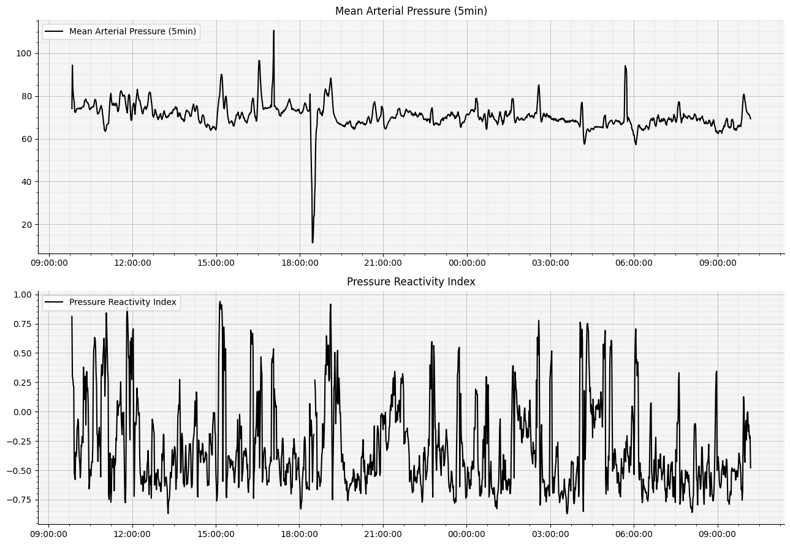

# INTS Neuromonitoring Workshop - ICM+ and Moberg Analytics
## Moberg Analytics Sandbox - Lab Exercise 06
## Maintaining cerebral autoregulation with CPPOpt

**For more information or help, please email support@moberganalytics.com**

- In this lab, we will show you how to calculate cppopt and the limits of cerebral autoregulation using our digital signal processing library, `moberg_dsp` 

#### Overview

[cppopt](https://cppopt.org/cppopt-trend-icm-relase-8-4-4-4/) (Optimal Cerebral Perfusion Pressure) is an individualized target for maintaining cerebral autoregulation in brain-injured patients. We offer a version of the cppopt algorithm in our digital signal processing library `moberg_dsp` which can be used to calculate CPPOpt, the limits of autoregulation, and other related metrics including the patient's individualized Pressure Reactivity Index.

#### Initial setup 


```python
# import libraries we'll use in this exercise
from pathlib import Path
import numpy as np

from cns_utils.readCNS import CNSDataSource
from sam_tools.cppopt import (
    plot_all_data,
    plot_data_frames,
    plot_cppopt_curve_fit
)

# Define path to output directories
preprocessed_images/output_directory = str(Path('data/06_output').resolve())
cns_data_directory = str(Path('data/01_output').resolve())
```

#### Step1 - Acquire ABP and ICP data
First, we'll need some data. Let's load in some data that we've already converted into CNS format. If you haven't already done this, go through the first exercise, ["01 - ICMH5 to CNS Conversion"](./01-ICMH5-to-CNS-conversion.ipynb).

*We will need **ABP** and **ICP** waveform data to run the CPPOpt algorithm.*


```python
# load the CNSDataSource object (using data from exercise 01)
cns_data_source = CNSDataSource(cns_data_directory)

# plot all the data - this may take a little while!
plot_all_data(cns_data_source)
```

    NO UNITS FOUND


    No artists with labels found to put in legend.  Note that artists whose label start with an underscore are ignored when legend() is called with no argument.


    NO UNITS FOUND


    No artists with labels found to put in legend.  Note that artists whose label start with an underscore are ignored when legend() is called with no argument.
    No artists with labels found to put in legend.  Note that artists whose label start with an underscore are ignored when legend() is called with no argument.


    NO UNITS FOUND


    

    


```python
# you can also plot a subset of the data
plot_all_data(cns_data_source, duration_seconds=100)
```

    No artists with labels found to put in legend.  Note that artists whose label start with an underscore are ignored when legend() is called with no argument.
    No artists with labels found to put in legend.  Note that artists whose label start with an underscore are ignored when legend() is called with no argument.
    No artists with labels found to put in legend.  Note that artists whose label start with an underscore are ignored when legend() is called with no argument.


    

    


#### Step 2 (Optional) Preprocessing

You might have noticed that the data is pretty noisy. We can get rid of some of those peaks that we know are artifacts. Optionally, add your own pre-processing here!

- First we'll load data for the specific signals that we are interested in


```python
# create reviewer objects for the signals we are interested in
abp = cns_data_source.get_modality_data_reviewer("ABP")  # create a reviewer object for ABP
icp = cns_data_source.get_modality_data_reviewer("ICP")  # create a reviewer object for ICP

# create data frames with the time-series data
abp_data_frame, _ = abp.review_data_frame(abp.start_time(), abp.end_time())
icp_data_frame, _ = icp.review_data_frame(icp.start_time(), icp.end_time())

# Perform some very simple artifact reduction by removing sections where the signal is above or below the threshold
abp_data_frame[(abp_data_frame < 25) | (abp_data_frame > 200)] = np.nan
icp_data_frame[(icp_data_frame < 0) | (icp_data_frame > 60)] = np.nan
```


```python
# we can visualize the preprocessed data
plot_data_frames([abp_data_frame, icp_data_frame], ["ABP Preprocessed", "ICP Preprocessed"])
```


    

    


### Step 3 - Run the CPPOpt Algorithm

The `moberg_dsp` package offers a version of the CPPOpt algorithm for you to use, which uses a single, 4-hour moving window that calculates CPPOpt once per minute (post-time). The resulting DataFrame also has the details of each curve fit.


```python
# import functions from moberg_dsp
from moberg_dsp.analytics.cppopt import cppopt_4_hr_single_window
from moberg_dsp.analytics.optimal_value import OptimalValueArgs
```


```python
# These default settings are the same ones used in ICM+ for the COGiTATE study
args = OptimalValueArgs(
    missing_data_limit_samples=120, # How many missing data points are acceptable
    min_bin=40, # Minimum value of CPP we are interested in
    max_bin=120, # Maximum value of CPP
    num_bins=16, # Spread out the CPP range into this number of bins
    minimum_bin_percent=3, # If a bin has less than this % of data, exclude the bin from polynomial fitting.
    minimum_included_data_percentage=50, # If there is more than this % data missing, do not calculate an optimal value.
    y_overlap_region_min=-0.3, # The PRx values must overlap this lower bound.
    y_overlap_region_max=0.6, # The PRx values must overlap this upper bound.
    limits_y=0.25, # The limits of autoregulation (CPP) are calculated when PRx equals this value.
    minimum_y_span=0.2 # The minimum variance in PRx required to calculate a value.
)

# The output of the function gives you:
# - the CPPOpt composite data frame
# - the Mean Arterial Pressure smoothed with a 5-minute rolling window function
# - the Pressure Reactivity Index (the correlation coefficient of ABP and ICP over a 5-minute rolling window) 
cppopt_composite, map_5min, prx_5min = cppopt_4_hr_single_window(abp_data_frame, icp_data_frame, args)
```


```python
# There are a lot of columns in the CPPOpt composite, almost anything you would want to know!
print(cppopt_composite.columns) 
```

    Index(['CPPOpt', 'LLA', 'ULA', 'Fit Type', 'Fit Span', 'Included Data %',
           'Coefficient_2', 'Coefficient_1', 'Coefficient_0', 'Y_0', 'Y_1', 'Y_2',
           'Y_3', 'Y_4', 'Y_5', 'Y_6', 'Y_7', 'Y_8', 'Y_9', 'Y_10', 'Y_11', 'Y_12',
           'Y_13', 'Y_14', 'Y_15', 'StandardError_0', 'StandardError_1',
           'StandardError_2', 'StandardError_3', 'StandardError_4',
           'StandardError_5', 'StandardError_6', 'StandardError_7',
           'StandardError_8', 'StandardError_9', 'StandardError_10',
           'StandardError_11', 'StandardError_12', 'StandardError_13',
           'StandardError_14', 'StandardError_15', 'DataPercent_0',
           'DataPercent_1', 'DataPercent_2', 'DataPercent_3', 'DataPercent_4',
           'DataPercent_5', 'DataPercent_6', 'DataPercent_7', 'DataPercent_8',
           'DataPercent_9', 'DataPercent_10', 'DataPercent_11', 'DataPercent_12',
           'DataPercent_13', 'DataPercent_14', 'DataPercent_15', 'IncludedInFit_0',
           'IncludedInFit_1', 'IncludedInFit_2', 'IncludedInFit_3',
           'IncludedInFit_4', 'IncludedInFit_5', 'IncludedInFit_6',
           'IncludedInFit_7', 'IncludedInFit_8', 'IncludedInFit_9',
           'IncludedInFit_10', 'IncludedInFit_11', 'IncludedInFit_12',
           'IncludedInFit_13', 'IncludedInFit_14', 'IncludedInFit_15'],
          dtype='object')


```python
# We can plot the curve fits from each row in the composite. This gives a more detailed look into how CPPOpt is calculated.
cppopt_composite_not_nan = cppopt_composite.dropna(how="all")

# plot the curve fit for the first row
plot_cppopt_curve_fit(cppopt_composite_not_nan.iloc[0])

# plot the curve fit for the 100th row
plot_cppopt_curve_fit(cppopt_composite_not_nan.iloc[100])

# plot the curve fit for the last row
plot_cppopt_curve_fit(cppopt_composite_not_nan.iloc[-5])
```


    

    


    

    


    

    


```python
# We can also plot the data trended over time

# extract the CPPOpt, LLA, and ULA columns
cppopt = cppopt_composite["CPPOpt"]
cppopt_lla = cppopt_composite["LLA"]
cppopt_ula = cppopt_composite["ULA"]

# plot the CPPOpt data trended over time
plot_data_frames(
    data_frames=[cppopt, cppopt_lla, cppopt_ula], 
    labels=["CPPOpt", "CPPOpt_LLA", "CPPOpt_ULA"], 
    colors=["black", "red", "red"], 
    share=True
)

# plot the MAP and PRx data trended over time
plot_data_frames(
    data_frames=[map_5min, prx_5min], 
    labels=["Mean Arterial Pressure (5min)", "Pressure Reactivity Index"]
)

```


    

    


    

    

