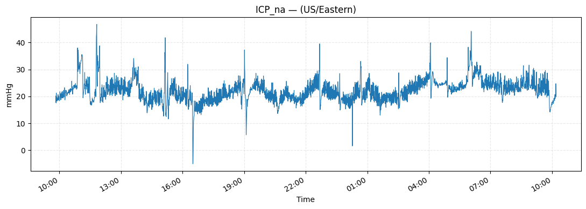

# The 2025 Informatics, Big Data, and AI Workshop
NCS 23rd Annual Meeting \
September 18, 2025 in Montréal, Québec.

## Notebook 2 - Data Formats, Conversion, and Plotting

**For more information or help, please email support@moberganalytics.com**

What you’ll learn
* Why we convert ICU monitoring data into a single format (HDF5).
* How to convert CNS Monitor archives to HDF5.
* How to open and explore HDF5 files (and what the structure means).

### 1. Understanding HDF5
**Goal: Understand why we export ICU data to HDF5.**

HDF5 is a single file that can hold many time series, metadata, and annotations—like a “self-contained patient folder.” It’s fast for reading long recordings and large cohorts.

When we combine ICU data from many patients and sites, we need a file format that is fast, organized, and self-describing. HDF5 gives us that in one portable file.

Plain-English idea:
Think of HDF5 as a single “digital binder” that contains folders (groups), pages (datasets), and sticky notes (attributes). It keeps signals, events, and metadata together so they’re easy to find and load quickly.

Practical reasons it helps
* One file, many data types: Store ICP, ABP, EEG, pupillometry, meds/events, and cohort metadata in one place instead of juggling multiple CSV/EDF/log files.
* Self-describing: Units, sampling rate, device (EVD vs IPM), timezone, and provenance live as attributes next to the data—so you don’t lose essential context.
* Fast partial reads: With chunking and compression, you can load just “10:00–12:00 on day 3” without reading the whole recording—critical for long ICU stays.
* Clean hierarchy: The organization of data can be designed to mirror how clinicians think (signals vs events) and how analysts query.
* Time alignment is simpler: Storing time_us alongside each signal makes cross-modal alignment (ICP vs meds vs EEG) reproducible.
* Tooling & interoperability: Supported in Python, R, MATLAB, and C++; GUIs like H5View let non-programmers browse contents safely.
* Scales to cohorts: Efficient with thousands of patients and multi-day recordings; works well on servers, clusters, and cloud storage.
* Reproducible & auditable: You can freeze an analysis snapshot with raw data + metadata + export version in the same file.

In short, HDF5 contains
* Groups ≈ folders
* Datasets ≈ arrays/tables (signals, timestamps, events)
* Attributes ≈ sticky labels on groups/datasets (units, sampling rate, device, patient ID, provenance)

### 2. Converting to HDF5 
**Goal: Convert one CNS Monitor archive (or a small batch) into an HDF5 file.**

What the code will do (you’ll add the code):
* Specify CNS Monitor archive
* Call export-utils to write to HDF5 file


```python
from export_utils.patient_convert_client import ConvertHDF5Process

CNS_ARCHIVE = '/mnt/s3/tracktbi-data-main/153/cns/Patient_1_w_ICMP'

convert_hdf5_process = ConvertHDF5Process(CNS_ARCHIVE, "/home/jovyan")
convert_hdf5_process.start()
```

    [1/7] Converting PtO2,na,Numeric,Float,ICM_plus...
    NO UNITS FOUND
    Reading 87773/87773: 100.0%
    [2/7] Converting ULA,ICMP,SampleSeries,Float,ICM_plus...
    NO UNITS FOUND
    Reading 2/1057: 0.19%
    Reading 46/1057: 4.35%
    Reading 102/1057: 9.65%
    Reading 1057/1057: 100.0%
    [3/7] Converting ICP,na,SampleSeries,Float,ICM_plus...


    /tmp/ipykernel_126/19278700.py:6: RuntimeWarning: invalid value encountered in scalar divide
      convert_hdf5_process.start()


    NO UNITS FOUND
    Reading 10532794/10532794: 100.0%
    [4/7] Converting LLA,ICMP,SampleSeries,Float,ICM_plus...
    NO UNITS FOUND
    Reading 120/1027: 11.68%
    Reading 1027/1027: 100.0%
    [5/7] Converting ABP,na,SampleSeries,Float,ICM_plus...
    NO UNITS FOUND
    Reading 10532794/10532794: 100.0%
    [6/7] Converting CPP,na,SampleSeries,Float,ICM_plus...
    Reading 10532794/10532794: 100.0%
    [7/7] Converting CPPOpt,ICMP,SampleSeries,Float,ICM_plus...
    NO UNITS FOUND
    Reading 120/1102: 10.89%
    Reading 1102/1102: 100.0%


### 3. Reading an HDF5 File

What’s inside?

Your exported file is an HDF5 “binder” with two top-level groups:
* /Trends – lower-rate signals (e.g., ICP_na, CPP_na, PtO2_na)
* /Waveforms – higher-rate signals (e.g., ABP waveform, raw ICP waveform)

Inside each group, signals usually come in pairs:
* SignalName → numeric values
* SignalName_Timestamps → matching timestamps (microseconds since epoch)

Attributes (units, sampling rate, source device, etc.) may be attached to a group or dataset.

1) Open the file and explore the layout


```python
import h5py

hdf5_file = '/home/jovyan/Patient_1_w_ICMP.h5'
f = h5py.File(hdf5_file, 'r')

# Top-level groups
print("Top level:", list(f.keys()))          # ['Trends', 'Waveforms']

# Peek into each group
print("Trends:", list(f['Trends'].keys()))
print("Waveforms:", list(f['Waveforms'].keys()))
```

    Top level: ['Trends', 'Waveforms']
    Trends: ['PtO2_na', 'PtO2_na_Timestamps']
    Waveforms: ['ABP_na', 'ABP_na_Timestamps', 'CPPOpt_ICMP', 'CPPOpt_ICMP_Timestamps', 'CPP_na', 'CPP_na_Timestamps', 'ICP_na', 'ICP_na_Timestamps', 'LLA_ICMP', 'LLA_ICMP_Timestamps', 'ULA_ICMP', 'ULA_ICMP_Timestamps']


Another way of looking at this file organization is through its tree structure as shown below.

Top level

```{bash}
/ (root)
  ├─ /Trends
  └─ /Waveforms
```

/Trends – lower-rate summary channels (value + timestamps pairs)

```{bash}
/Trends
  ├─ PtO2_na                 (dataset: values)
  └─ PtO2_na_Timestamps      (dataset: int64 µs since epoch)
```

/Waveforms – higher-rate channels and derived indices (each as value + timestamps)

```{bash}
/Waveforms
  ├─ ABP_na                  (values)            ├─ CPPOpt_ICMP              (values)
  ├─ ABP_na_Timestamps       (timestamps)        ├─ CPPOpt_ICMP_Timestamps   (timestamps)
  ├─ CPP_na                  (values)            ├─ ICP_na                   (values)
  ├─ CPP_na_Timestamps       (timestamps)        ├─ ICP_na_Timestamps        (timestamps)
  ├─ LLA_ICMP                (values)            ├─ ULA_ICMP                 (values)
  ├─ LLA_ICMP_Timestamps     (timestamps)        └─ ULA_ICMP_Timestamps      (timestamps)
```

Conventions (how to read this structure)
* Every signal appears as a pair: SignalName (numeric values) and SignalName_Timestamps (matching time stamps in microseconds since Unix epoch).
* Naming examples in this file:
    * *_na → numeric channel (e.g., ICP_na, ABP_na, CPP_na, PtO2_na)
    * *_ICMP → derived indices (e.g., CPPOpt_ICMP, LLA_ICMP, ULA_ICMP)
* Units, sampling rate (fs), device/source (e.g., EVD vs IPM), and provenance may be stored as attributes on each dataset or group.
* To plot a channel, read the values and its _Timestamps, convert timestamps to datetimes, then join/align as needed.

2) Read one signal (values + timestamps)


```python
import numpy as np
import pandas as pd

def load_signal(h5file, group, base):
    """
    Load a signal pair (values + timestamps) from group ('Trends' or 'Waveforms')
    base: e.g., 'ICP_na' -> expects 'ICP_na' and 'ICP_na_Timestamps'
    Returns tz-aware pandas.Series indexed by datetime.
    """
    g = h5file[group]
    vals = np.array(g[base])
    ts   = np.array(g[f"{base}_Timestamps"], dtype='int64')  # microseconds
    dt   = pd.to_datetime(ts, unit='us', utc=True)           # UTC
    s    = pd.Series(vals, index=dt, name=base)

    # Optional: convert to Eastern time for readability in clinic context
    s = s.tz_convert('US/Eastern')
    return s

# Example: load ICP trend
s_icp = load_signal(f, 'Waveforms', 'ICP_na')
s_icp.head()
```


    2009-09-07 05:49:20.985000-04:00    15.406830
    2009-09-07 05:49:20.993333-04:00    15.006830
    2009-09-07 05:49:21.001666-04:00    14.766830
    2009-09-07 05:49:21.010000-04:00    14.966829
    2009-09-07 05:49:21.018333-04:00    14.786830
    Name: ICP_na, dtype: float32


3) Inspect metadata (attributes)


```python
def print_attrs(obj, path="/"):
    print(f"Attributes for {path}")
    for k, v in obj.attrs.items():
        print(f"  {k}: {v}")

# File-level attributes (if present)
print_attrs(f, "/")

# Group-level attributes
print_attrs(f['Trends'], "/Trends")
print_attrs(f['Waveforms'], "/Waveforms")

# Dataset-level attributes (units, fs, source, etc.)
print_attrs(f['Waveforms']['ICP_na'], "/Trends/ICP_na")
```

    Attributes for /
    Attributes for /Trends
    Attributes for /Waveforms
    Attributes for /Trends/ICP_na
      continuous_regions: [[1252316960985000 1252404734260000]]
      data_type: SampleSeries
      end_time: 1252404734260000
      gaps: []
      label: ICP,na,SampleSeries,Float,ICM_plus
      location: na
      number_points: 10532794
      representation: Float
      source_device: ICM_plus
      start_time: 1252316960985000


4) Quick plot (one day at a time)


```python
import matplotlib.pyplot as plt
import matplotlib.dates as mdates

# Downsample to 30-second median for snappy plotting
s1 = s_icp.resample('30S').median().clip(lower=-5, upper=200)

def plot_day(series):
    fig, ax = plt.subplots(figsize=(11,4))
    ax.plot(series.index, series.values, linewidth=0.8)
    ax.set_title(f"{series.name} — ({series.index.tz})")
    ax.set_ylabel("mmHg"); ax.set_xlabel("Time")
    ax.grid(True, ls='--', alpha=0.3)
    ax.xaxis.set_major_formatter(mdates.DateFormatter('%H:%M'))
    fig.autofmt_xdate(); plt.tight_layout()
    return ax

# Example:
plot_day(s1)
```


    <Axes: title={'center': 'ICP_na — (US/Eastern)'}, xlabel='Time', ylabel='mmHg'>


    

    


Notice how this data is exactly the same as the data from Notebook 1 section 4.

5) Align two channels (e.g., ICP and CPP)


```python
s_cpp = load_signal(f, 'Waveforms', 'CPP_na').resample('30S').median()
aligned = pd.concat([s1.rename('ICP'), s_cpp.rename('CPP')], axis=1)

ax = aligned.plot(figsize=(11,4), linewidth=0.8)
ax.set_title("ICP and CPP (1s median)"); ax.set_ylabel("mmHg")
ax.grid(True, ls='--', alpha=0.3); plt.tight_layout()
```


    

    


## End of Notebook 2
At this point, participants should be able to:
* Convert Moberg CNS archives to HDF5.
* Understand why we use HDF5 as a data export format.
* Navigate the HDF5 structure.

## What’s Next?

TODO

There is no notebook 3. 

In Notebook 4, we will build on what we learend so far to perform a cerebral autoregulation analysis. Specifically, we’ll learn how to:
* Data Preprocessing: Understand the impact and importance of reducing the impact of non-physiologic data on downstream metrics by applying artifact reduction to high-resolution ABP and ICP data
* Visualize cerebrovascular physiology: Compute and interpret PRx and CPPopt and visualize the CPPopt curve fit.
* Move from analysis to application: Learn how retrospective methods transition into prospective, real-time monitoring and bedside implementation.
* Extract insights at scale: Derive statistics from chosen data regions and run automated, batch analyses across patients or sessions.
