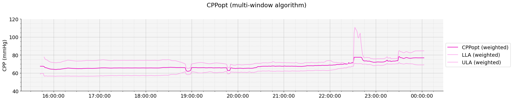

# The 2025 Informatics, Big Data, and AI Workshop
NCS 23rd Annual Meeting \
September 18, 2025 in Montréal, Québec.

## Notebook 4 - Cerebral Autoregulation Analysis

**For more information or help, please email support@moberganalytics.com**

What you'll learn:
- How to calculate the pressure reactivity index (PRx) ([Czosnyka et al.](https://pubmed.ncbi.nlm.nih.gov/9218290/)), a measure of cerebral autoregulation (CA).
- How to derive CPPopt, an estimate of the CPP where CA is most intact. ([Aries et al.](https://pubmed.ncbi.nlm.nih.gov/22622398/))
- The importance of excluding non-physiologic data prior to calculating PRx and CPPopt
- Extensions of the CPPopt algorithm: 
    - Calculating the limits of CA
    - Using a weighted multi-window approach ([Liu et al.](https://pubmed.ncbi.nlm.nih.gov/28486883/))
    - Non-invasive estimates of CA using near-infrared Spectroscopy (NIRS); Cerebral Oximetry Index (COx), MAPopt (optimal mean arterial pressure) ([Sekhon et al.](https://pubmed.ncbi.nlm.nih.gov/27255957/))

#### Exercise 0: Setup
1. Import the necessary libraries and functions we will need for the rest of the exercises


```python
from sam_tools.cppopt import (
    plot_data_frames,
    plot_cppopt_curve_fit,
    exclude_non_physiologic_values
)

from datetime import timedelta
from pathlib import Path
from pandas import Timestamp, Series, DataFrame
import numpy as np
from moberg_dsp.analytics import OptimalValueArgs, OptimalValueFlexArgs, cppopt_single_window, cppopt_multi_window, mapopt_multi_window, mapopt_single_window, prx as rolling_correlation
from cns_utils import CNSDataSource

cppopt_cns_data_path = str(Path('data/04_cppopt').resolve())
mapopt_cns_data_path = str(Path('data/04_mapopt').resolve())
```

#### Exercise 1: Data Loading and Cleaning
1. Load data from Moberg CNS format using the `cns_utils` library, which provides a `CNSDataSource` reader.


```python
# The CNSDataSource allows us to read data stored in Moberg CNS format.
cns_data_source = CNSDataSource(cppopt_cns_data_path)

# Create reviewer objects for ABP and ICP data.
abp_reviewer = cns_data_source.get_modality_data_reviewer("ABP,waveform")
icp_reviewer = cns_data_source.get_modality_data_reviewer("ICP,waveform")

# Read up to 12 hours of data from the patient archive.
limit = timedelta(hours=12)
raw_abp, _ = abp_reviewer.review_data_frame(abp_reviewer.start_time(), abp_reviewer.start_time() + limit.total_seconds()*1e6)
raw_icp, _ = icp_reviewer.review_data_frame(icp_reviewer.start_time(), icp_reviewer.start_time() + limit.total_seconds()*1e6)

# Visualize the data
subsection_start, subsection_end = Timestamp("2017-12-06 12:12:00"), Timestamp("2017-12-06 12:12:15")

plot_data_frames(
    data_frames=[raw_abp[subsection_start:subsection_end], raw_icp[subsection_start:subsection_end]], 
    legend_labels=["ABP","ICP"],
    axes=[0, 1],
    graph_y_labels=["ABP (mmHg)", "ICP (mmHg)"],
    figsize=(16, 4),
    sharex=True,
    title="Waveform view of raw ABP and ICP Data (15 seconds)"
)

plot_data_frames(
    data_frames=[raw_abp, raw_icp], 
    legend_labels=["ABP","ICP"],
    axes=[0, 1],
    graph_y_labels=["ABP (mmHg)", "ICP (mmHg)"],
    figsize=(16, 4),
    sharex=True,
    title="ABP and ICP Data (12 hours)"
)

```


    

    


    

    


2. Apply basic artifact reduction

There are large spikes and clear non-physiologic data in the raw ABP and ICP signal. 

Any metrics we derive from this data (CPP, PRx, CPPopt) will be impacted by the non-physiologic data. 

We can apply basic thresholding to remove them.


```python
abp_ar = exclude_non_physiologic_values(raw_abp, valid_range=(40, 180))
icp_ar = exclude_non_physiologic_values(raw_icp, valid_range=(0, 30))

plot_data_frames(
    data_frames=[raw_abp, abp_ar, raw_icp, icp_ar], 
    legend_labels=["ABP (raw)", "ABP (with threshold)", "ICP (raw)", "ICP (with threshold)"],
    axes=[0, 0, 1, 1],
    colors=["red", "black", "red", "black"],
    graph_y_labels=["ABP (mmHg)", "ICP (mmHg)"],
    figsize=(20, 4),
    sharex=True,
    title="ABP and ICP Data After Artifact Reduction"
)

# Showing the 10-second trends of ABP and ICP makes it easier to visualize
abp_10s_trend = abp_ar.resample(timedelta(seconds=10), origin=Timestamp(0)).mean()
icp_10s_trend = icp_ar.resample(timedelta(seconds=10), origin=Timestamp(0)).mean()

plot_data_frames(
    data_frames=[abp_10s_trend, icp_10s_trend],
    legend_labels=["ABP (10-second average)", "ICP (10-second average)"],
    axes=[0, 1],
    graph_y_labels=["ABP (mmHg)", "ICP (mmHg)"],
    figsize=(20, 4),
    sharex=True,
    title="ABP and ICP 10-second average (after thresholding)"
)
```


    

    


    

    


3. Apply a median filter

Basic thresholding helps, but does not remove the non-physiologic spikes that are at low amplitudes. We can apply an additional median filtering step to remove these residual spikes.

This is typical for CPPopt and MAPopt calculation, where the trend is most important, and high-frequency data is not needed.

In this case, a 10-minute median filter smooths over the majority of non-physiologic data, although it is a heavy-handed approach.


```python
abp_median_filter = abp_10s_trend.rolling(timedelta(minutes=10)).median()
icp_median_filter = icp_10s_trend.rolling(timedelta(minutes=10)).median()

plot_data_frames(
    data_frames=[abp_10s_trend, abp_median_filter, icp_10s_trend, icp_median_filter], 
    legend_labels=["ABP (10s trend)", "ABP (median filtered)", "ICP (10s trend)", "ICP (median filtered)"],
    axes=[0, 0, 1, 1],
    colors=["red", "black", "red", "black"],
    graph_y_labels=["ABP (mmHg)", "ICP (mmHg)"],
    figsize=(20, 4),
    sharex=True,
    title="ABP and ICP after thresholding + median filter"
)

```


    

    


*Interpretation: Most of the non-physiologic spikes can be reduced by applying simple thresholding and median filter processing.*

#### Exercise 2: Compute CPP and PRx

After artifact removal, CPP and PRx can be derived.

- CPP = ABP - ICP
- PRx = Rolling 5-minute correlation of ABP and ICP ([Czosnyka et al.](https://pubmed.ncbi.nlm.nih.gov/9218290/))


```python
aligned = DataFrame({"ABP": abp_median_filter, "ICP": icp_median_filter})
aligned_no_ar = DataFrame({"ABP": abp_10s_trend, "ICP": icp_10s_trend})
cpp = aligned["ABP"] - aligned["ICP"]
cpp_no_ar = aligned_no_ar["ABP"] - aligned_no_ar["ICP"]

prx = Series(*rolling_correlation(abp_median_filter, icp_median_filter, window=30, step=6))
prx_no_ar = Series(*rolling_correlation(abp_10s_trend, icp_10s_trend, window=30, step=6))

plot_data_frames(
    data_frames=[abp_median_filter, icp_median_filter, cpp_no_ar, cpp, prx_no_ar, prx], 
    legend_labels=["ABP (median filtered)", "ICP (median filtered)", "CPP (no AR)", "CPP", "PRx (no AR)", "PRx"],
    axes=[0, 1, 2, 2, 3, 3],
    colors=["black", "black", "red", "black", "red", "black"],
    graph_y_labels=["ABP (mmHg)", "ICP (mmHg)", "CPP (mmHg)", "PRx"],
    figsize=(20, 8),
    sharex=True,
    title="ABP, ICP, CPP, and PRx With vs. Without Artifact Reduction (AR)"
)
```


    

    


*Interpretation: Non-physiologic data may significantly impact CPP and PRx calculation*.

#### Exercise 3: Calculating and visualizing CPPopt
The CPPopt algorithm takes ABP and ICP as input, computes CPP and PRx, and finally CPPopt ([Aries et al.](https://pubmed.ncbi.nlm.nih.gov/22622398/)) using the parameters below.
1. Use the `moberg_dsp` library to calculate CPPopt and the limits of autoregulation (LLA, ULA) over time using a 4-hour moving window.


```python
prx_car_threshold=0.25 # The cutoff for PRx that determines intact vs. impaired Cerebrovascular Autoregulation (CAR)
window_size = timedelta(hours=4) # The amount of data to use in each CPPopt calculation.

arguments = OptimalValueArgs(
    window_size_samples=int(window_size.total_seconds() / 60), # The amount of data to use in the CPPopt calculation.
    min_bin=40, # Minimum value of CPP we are interested in.
    max_bin=120, # Maximum value of CPP.
    num_bins=16, # Spread out the CPP range into this number of bins.
    minimum_bin_percent=2, # If a bin has less than this % of data, exclude the bin from polynomial fitting.
    minimum_included_data_percentage=50, # If there is more than this % data missing, do not calculate an optimal value.
    y_overlap_region_min=-0.3, # The PRx values must overlap this lower bound.
    y_overlap_region_max=0.6, # The PRx values must overlap this upper bound.
    limits_y=prx_car_threshold, # The cutoff for PRx that determines intact vs. impaired Cerebrovascular Autoregulation (CAR).
    minimum_y_span=0.2, # The minimum variance in PRx required to calculate a value.
    missing_data_limit_samples=120, # If there are more than this many missing data points, CPPopt will not be calculated.
)

# Calculate CPPopt, CPP, and PRx
cppopt_composite, cpp, prx = cppopt_single_window(abp_median_filter, icp_median_filter, arguments)
cppopt_composite_no_ar, cpp_no_ar, prx_no_ar = cppopt_single_window(raw_abp, raw_icp, arguments)

plot_data_frames(
    data_frames=[cppopt_composite_no_ar["CPPOpt"], cppopt_composite_no_ar["LLA"], cppopt_composite_no_ar["ULA"], cppopt_composite["CPPOpt"], cppopt_composite["LLA"], cppopt_composite["ULA"]], 
    legend_labels=["CPPOpt (no AR)", "CPPOpt_LLA (no AR)", "CPPOpt_ULA (no AR)", "CPPOpt (AR)", "CPPopt_LLA (AR)", "CPPOpt_ULA (AR)"], 
    colors=["#EA03C0", "#FCA5EC", "#FCA5EC","#EA03C0", "#FCA5EC", "#FCA5EC"],
    axes=[0, 0, 0, 1, 1, 1,],
    y_limits=[(40, 120), (40, 120)],
    graph_y_labels=["CPPopt (mmHg)", "CPPopt (mmHg)"],
    figsize=(20, 6),
    sharex=True,
    title="CPPopt Over Time (without vs. with AR)"
)
```


    

    


*Interpretation:*
- *The CPPopt algorithm produces more stable output when non-physiologic spikes are reduced.*
- *Including non-physiologic data in CPPopt calculation could produce misleading CPPopt values, which could alter clinical decision-making.*
- *Artifact reduction is critical to producing reliable estimates of cerebral autoregulation.*

3. Visualize how CPPopt and the limits of autoregulation are calculated. *(Re-run the cell below to see a different CPPopt curve fit from the trend above)*


```python
# Filter out any concave parabolic fits and choose a successful one at random.
successful_fits = cppopt_composite_no_ar[cppopt_composite_no_ar["Coefficient_0"] > 0]
random_index = np.random.choice(range(len(successful_fits)), size=1, replace=False)[0]

# These times represent the range of data that went into the CPPopt calculation.
end_time = successful_fits.index[random_index]
start_time = end_time - window_size

plot_cppopt_curve_fit(
    cppopt_composite_no_ar[:end_time].iloc[-1], 
    title=f"CPPopt Curve Fit\n{end_time}", 
    prx_threshold=prx_car_threshold,
    cpp=cpp_no_ar[start_time:end_time],
    prx=prx_no_ar[start_time:end_time]
)
```


    

    


- PRx is plotted against CPP and a parabolic curve fit is used to find the CPP where PRx is most negative, indicating intact CA. 
- Bins of CPP that do not have enough data are excluded from curve fitting to prevent fitting non-physiologic data. 
- Lower and upper limits of autoregulation (LLA and ULA) are the CPP values where PRx = 0.25, often used as a cutoff between intact and impaired CA.

*Interpretation: The CPPopt, LLA, and ULA create an individualized target range for CPP over time- which can be used to predict patient outcomes, or be used as a guide for real-time blood pressure management at the bedside.*


#### Exercise 4: Calculating CPPopt with a Multi-Window algorithm
Despite interest in using CPPopt in real-time, the single-window CPPopt algorithm only produces CPPopt values for 50-60% of the monitoring period. Instead, a multi-window algorithm increased the CPPopt yield to >90%, vastly increasing its usability ([Liu et al.](https://pubmed.ncbi.nlm.nih.gov/28486883/)).
1. Calculate CPPopt using a multi-window algorithm (This may take a little longer).


```python
minimum_window_size = timedelta(hours=2) 
maximum_window_size = timedelta(hours=8)
window_increment = timedelta(minutes=10)

multi_window_arguments = OptimalValueFlexArgs(
    missing_data_limit_samples=120, # How many missing data points are acceptable
    min_bin=40, # Minimum value of CPP we are interested in
    max_bin=120, # Maximum value of CPP
    num_bins=16, # Spread out the CPP range into this number of bins
    minimum_bin_percent=2, # If a bin has less than this % of data, exclude the bin from polynomial fitting.
    minimum_included_data_percentage=50, # If there is more than this % data missing, do not calculate an optimal value.
    y_overlap_region_min=-0.3, # The PRx values must overlap this lower bound.
    y_overlap_region_max=0.6, # The PRx values must overlap this upper bound.
    limits_y=prx_car_threshold, # The cutoff for PRx that determines intact vs. impaired Cerebrovascular Autoregulation (CAR)
    minimum_y_span=0.2, # The minimum variance in PRx required to calculate a value.
    window_size_samples=int(maximum_window_size.total_seconds() / 60), # The maximum amount of data to use in each weighted CPPopt calculation.
    min_window_samples=int(minimum_window_size.total_seconds() / 60), # The minimum amount of data to use in each weighted CPPopt calculation
    window_grow_samples=int(window_increment.total_seconds() / 60), # The amount each window will increase by until the maximum window size.
    minimum_r_squared=0.2, # If the r-squared value (goodness of fit) of the curve fit is less than this, no CPPopt value will be suggested.
    non_parabolic_window_weight=0.1 # The weight applied to CPPopt curve fits where the estimated CPPopt is outside of the CPP range (lower quality estimate).
)

cppopt_composite, cpp, prx = cppopt_multi_window(abp_median_filter, icp_median_filter, multi_window_arguments)

plot_data_frames(
    data_frames=[cppopt_composite["Weighted CPPOpt"], cppopt_composite["Weighted LLA"], cppopt_composite["Weighted ULA"]], 
    legend_labels=["CPPopt (weighted)", "LLA (weighted)", "ULA (weighted)"], 
    colors=["#EA03C0", "#FCA5EC", "#FCA5EC"],
    axes=[0, 0, 0],
    y_limits=[(40, 120)],
    graph_y_labels=["CPP (mmHg)"],
    figsize=(20, 4),
    title="CPPopt (multi-window algorithm)"
)
```


    

    


*Interpretation: The multi-window algorithm produces a more continuous CPPopt estimation, aiding real-time bedside use.*

#### Exercise 5: Non-invasive CPPopt (MAPopt)
Instead of CPP and PRx, ABP and Brain tissue saturation of oxygen (StO2) from near-infrared spectroscopy (NIRS) can be used to calculate the cerebral oximetry index (COx) and derive the mean arterial pressure (MAP) where CA is most intact, termed MAPopt ([Sekhon et al.](https://pubmed.ncbi.nlm.nih.gov/27255957/)).

This is done extraordinarily similarly to CPPopt:
1. Load ABP and StO2 data (left and right bilateral NIRS), 
    - optionally, average the left and right signals together if the patient's injury affects both sides of the brain equally, such as in cardiac arrest.
2. Reduce the influence of non-physiologic spikes.
3. Derive COx with a 5-minute rolling correlation between ABP and StO2.
4. Plot COx vs. MAP and apply a curve fit to find the optimal MAP.


```python
# Step 1 - Load Data
cns = CNSDataSource(mapopt_cns_data_path)
abp = cns.get_modality_data_reviewer("ART1,na")
stO2_l = cns.get_modality_data_reviewer("StO2,1_Left_Brain")
stO2_r = cns.get_modality_data_reviewer("StO2,2_Right_Brain")

raw_abp, _ = abp.review_data_frame(abp.start_time(), abp.end_time())
raw_stO2_l, _ = stO2_l.review_data_frame(stO2_l.start_time(), stO2_l.end_time())
raw_stO2_r, _ = stO2_r.review_data_frame(stO2_r.start_time(), stO2_r.end_time())

abp_10s = raw_abp.resample(timedelta(seconds=10), origin=Timestamp(0)).mean() 
sto2_10s_l = raw_stO2_l.resample(timedelta(seconds=10), origin=Timestamp(0)).mean() 
sto2_10s_r = raw_stO2_r.resample(timedelta(seconds=10), origin=Timestamp(0)).mean()
 
# Step 2 - Apply Artifact Reduction
abp_ar = exclude_non_physiologic_values(abp_10s, valid_range=(50,100)).rolling(timedelta(minutes=15)).median()
stO2_l_ar = exclude_non_physiologic_values(sto2_10s_l, valid_range=(60,100)).rolling(timedelta(minutes=15)).median()
stO2_r_ar = exclude_non_physiologic_values(sto2_10s_r, valid_range=(60,100)).rolling(timedelta(minutes=15)).median()

# Step 3 - Calculate MAPopt over time
window_size = timedelta(hours=4)

arguments = OptimalValueArgs(
    window_size_samples=int(window_size.total_seconds() / 60), # The amount of data to use in the MAPopt calculation (in minutes)
    min_bin=40, # Minimum value of MAP we are interested in
    max_bin=120, # Maximum value of MAP used in the curve fit
    num_bins=50, # Spread out the MAP range into this number of bins
    minimum_bin_percent=2, # If a bin has less than this % of data, exclude the bin from polynomial fitting.
    minimum_included_data_percentage=50, # If there is more than this % data missing, do not calculate an optimal value.
    y_overlap_region_min=-0.3, # The COx values must overlap this lower bound.
    y_overlap_region_max=0.6, # The COx values must overlap this upper bound.
    limits_y=0.25, # The cutoff for COx that determines intact vs. impaired Cerebrovascular Autoregulation (CAR)
    minimum_y_span=0.2, # The minimum variance in COx required to calculate a value.
    missing_data_limit_samples=120, # How many missing data points are acceptable
)

# Step 4 - Calculate MAPopt
mapopt_l, map, cox_l  = mapopt_single_window(raw_abp, raw_stO2_l, arguments)
mapopt_r, _, cox_r = mapopt_single_window(raw_abp, raw_stO2_r, arguments)
mapopt_l_ar, map_ar, cox_l_ar = mapopt_single_window(abp_ar, stO2_l_ar, arguments)
mapopt_r_ar, _, cox_r_ar = mapopt_single_window(abp_ar, stO2_r_ar, arguments)

plot_data_frames(
    data_frames=[abp_10s, abp_ar, raw_stO2_l, stO2_l_ar, raw_stO2_r, stO2_r_ar, map, map_ar, cox_l, cox_l_ar, cox_r, cox_r_ar, mapopt_l["MAPOpt"], mapopt_r["MAPOpt"], mapopt_l_ar["MAPOpt"], mapopt_r_ar["MAPOpt"]],
    axes=[0, 0, 1, 1, 2, 2, 3, 3, 4, 4, 5, 5, 6, 6, 7, 7],
    legend_labels=["ABP", "ABP (AR)", "StO2 L", "StO2 L (AR)", "StO2 R", "StO2 R (AR)", "MAP", "MAP (AR)", "COx (L)", "COx (L) (AR)", "COx (R)", "COx (R) (AR)","MAPopt (L)", "MAPopt (R)", "MAPopt (L) (AR)", "MAPopt (R) (AR)"],
    colors=["red", "black", "red", "black", "red", "black", "red", "black", "red", "black", "red", "black", "blue", "red", "blue", "red"],
    graph_y_labels=["ABP (mmHg)", "StO2 (%)", "StO2 (%)", "MAP (mmHg)", "COx", "COx", "MAP (mmHg)", "MAP (mmHg)"],
    y_limits=[(0, 150), (50, 100), (50, 100), (50, 100), (-1, 1), (-1, 1), (50, 100), (50, 100)],
    title="MAPopt Calculation",
    figsize=(20, 12),
    sharex=True
)
```


    

    

